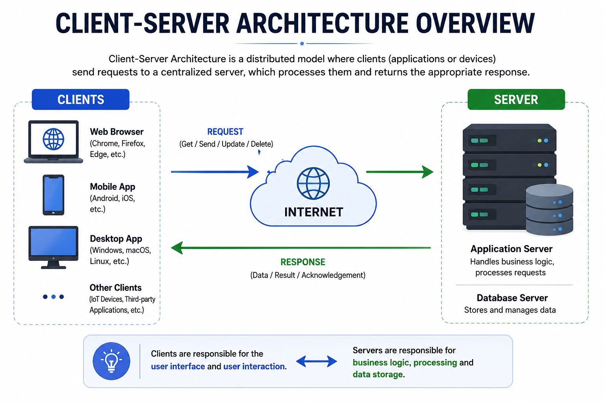
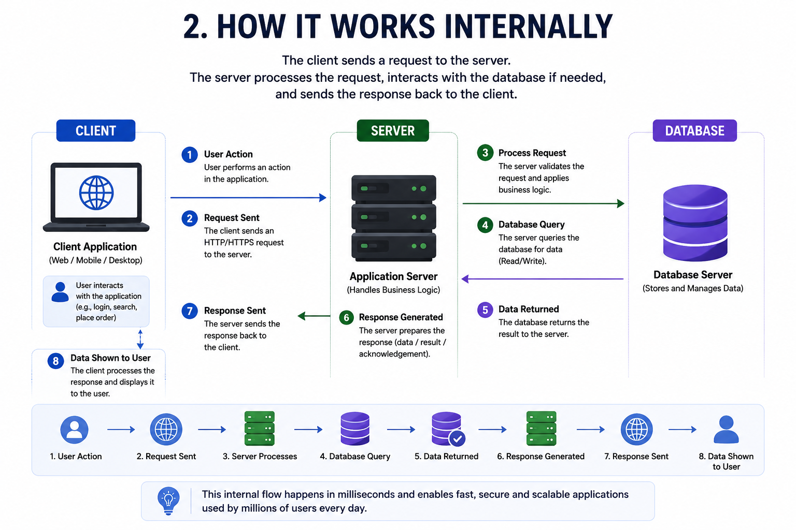
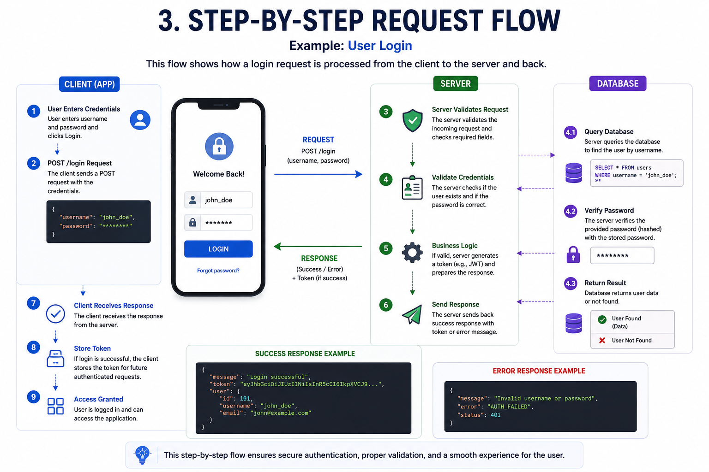
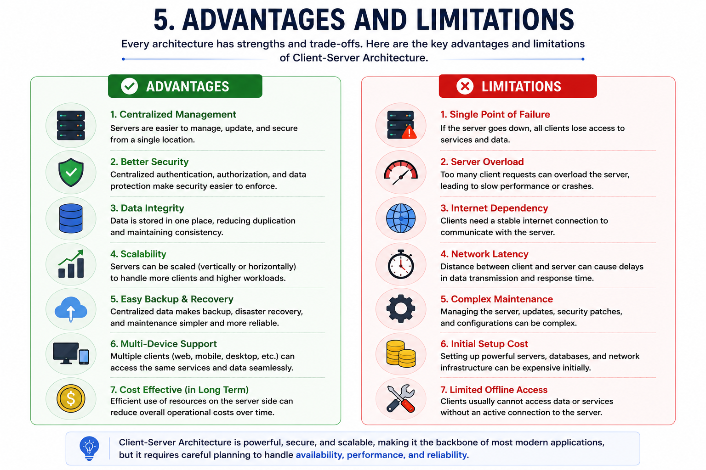
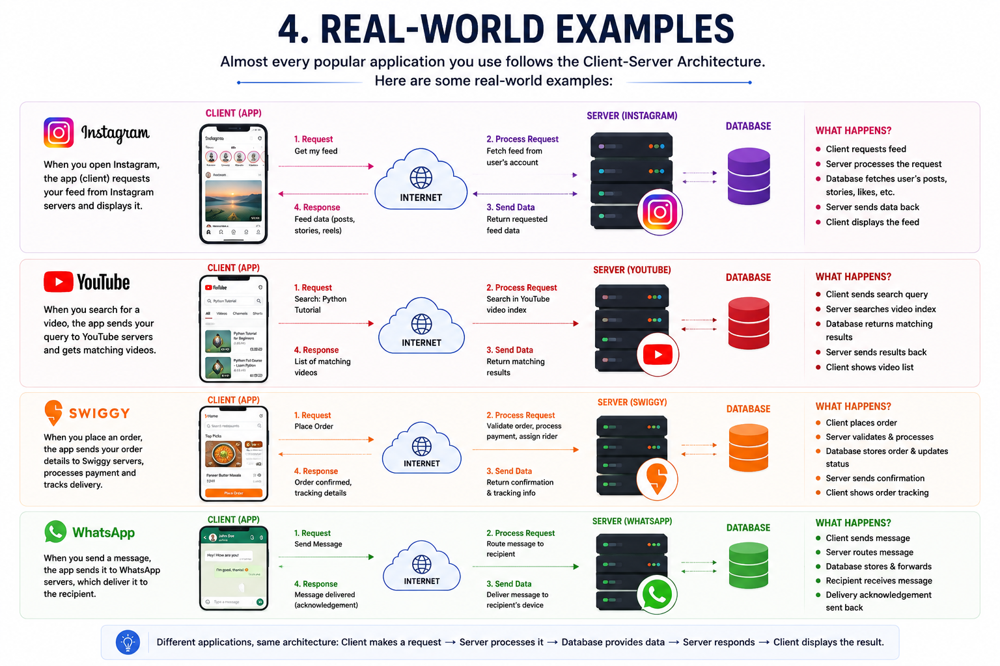

# Client-Server Architecture

## 1. Why do we need Client-Server Architecture?
Imagine applications like Instagram, YouTube, WhatsApp, or Swiggy. Millions of users use these applications every day from different devices and locations.

If every user's data were stored only on their own device:
* Data would be lost if the device was damaged or replaced.
* Users couldn't access their data from another device.
* Sharing data between users would be almost impossible.
* Managing updates, security, and backups would become extremely difficult.

To solve these problems, applications use **Client-Server Architecture**, where all important data and business logic are managed by a central server that clients can access over the internet.

---

## 2. What problem does it solve?
Client-Server Architecture solves several important problems:

### Centralized Data Storage
Instead of storing data separately on every user's device, all data is stored securely on servers.

### Easy Data Access
Users can access their account from any device simply by logging in.

### Better Security
Sensitive information such as passwords, payment details, and user data remains on the server instead of being exposed on client devices.

### Data Sharing
Users can easily interact with each other because all data exists in one centralized system.

### Easy Maintenance
Developers can update the server without requiring every user to reinstall the application.

---

## 3. Real-Life Analogy
Think about a restaurant.
* **Customer** → Client
* **Waiter** → Network (communication)
* **Kitchen** → Server
* **Food** → Response

The customer places an order.
The waiter takes the order to the kitchen.
The kitchen prepares the food.
The waiter brings the food back.

Similarly:
* The client sends a request.
* The server processes the request.
* The server sends back a response.

The customer never enters the kitchen directly, just like a client never directly accesses the database.

---

## 4. How does it work internally?
The communication between a client and a server follows a simple sequence:
1. The user performs an action (such as clicking Login or Search).
2. The client application creates an HTTP request.
3. The request travels through the internet.
4. The server receives the request.
5. The server validates the request.
6. If needed, the server communicates with the database.
7. The database returns the requested data.
8. The server prepares a response.
9. The response is sent back to the client.
10. The client displays the result to the user.

The client is mainly responsible for displaying the user interface, while the server handles processing, security, and data management.

---

## 5. Step-by-Step Request Flow
Suppose a user logs into Instagram.

### Step 1
The user enters:
* Username
* Password

### Step 2
The client sends a request:
```
POST /login
```

### Step 3
The server receives the request.

### Step 4
The server checks:
* Does the user exist?
* Is the password correct?
* Is the account active?

### Step 5
If everything is valid, the server responds:
```
Login Successful
```
Otherwise:
```
Invalid Username or Password
```

### Step 6
The client displays the appropriate message to the user.

---

## 6. Real-World Examples

### Instagram
When you open Instagram:
* The mobile app acts as the client.
* Instagram's servers retrieve your feed.
* The server sends posts, stories, and reels.
* The app displays them on your screen.

---

### YouTube
When you search for "Python Tutorial":
* The client sends your search query.
* The server searches millions of videos.
* The server returns the matching videos.
* The client displays the search results.

---

### Swiggy
When ordering food:
* Browse restaurants
* View menu
* Add items to cart
* Make payment
* Track delivery

Every action sends a request to Swiggy's servers, which process the request and return updated information.

---

### WhatsApp
When you send a message:
* The app sends the message to WhatsApp's servers.
* The server identifies the recipient.
* The server delivers the message.
* The recipient's device receives and displays it.

---

## 7. Advantages

### Centralized Data
All important information is stored in one location.

### Better Security
Clients do not directly access the database.

### Easy Backup
Servers can be backed up regularly to prevent data loss.

### Scalability
Many clients can connect to the same server simultaneously.

### Easy Maintenance
Business logic can be updated on the server without updating every client.

### Multi-Device Support
Users can log in from different devices and access the same data.

---

## 8. Limitations

### Single Point of Failure
If only one server exists and it crashes, clients cannot access the service.

### Server Overload
A large number of requests can overwhelm the server if it is not scaled properly.

### Internet Dependency
Most client-server applications require a network connection.

### Network Latency
Communication between the client and server takes time, which may affect performance.

These challenges lead to advanced system design concepts such as Load Balancers, Caching, Replication, and Horizontal Scaling.

---

## 9. Common Interview Questions

### Q1. What is Client-Server Architecture?
It is a software architecture where clients send requests to a centralized server, and the server processes those requests and returns responses.

### Q2. What is a Client?
A client is an application or device that sends requests to a server.
Examples: Web Browser, Mobile App, Desktop Application.

### Q3. What is a Server?
A server is a computer or software that listens for incoming requests, processes them, and returns responses.

### Q4. Why can't the client access the database directly?
Direct database access would create security risks, make validation difficult, and expose sensitive data. The server acts as a secure layer between clients and the database.

### Q5. Can one server serve multiple clients?
Yes. A single server can handle requests from thousands or even millions of clients, depending on its resources and architecture.

### Q6. What protocol is commonly used for communication?
Most modern web applications use HTTP or HTTPS for communication between clients and servers.

### Q7. What happens if the server is down?
Clients cannot retrieve or modify data until the server becomes available again. This is why production systems use multiple servers and failover mechanisms.

---

## 10. Summary
Client-Server Architecture is the foundation of almost every modern web application.

The client is responsible for interacting with the user, while the server manages data, business logic, security, and communication with databases.

Whenever a user performs an action—such as logging in, searching, uploading a file, or placing an order—the client sends a request to the server. The server processes the request, performs the necessary operations, and sends back a response.

This architecture provides centralized data management, improved security, easier maintenance, and scalability, making it suitable for applications ranging from small websites to platforms with millions of users like Instagram, YouTube, WhatsApp, and Swiggy.

Understanding Client-Server Architecture is the first step toward learning advanced system design topics such as Load Balancers, Caching, Databases, Microservices, and Distributed Systems.

---
## Reference Images





