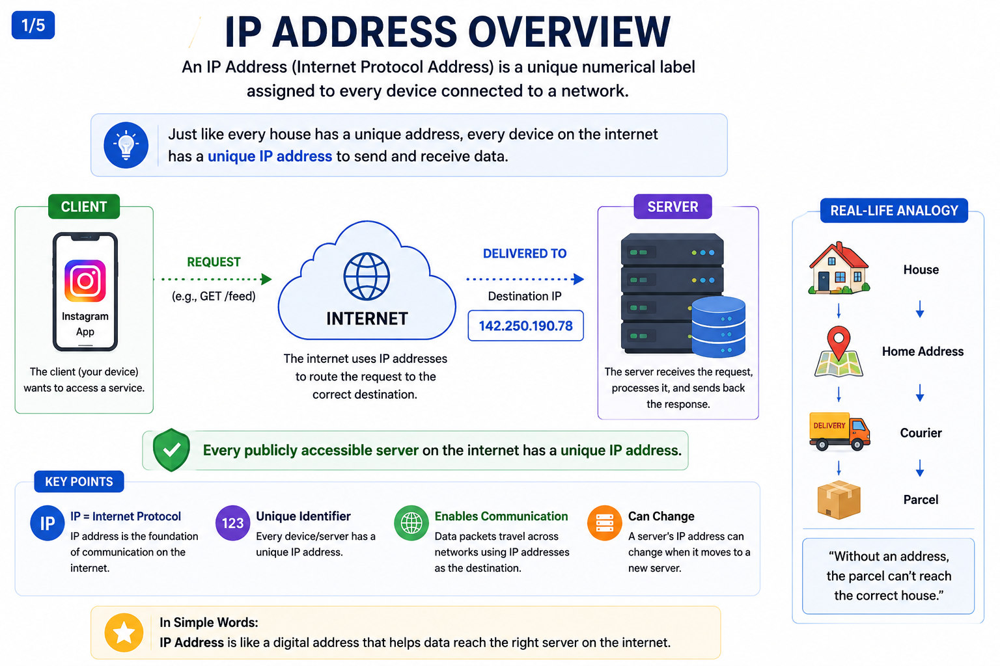
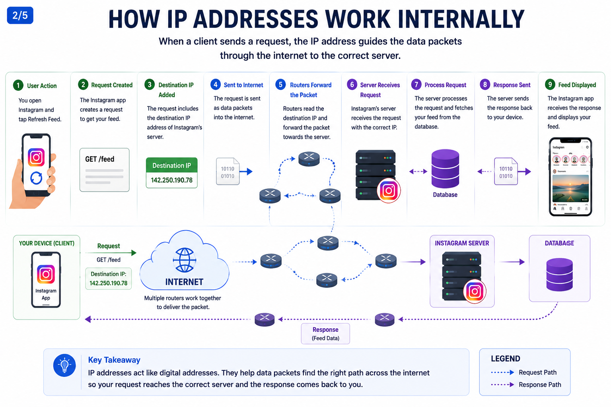
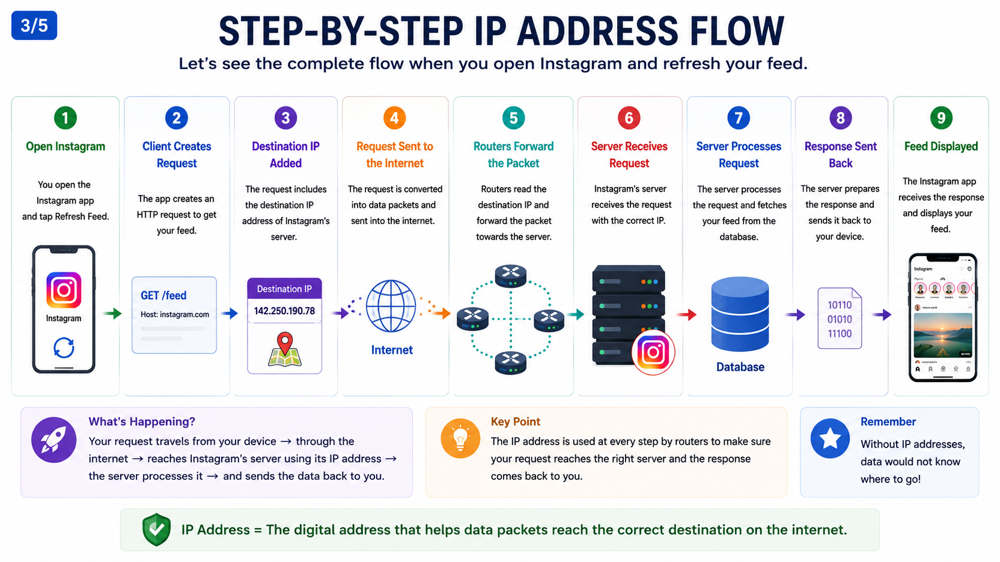
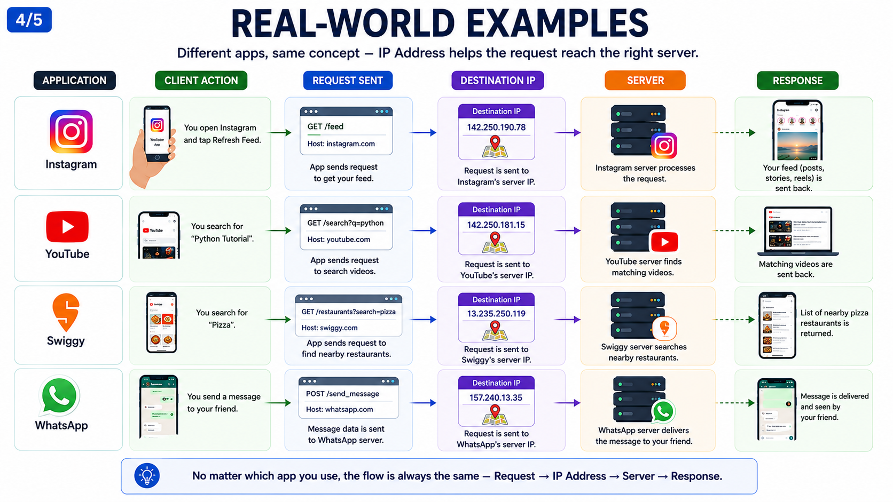
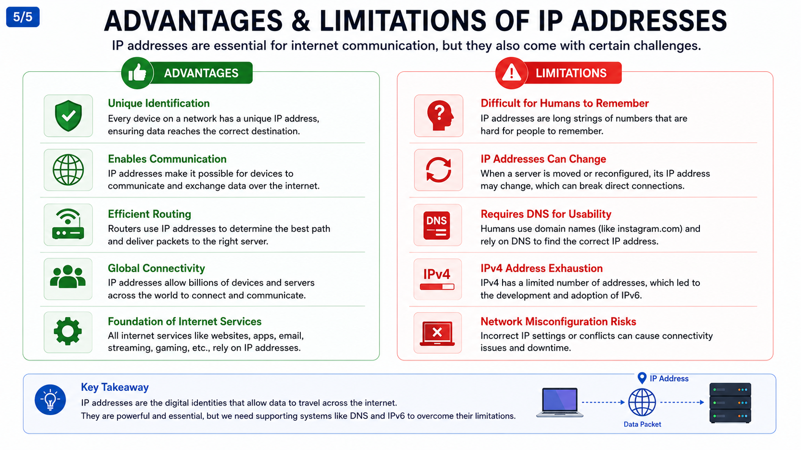

# IP Address

## 1. Why do we need an IP Address?

In the previous chapter, we learned that a client sends requests to a server. But that raises an important question:

**How does the client know which server to send the request to?**

The Internet contains billions of devices. If every device looked the same, there would be no way to send data to the correct destination.

Just like every house has a unique address for receiving letters and parcels, every device connected to a network needs a unique address to receive and send data.

This unique address is called an **IP Address (Internet Protocol Address).**

Without an IP address, devices on the Internet would have no way to identify or communicate with each other.

---

## 2. What Problem Does It Solve?

Imagine you want to visit your friend Rahul.

You can't simply tell the taxi driver:

> "Take me to Rahul."

The driver will immediately ask:

> "Which Rahul? Where does he live?"

You need to provide the complete address.

Similarly, when a client wants to communicate with a server, it must know exactly where that server is located on the network.

An IP address solves this problem by uniquely identifying every device connected to the Internet.

Without IP addresses:

* Requests would not know where to go.
* Servers could not receive client requests.
* Websites and applications would not work.
* Internet communication would become impossible.

---

## 3. Real-Life Analogy

Think of an IP address as a **home address**.

| Real World   | Internet           |
| ------------ | ------------------ |
| House        | Server             |
| Home Address | IP Address         |
| Courier      | Data Packet        |
| Road Network | Internet           |
| Delivery     | Request & Response |

When you order something online, the courier uses your home address to deliver the package.

Similarly, Internet routers use an IP address to deliver data packets to the correct server.

---

## 4. How Does It Work Internally?

Let's continue using Instagram as our example.

### Step 1

You open the Instagram app.

### Step 2

You tap the **Refresh Feed** button.

### Step 3

The Instagram client creates a request.

```text
GET /feed
```

### Step 4

The request contains the destination IP address of Instagram's server.

Example:

```text
Destination IP:
142.xxx.xxx.xxx
```

### Step 5

The request travels through multiple routers across the Internet.

Each router reads the destination IP address and forwards the packet toward the correct server.

### Step 6

Instagram's server receives the request.

### Step 7

The server processes the request and retrieves your feed from the database.

### Step 8

The server sends the response back to your device.

### Step 9

The Instagram app displays your latest posts, stories, and reels.

This entire process usually takes only a few milliseconds.

---

## 5. Step-by-Step Request Flow

```text
User Opens Instagram
        │
        ▼
Client Creates Request
(GET /feed)
        │
        ▼
Destination IP Added
        │
        ▼
Internet Routers
        │
        ▼
Instagram Server
        │
        ▼
Database
        │
        ▼
Server Sends Response
        │
        ▼
Instagram Displays Feed
```

---

## 6. Real-World Examples

### Instagram

You open Instagram.

The app sends a request to Instagram's server using its IP address.

The server retrieves your feed and sends it back.

---

### YouTube

You search for **"Python Tutorial."**

The request is sent to YouTube's server using its IP address.

The server searches millions of videos and returns matching results.

---

### Swiggy

You search for **Pizza**.

The app sends the request to Swiggy's server.

The server finds nearby restaurants and returns the results.

---

### WhatsApp

You send a message to a friend.

Your phone sends the message to WhatsApp's server using its IP address.

The server forwards the message to the recipient.

---

## 7. Types of IP Addresses

### Public IP Address

A Public IP Address is used for communication over the Internet.

Servers like Instagram, YouTube, and Amazon have public IP addresses that users can reach from anywhere in the world.

---

### Private IP Address

A Private IP Address is used inside local networks such as homes, offices, and schools.

Devices like laptops, phones, printers, and smart TVs usually communicate using private IP addresses within the same network.

---

## 8. Advantages

* Every device has a unique identity on the network.
* Makes communication between devices possible.
* Enables routers to deliver data to the correct destination.
* Supports billions of connected devices.
* Forms the foundation of Internet communication.

---

## 9. Limitations

* IP addresses are difficult for humans to remember.
* Public IP addresses can change when infrastructure changes.
* Users cannot easily identify websites using only numeric IP addresses.
* IPv4 has a limited number of available addresses, which led to the development of IPv6.

---

## 10. Common Interview Questions

### Q1. What is an IP Address?

An IP Address is a unique numerical address assigned to a device on a network so that it can communicate with other devices.

---

### Q2. Why do we need IP Addresses?

IP addresses allow devices to locate and communicate with each other over a network.

---

### Q3. Can two public servers have the same IP Address?

No.

Each public IP address must be unique so that data reaches the correct destination.

---

### Q4. What happens if a request is sent to the wrong IP Address?

The request reaches the wrong server, which may return an error or an unexpected response because it doesn't host the requested service.

---

### Q5. What is the difference between a Public IP and a Private IP?

A Public IP is accessible over the Internet, while a Private IP is used only within a local network.

---

## 11. Summary

An IP Address is the unique identity of a device on a network.

Whenever a client wants to communicate with a server, it sends its request to the server's IP address. Internet routers use this address to ensure the request reaches the correct destination.

Without IP addresses, devices would have no reliable way to identify each other or exchange information, making Internet communication impossible.

---

## What's Next?

Imagine opening your browser.

Do you type:

```text
142.xxx.xxx.xxx
```

Probably not.

Instead, you type:

* instagram.com
* youtube.com
* swiggy.com
* whatsapp.com

These names are easy for humans to remember, but computers communicate using IP addresses.

So how does your computer know the IP address behind **instagram.com**?

That's exactly what we'll learn in the next chapter: **DNS (Domain Name System)**.

---
## Reference Images





