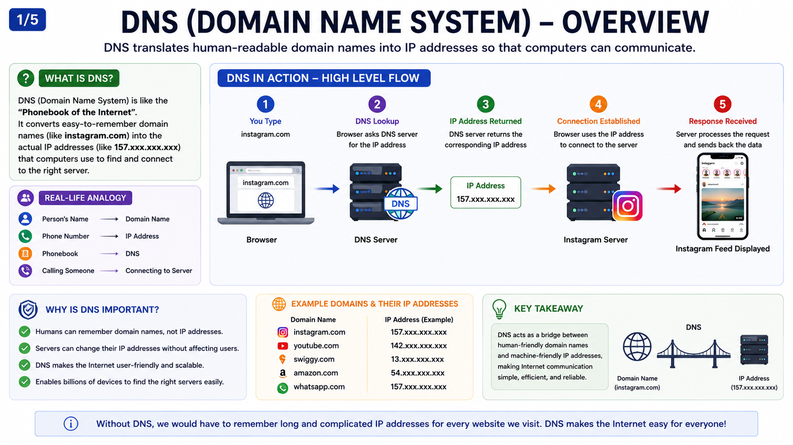
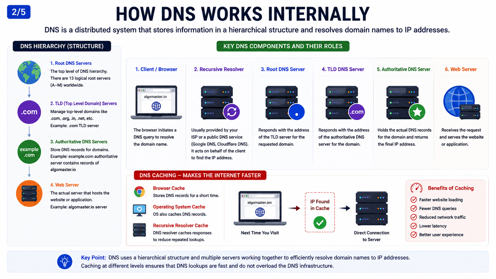
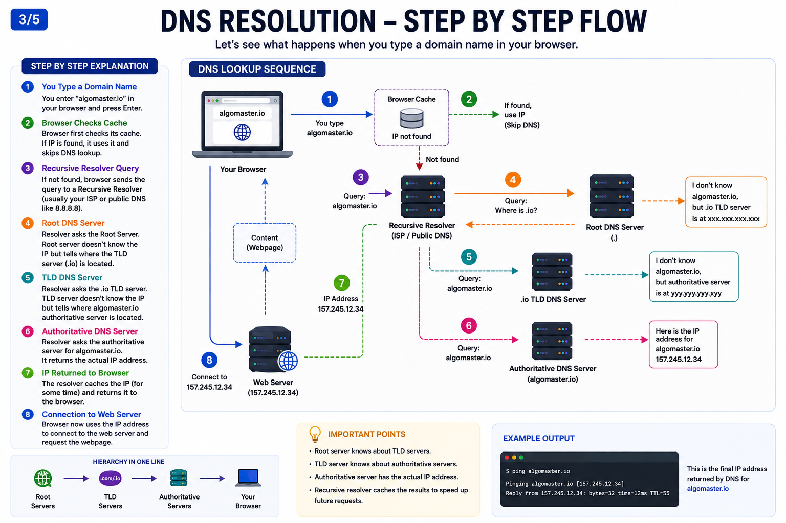
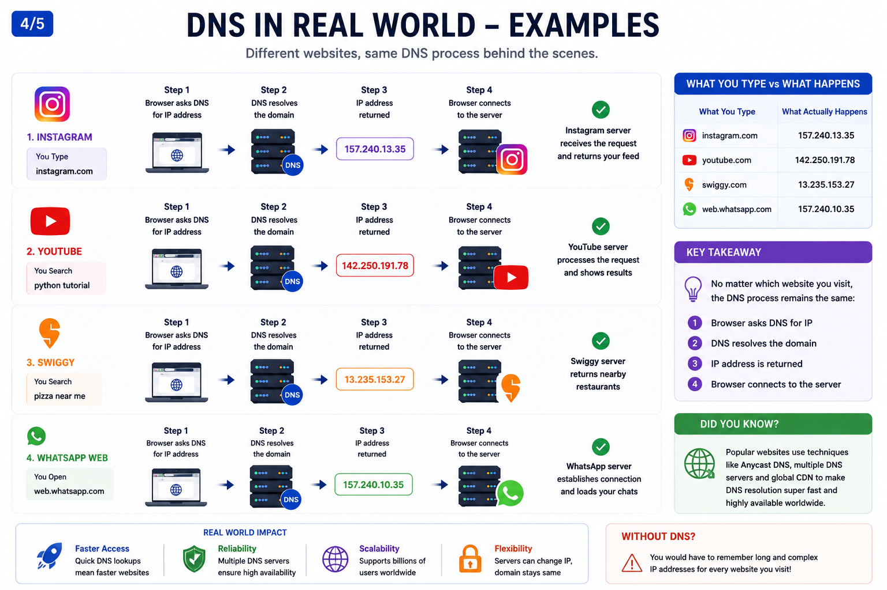
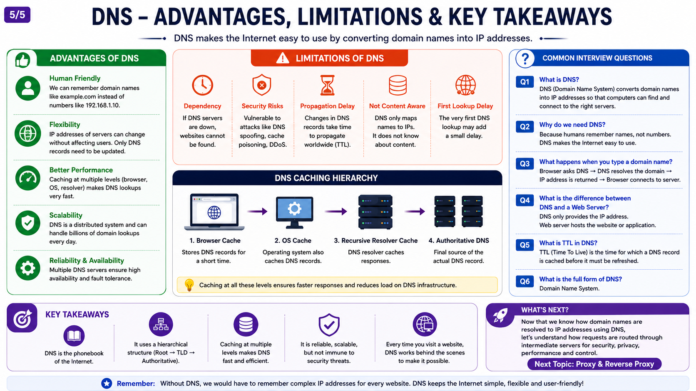

# DNS (Domain Name System)

## 1. Why do we need DNS?

In the previous chapter, we learned that every server on the Internet has a unique **IP Address**.

Whenever a client wants to communicate with a server, it sends its request to that server's IP address.

But this creates a problem.

**Can you remember the IP address of every website you visit?**

Probably not.

Imagine trying to remember these:

* Instagram → 157.xxx.xxx.xxx
* YouTube → 142.xxx.xxx.xxx
* Swiggy → 13.xxx.xxx.xxx
* Amazon → 54.xxx.xxx.xxx

Remembering numbers like these is difficult.

Instead, we remember names such as:

* instagram.com
* youtube.com
* swiggy.com
* amazon.com

These are called **Domain Names**.

Computers cannot understand domain names. They only understand IP addresses.

This is where **DNS (Domain Name System)** comes in.

DNS converts a domain name into its corresponding IP address so that your browser can connect to the correct server.

Without DNS, we would have to remember the IP address of every website we visit.

---

## 2. What Problem Does It Solve?

Imagine you want to call your friend Rahul.

Do you remember Rahul's phone number?

Probably not.

Instead, you open your phone contacts and tap **Rahul**.

Your phone automatically finds Rahul's phone number and places the call.

DNS works in the same way.

Instead of remembering

```text
157.xxx.xxx.xxx
```

you simply type

```text
instagram.com
```

DNS finds the correct IP address and returns it to your browser.

Without DNS:

* Users would have to remember IP addresses.
* Websites would become difficult to access.
* If a server's IP address changed, users would have to remember the new one.

DNS makes the Internet easy to use.

---

## 3. Real-Life Analogy

Think of DNS as the **Phonebook of the Internet**.

| Real World      | Internet               |
| --------------- | ---------------------- |
| Person's Name   | Domain Name            |
| Phone Number    | IP Address             |
| Phonebook       | DNS                    |
| Calling Someone | Connecting to a Server |

Example:

```text
Rahul
     ↓
9876543210
```

Similarly,

```text
instagram.com
        ↓
DNS
        ↓
157.xxx.xxx.xxx
```

Only after getting the IP address can your browser connect to Instagram's server.

---

## 4. How Does DNS Work Internally?

Let's understand the complete process using Instagram as an example.

### Step 1

You open your browser.

### Step 2

You type

```text
instagram.com
```

and press **Enter**.

### Step 3

Your browser first checks its own **Browser Cache**.

The Browser Cache stores recently visited websites.

If the IP address is already available, the browser uses it immediately.

No DNS lookup is required.

---

### Step 4

If the Browser Cache doesn't have the IP address, the browser checks the **Operating System (OS) Cache**.

Your operating system also stores recently visited DNS records.

If the IP address is found, it is returned to the browser.

---

### Step 5

If neither the Browser Cache nor the OS Cache has the IP address, the request is sent to a **Recursive Resolver**.

A Recursive Resolver is a DNS server that searches for the IP address on behalf of your browser.

It is usually provided by:

* Your Internet Service Provider (ISP)
* Google DNS
* Cloudflare DNS

Think of the Recursive Resolver as your assistant.

Instead of making you search for the answer, it finds the answer for you.

---

### Step 6

The Recursive Resolver first contacts a **Root DNS Server**.

The Root DNS Server does **not** know the IP address of Instagram.

Instead, it knows where the **.com** information is located.

It replies:

> "I don't know the IP address, but ask the .com TLD Server."

---

### Step 7

The Recursive Resolver now contacts the **TLD (Top-Level Domain) Server**.

A TLD Server manages domain extensions such as:

* .com
* .org
* .net
* .io

The TLD Server still doesn't know Instagram's IP address.

Instead, it replies:

> "I don't know the IP address, but ask Instagram's Authoritative DNS Server."

---

### Step 8

The Recursive Resolver now contacts the **Authoritative DNS Server**.

This server stores the official DNS records for the domain.

It finally returns:

```text
instagram.com
        ↓
157.xxx.xxx.xxx
```

This is the correct IP address.

---

### Step 9

The Recursive Resolver stores the IP address in its cache for future requests.

It then sends the IP address back to your browser.

---

### Step 10

Your browser now knows Instagram's IP address.

It creates the request.

```text
GET /feed
```

and sends it to Instagram's server.

---

### Step 11

Instagram's server processes the request, retrieves your feed from the database, and sends the response back.

Finally, your browser displays your latest posts, stories, and reels.

All of this usually happens within a few milliseconds.

---

## 5. Step-by-Step Request Flow

```text
User Opens Browser
        │
        ▼
Types instagram.com
        │
        ▼
Browser Cache
        │
Not Found
        ▼
Operating System Cache
        │
Not Found
        ▼
Recursive Resolver
        │
        ▼
Root DNS Server
        │
Points to .com TLD Server
        ▼
TLD (.com) Server
        │
Points to Authoritative DNS Server
        ▼
Authoritative DNS Server
        │
Returns IP Address
        ▼
Recursive Resolver
        │
Stores Result in Cache
        ▼
Browser
        │
Creates GET /feed Request
        ▼
Instagram Server
        │
Database
        ▼
Server Sends Response
        ▼
Instagram Feed Displayed
```

---

## 6. Real-World Examples

### Instagram

You type:

```text
instagram.com
```

DNS finds Instagram's IP address.

The browser connects to Instagram's server and loads your feed.

---

### YouTube

You search for:

**Python Tutorial**

DNS finds YouTube's IP address.

The browser connects to YouTube's server and displays the videos.

---

### Swiggy

You open:

```text
swiggy.com
```

DNS converts the domain name into an IP address.

The browser connects to Swiggy's server and loads nearby restaurants.

---

### WhatsApp Web

You open:

```text
web.whatsapp.com
```

DNS resolves the domain name.

The browser connects to WhatsApp's server and loads your chats.

---

## 7. Why Do We Use DNS Cache?

Imagine opening Instagram every few minutes.

If your browser contacted the DNS server every single time,

```text
instagram.com
       ↓
DNS Server
       ↓
IP Address
```

millions of unnecessary DNS requests would be generated every second.

To avoid this, DNS uses **Caching**.

Caching means storing recently found IP addresses for a short period.

Benefits of DNS Cache:

* Faster website loading
* Fewer DNS requests
* Less network traffic
* Better performance

---

## 8. Advantages

* Easy-to-remember domain names.
* No need to memorize IP addresses.
* Faster browsing using DNS Cache.
* Websites can change their IP addresses without affecting users.
* Makes the Internet simple and user-friendly.
* Supports billions of websites efficiently.

---

## 9. Limitations

* If DNS servers are unavailable, websites cannot be found.
* The first DNS lookup adds a small delay.
* Cached records may become outdated after some time.
* DNS can be targeted by attacks such as DNS Spoofing or Cache Poisoning if not properly secured.

---

## 10. Common Interview Questions

### Q1. What is DNS?

DNS (Domain Name System) converts domain names into IP addresses.

---

### Q2. Why do we need DNS?

Because humans can easily remember names like **instagram.com**, while computers communicate using IP addresses.

---

### Q3. Why is DNS called the Phonebook of the Internet?

Because it maps domain names to IP addresses, just like a phonebook maps names to phone numbers.

---

### Q4. What is a Recursive Resolver?

A Recursive Resolver is a DNS server that searches for the correct IP address on behalf of your browser.

---

### Q5. What is a Root DNS Server?

A Root DNS Server directs the request to the correct Top-Level Domain (TLD) Server.

---

### Q6. What is a TLD Server?

A TLD Server manages domain extensions such as **.com**, **.org**, **.net**, and points the request to the correct Authoritative DNS Server.

---

### Q7. What is an Authoritative DNS Server?

An Authoritative DNS Server stores the official DNS records for a domain and returns the correct IP address.

---

### Q8. What is DNS Cache?

DNS Cache temporarily stores recently resolved IP addresses so that future visits are faster.

---

## 11. Summary

DNS (Domain Name System) is one of the most important services on the Internet.

It acts as a bridge between **human-readable domain names** and **machine-readable IP addresses**.

Whenever you type a website like **instagram.com**, your browser first looks for the IP address using Browser Cache, OS Cache, and the Recursive Resolver. If needed, the Recursive Resolver communicates with the Root DNS Server, TLD Server, and Authoritative DNS Server to find the correct IP address.

Once the IP address is found, the browser connects to the server and requests the required data.

Without DNS, users would have to remember the IP address of every website, making the Internet difficult to use.

---

## What's Next?

So far we've learned:

* Client communicates with a Server.
* IP Address identifies the server.
* DNS converts a domain name into an IP address.

But another important question arises.

**Does a client always communicate directly with the server?**

The answer is **No**.

In many real-world applications, requests first pass through another server before reaching the destination.

These servers help improve **security**, **performance**, **privacy**, and **traffic management**.

In the next chapter, we'll learn about **Proxy** and **Reverse Proxy**, how they work, and why companies like Netflix, Cloudflare, and NGINX use them in production systems.

---
## Reference Images





