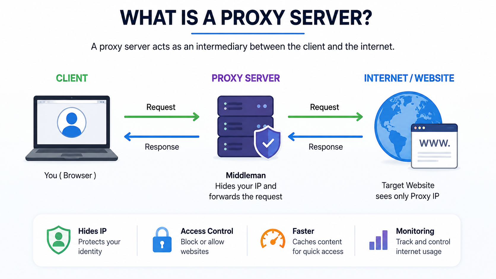
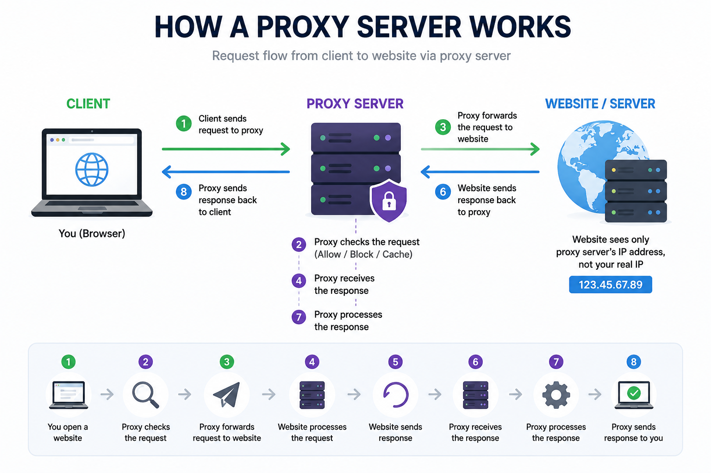
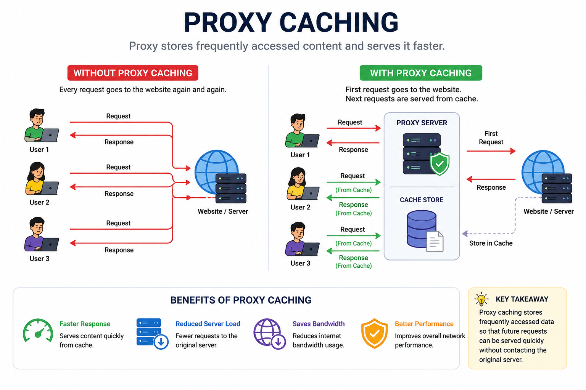
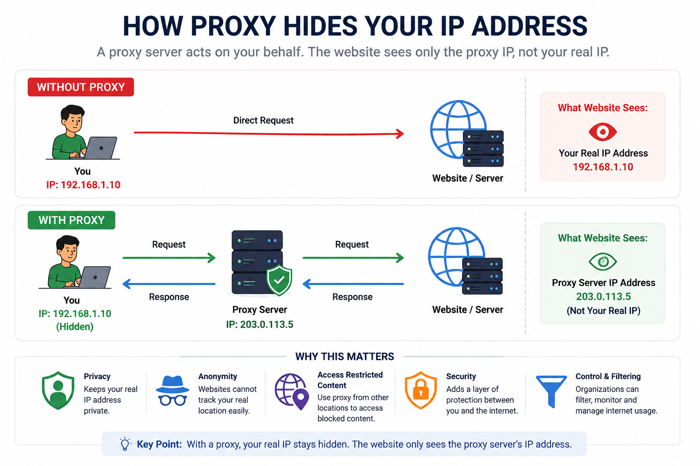
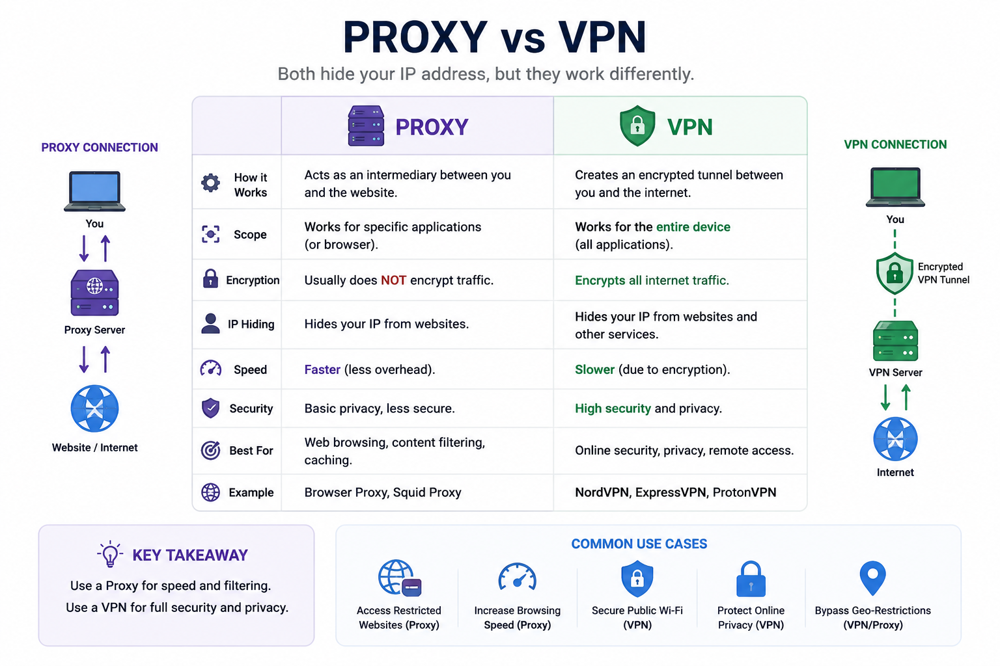

# Proxy Server

## 1. Why do we need a Proxy Server?

In the previous chapter, we learned how a client finds the IP address of a server using DNS.

The communication flow looked like this:

```text
Client
   │
   ▼
DNS
   │
Returns IP Address
   ▼
Server
```

This makes it seem like the client always communicates directly with the server.

But in many real-world applications, that is not always true.

Sometimes, another server sits between the client and the destination server.

This server is called a **Proxy Server**.

A Proxy Server acts as a middleman between the client and the internet.

Instead of the client communicating directly with the website, the request first goes to the Proxy Server.

The Proxy Server then forwards the request to the destination server, receives the response, and sends it back to the client.

---

## 2. What Problem Does It Solve?

Imagine you work in a company.

Instead of every employee directly talking to the CEO, all communication first goes through the manager.

```text
Employee
    │
    ▼
Manager
    │
    ▼
CEO
```

The manager acts as a middleman.

Similarly, a Proxy Server acts as a middleman between the client and the destination server.

Without a Proxy Server:

- Every client directly communicates with websites.
- Websites can see the client's real IP address.
- Organizations cannot control internet usage.

With a Proxy Server:

- Client identity can be hidden.
- Internet access can be controlled.
- Websites can be blocked.
- Frequently visited websites can be cached.
- Network traffic can be monitored.

---

## 3. Real-Life Analogy

Imagine you want to buy a product from another country.

Instead of contacting the seller directly, you use a shopping agent.

```text
You
 │
 ▼
Shopping Agent
 │
 ▼
Online Store
```

The online store only communicates with the shopping agent.

It never directly communicates with you.

Similarly,

- You → Client
- Shopping Agent → Proxy Server
- Online Store → Destination Server

The Proxy Server works on behalf of the client.

---

## 4. How Does a Proxy Server Work?

Let's understand this using Instagram.

### Step 1

You open Instagram.

### Step 2

Your browser creates a request.

```text
GET /feed
```

### Step 3

Instead of sending the request directly to Instagram,

the request first reaches the Proxy Server.

### Step 4

The Proxy Server examines the request.

It can:

- Allow the request.
- Block the request.
- Return a cached response.
- Forward the request.

### Step 5

If the request is allowed,

the Proxy Server forwards it to Instagram.

### Step 6

Instagram processes the request.

### Step 7

Instagram sends the response back to the Proxy Server.

### Step 8

The Proxy Server forwards the response back to your browser.

Finally,

your Instagram feed is displayed.

---

## 5. Step-by-Step Request Flow

```text
User Opens Instagram
        │
        ▼
Browser Creates Request
        │
        ▼
Proxy Server
        │
Checks Request
        │
        ▼
Instagram Server
        │
Processes Request
        ▼
Proxy Server
        │
Returns Response
        ▼
Browser Displays Feed
```

---

## 6. How Does a Proxy Hide Your IP Address?

Without a Proxy Server

```text
You
 │
 ▼
Instagram
```

Instagram can see:

- Your IP Address
- Your approximate location

---

With a Proxy Server

```text
You
 │
 ▼
Proxy Server
 │
 ▼
Instagram
```

Instagram now sees only the Proxy Server's IP address.

Your real IP address remains hidden.

This improves privacy and anonymity.

---

## 7. Proxy Caching

Imagine 100 employees open the same website every morning.

Without caching,

every request goes to the website.

```text
100 Users
     │
     ▼
Website
```

The website has to process all 100 requests.

Now imagine using a Proxy Server.

The first request reaches the website.

The Proxy Server stores a copy of the response.

```text
First User
     │
     ▼
Proxy Server
     │
     ▼
Website
```

Now the second user requests the same page.

Instead of contacting the website again,

the Proxy Server returns the stored copy.

```text
Second User
     │
     ▼
Proxy Server
     │
Cached Copy
```

This is called **Caching**.

Caching reduces:

- Response time
- Internet bandwidth usage
- Server load

It also improves overall performance.

---

## 8. Real-World Examples

### Office Networks

Many companies use Proxy Servers.

Employees connect to the internet through the Proxy Server.

The company can:

- Block social media websites.
- Monitor internet usage.
- Restrict downloads.

---

### Schools and Colleges

Educational institutions use Proxy Servers to block gaming websites and adult content.

Students only access approved websites.

---

### Public Wi-Fi

Some public Wi-Fi providers use Proxy Servers to monitor and filter internet traffic.

---

### Accessing Region-Locked Content

Suppose you are in India.

You want to access content available only in the United States.

You connect to a Proxy Server located in the US.

```text
You (India)
      │
      ▼
US Proxy Server
      │
      ▼
Netflix
```

Netflix sees the Proxy Server's US IP address instead of your Indian IP.

As a result,

it believes the request is coming from the United States.

---

## 9. Advantages

- Hides the client's IP address.
- Improves user privacy.
- Allows anonymous browsing.
- Blocks unwanted websites.
- Monitors internet usage.
- Caches frequently accessed content.
- Reduces bandwidth usage.
- Improves browsing speed.

---

## 10. Limitations

- Adds an extra step between the client and the server.
- A slow proxy can reduce browsing speed.
- If the Proxy Server fails, internet access may stop.
- Free proxy servers may not be trustworthy.
- Most Proxy Servers do not encrypt internet traffic.

---

## 11. Proxy vs VPN

Many people think Proxy and VPN are the same.

They are not.

| Proxy Server | VPN |
|--------------|-----|
| Hides IP Address | Hides IP Address |
| Usually does not encrypt traffic | Encrypts all internet traffic |
| Works for specific applications | Protects the entire device |
| Faster | More secure |
| Mainly used for privacy and filtering | Used for privacy and security |

---

## 12. Common Interview Questions

### Q1. What is a Proxy Server?

A Proxy Server is a server that acts as a middleman between the client and the destination server.

---

### Q2. Why do we need a Proxy Server?

A Proxy Server improves privacy, controls internet access, caches frequently visited content, and hides the client's IP address.

---

### Q3. Does a Proxy Server hide the client's IP address?

Yes.

The destination server only sees the Proxy Server's IP address.

---

### Q4. What is Proxy Caching?

Proxy Caching stores frequently requested content so that future requests can be served without contacting the destination server again.

---

### Q5. Is a Proxy the same as a VPN?

No.

A VPN encrypts all internet traffic, while a Proxy Server usually only forwards requests and hides the client's IP address.

---

## 13. Summary

A **Proxy Server** acts on behalf of the client.

Instead of communicating directly with the destination server, the client first sends the request to the Proxy Server.

The Proxy Server then forwards the request, receives the response, and sends it back to the client.

Proxy Servers are widely used for:

- Privacy
- Anonymous browsing
- Content filtering
- Monitoring internet usage
- Caching
- Improving performance

They are commonly used in offices, schools, organizations, and public networks.

---

## What's Next?

A Proxy Server works on behalf of the **client**.

But what if we want to protect the **server** instead?

Instead of hiding the client,

can we hide the backend servers from users?

Yes.

This is where **Reverse Proxy** comes in.

In the next chapter, we'll learn how Reverse Proxy works, why companies like Cloudflare and NGINX use it, and how it improves security, performance, and scalability.

---
## Reference Images





