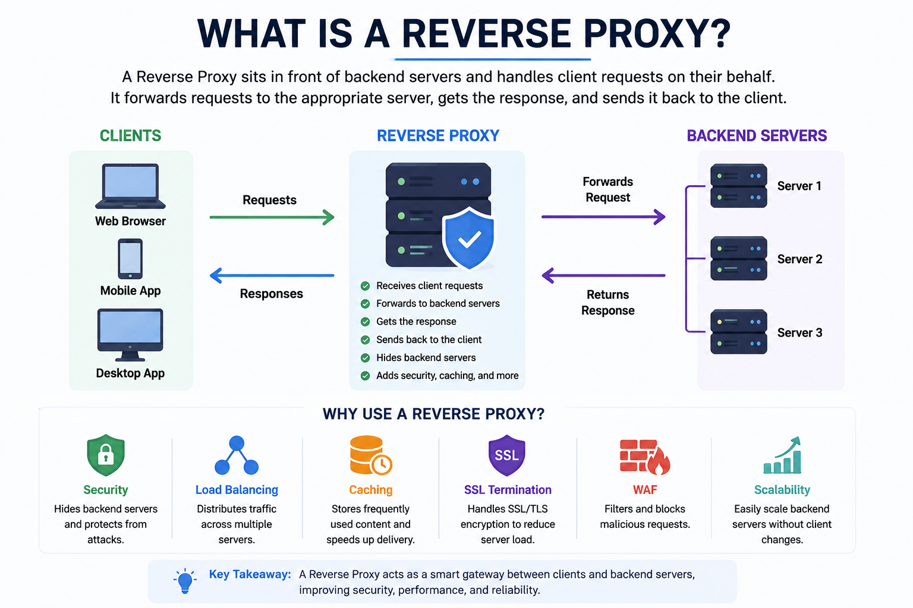
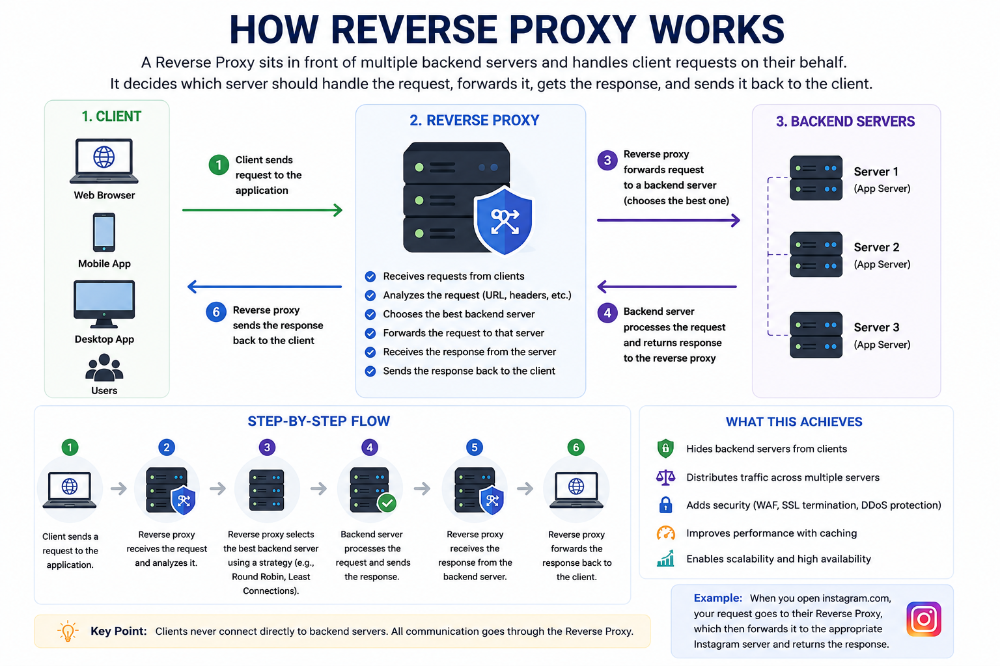
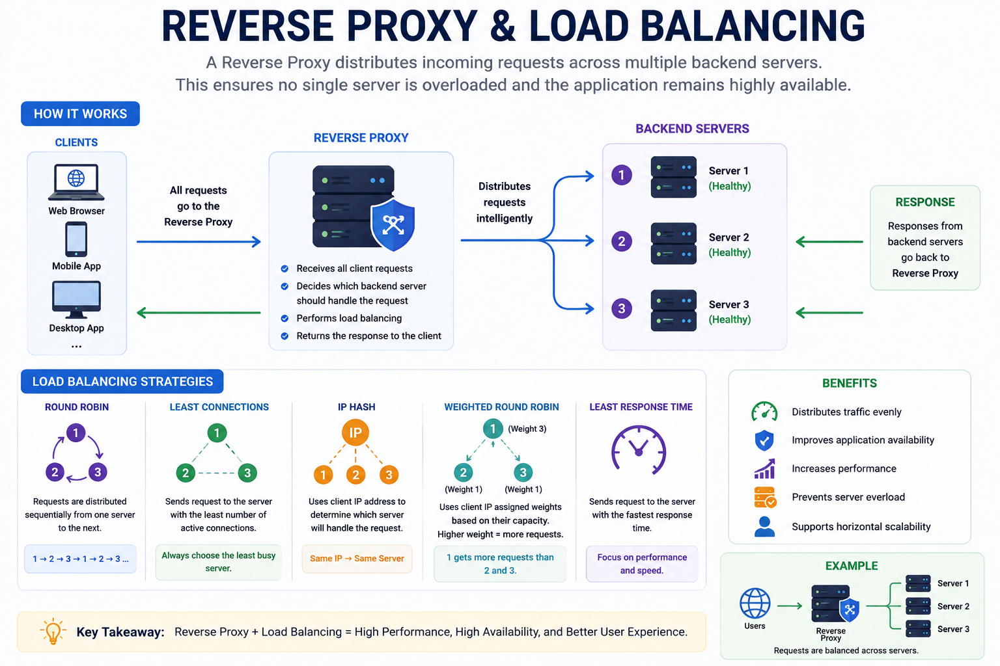
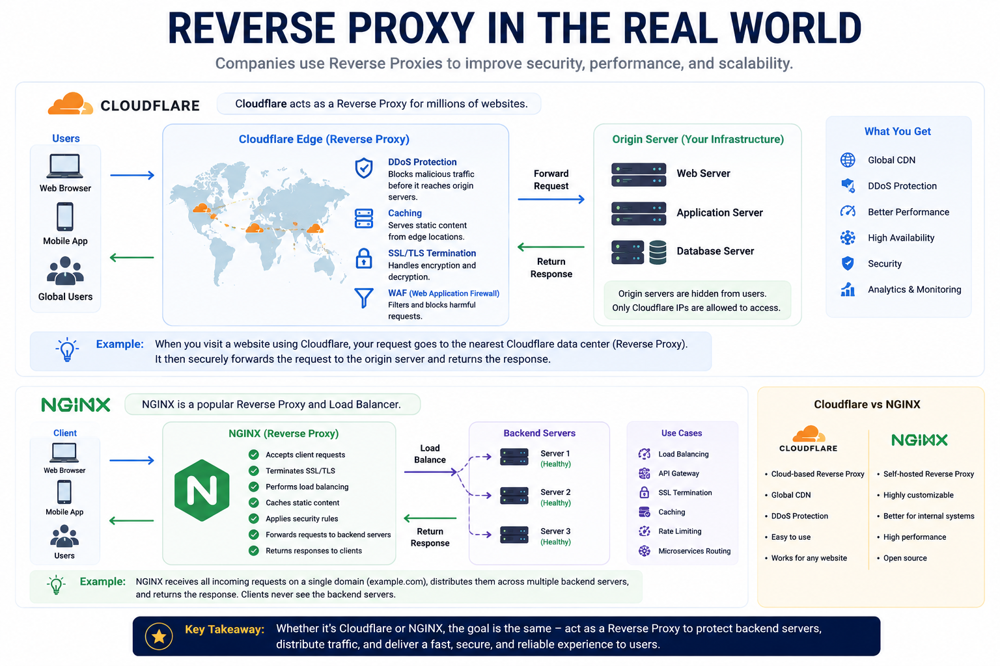
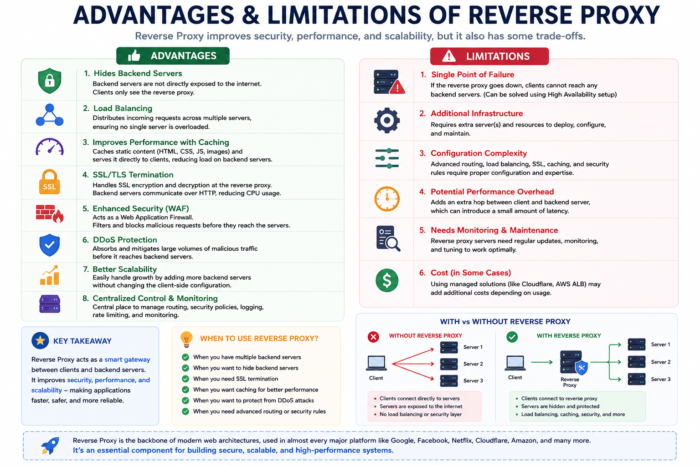

# Reverse Proxy

## 1. Why do we need a Reverse Proxy?

In the previous chapter, we learned about **Proxy Servers**.

A Proxy Server works on behalf of the **client**. It receives requests from the client, forwards them to the destination server, receives the response, and sends it back to the client.

The communication looks like this:

```text
Client
   │
   ▼
Proxy Server
   │
   ▼
Website
```

Now let's ask another important question.

**Who protects the server?**

Imagine Instagram has only one backend server.

```text
Users
   │
   ▼
Instagram Server
```

Everything works perfectly.

But as Instagram becomes popular, millions of users start using the application every day.

One backend server is no longer enough.

Instagram now adds more backend servers.

```text
Instagram

Server 1

Server 2

Server 3

Server 4
```

Now another problem appears.

- Which server should receive the request?
- What happens if one server crashes?
- Should clients know every backend server?
- How do we protect backend servers from hackers?

Instead of allowing users to communicate directly with backend servers, companies place another server in front of them.

This server is called a **Reverse Proxy**.

A Reverse Proxy acts as a middleman between clients and backend servers.

Clients never communicate directly with backend servers.

Instead, every request first reaches the Reverse Proxy.

The Reverse Proxy then decides which backend server should handle the request.

---

## 2. What Problem Does It Solve?

Imagine you visit a hotel.

When you enter the hotel,

do you directly walk into the kitchen and ask a chef to prepare your food?

No.

You first speak with the receptionist.

```text
Customer
     │
     ▼
Receptionist
     │
     ▼
Kitchen
```

The receptionist decides:

- Which chef should prepare your order.
- Which table should receive the food.
- Whether the kitchen is available.

Customers never directly communicate with the kitchen.

Similarly,

a Reverse Proxy acts like the receptionist.

Clients communicate only with the Reverse Proxy.

The Reverse Proxy communicates with the backend servers.

Without a Reverse Proxy:

- Every backend server is exposed to the Internet.
- Hackers can directly attack backend servers.
- Clients need to know backend server addresses.
- Managing multiple servers becomes difficult.

With a Reverse Proxy:

- Backend servers remain hidden.
- One public entry point handles all requests.
- Better security.
- Easier traffic management.
- Better scalability.

---

## 3. Real-Life Analogy

Imagine you visit a hospital.

You don't directly enter the doctor's room.

Instead,

you first visit the reception desk.

```text
Patient
     │
     ▼
Reception
     │
     ▼
Doctor 1

Doctor 2

Doctor 3
```

The receptionist checks:

- Which doctor is available.
- Which department should treat you.
- Which room you should visit.

Here,

- Patient → Client
- Reception → Reverse Proxy
- Doctors → Backend Servers

The receptionist works on behalf of the doctors.

Similarly,

a Reverse Proxy works on behalf of backend servers.

---

## 4. How Does a Reverse Proxy Work Internally?

Let's understand this using Instagram.

### Step 1

You open Instagram.

### Step 2

Your browser creates a request.

```text
GET /feed
```

### Step 3

Instead of sending the request directly to Instagram Server,

the request first reaches the Reverse Proxy.

### Step 4

The Reverse Proxy receives the request.

It checks:

- Is the request valid?
- Which backend server is available?
- Which server has less traffic?

### Step 5

The Reverse Proxy forwards the request to one backend server.

Example:

```text
Instagram Server 2
```

### Step 6

The backend server processes the request.

It retrieves your feed from the database.

### Step 7

The backend server sends the response back to the Reverse Proxy.

### Step 8

The Reverse Proxy sends the response back to your browser.

Finally,

your Instagram feed is displayed.

Notice one important thing.

The client never communicates directly with the backend server.

The client only knows the Reverse Proxy.

---

## 5. Step-by-Step Request Flow

```text
User Opens Instagram
        │
        ▼
Browser Creates Request
        │
        ▼
Reverse Proxy
        │
Checks Request
        │
Chooses Backend Server
        ▼
Instagram Server
        │
Processes Request
        ▼
Reverse Proxy
        │
Returns Response
        ▼
Instagram Feed Displayed
```

---

## 6. What Else Can a Reverse Proxy Do?

A Reverse Proxy does much more than simply forwarding requests.

Modern applications use Reverse Proxies to improve security, performance, and scalability.

Let's look at some of the important features.

### 1. Load Balancing

Imagine Instagram has three backend servers.

```text
Server 1

Server 2

Server 3
```

Instead of sending every request to Server 1,

the Reverse Proxy distributes requests across multiple servers.

Example:

```text
User A → Server 1

User B → Server 2

User C → Server 3
```

This prevents one server from becoming overloaded.

This process is called **Load Balancing**.

> We will learn Load Balancing in detail in the next chapters.

---

### 2. Caching

Some files rarely change.

For example:

- Images
- CSS
- JavaScript

Instead of asking the backend server every time,

the Reverse Proxy can store these files.

When another user requests the same file,

the Reverse Proxy immediately returns the stored copy.

This reduces server load and improves response time.

This is called **Caching**.

> We'll learn Caching in detail in a separate chapter.

---

### 3. SSL Termination

When you open a website using HTTPS,

your connection is encrypted.

Instead of every backend server performing encryption,

the Reverse Proxy can handle encryption for all backend servers.

This reduces the workload on backend servers.

This feature is called **SSL Termination**.

> We'll understand HTTPS and SSL in upcoming chapters.

---

### 4. Web Application Firewall (WAF)

Not every request reaching your application is safe.

Some requests are sent by attackers.

A Reverse Proxy can inspect incoming requests.

If it finds a malicious request,

it blocks it before it reaches the backend servers.

This security feature is called a **Web Application Firewall (WAF)**.

> We'll study application security concepts later.

---

### 5. DDoS Protection

Sometimes attackers send millions of fake requests to crash a website.

This attack is called a **Distributed Denial of Service (DDoS)** attack.

Many Reverse Proxies can detect and block these fake requests before they reach backend servers.

This keeps the application available for real users.

> We'll briefly learn more about DDoS attacks in later System Design topics.

### 6. Real-World Examples

### Cloudflare

Cloudflare is one of the world's most popular Reverse Proxy services.

When you visit many websites, your request first reaches Cloudflare before reaching the actual server.

Instead of immediately forwarding every request, Cloudflare first checks whether the request is safe.

Cloudflare can:

- Protect websites from DDoS attacks.
- Block malicious requests.
- Cache frequently accessed content.
- Improve website performance.
- Forward only safe requests to backend servers.

Millions of websites use Cloudflare because it improves both security and performance.

> 📘 We'll learn Cloudflare in detail when we study **CDN (Content Delivery Network).**

---

### NGINX

NGINX is one of the most popular Reverse Proxy servers used by developers and companies.

Many websites place NGINX in front of their backend servers.

NGINX can:

- Receive client requests.
- Forward requests to backend servers.
- Hide backend server IP addresses.
- Perform Load Balancing.
- Cache static files.
- Handle HTTPS connections.

Because of these features, NGINX is widely used in production systems.

> 📘 We'll learn how to configure NGINX after completing the core System Design concepts.

---

### Example: Instagram

Suppose Instagram has three backend servers.

```text
Instagram Server 1

Instagram Server 2

Instagram Server 3
```

When you refresh your feed,

your request first reaches the Reverse Proxy.

The Reverse Proxy decides which backend server should process your request.

For example,

```text
You
 │
 ▼
Reverse Proxy
 │
 ▼
Instagram Server 2
```

The backend server processes your request and sends the response back through the Reverse Proxy.

You never directly communicate with Instagram's backend servers.

---

### Example: YouTube

Millions of users watch YouTube videos every second.

If every user directly contacted a backend server,

some servers would become overloaded.

Instead,

YouTube uses Reverse Proxies to distribute incoming requests across multiple backend servers.

This keeps YouTube fast and highly available.

---

## 7. Advantages

- Hides backend server IP addresses.
- Improves application security.
- Acts as a single entry point for all requests.
- Can distribute requests across multiple servers.
- Can cache frequently accessed content.
- Can block malicious requests.
- Can protect against DDoS attacks.
- Can handle HTTPS encryption.
- Improves scalability.
- Makes backend infrastructure easier to manage.

---

## 8. Limitations

- Adds another server to maintain.
- Incorrect configuration can affect application performance.
- If a single Reverse Proxy fails, users may not reach the application unless multiple Reverse Proxies are deployed.
- Additional infrastructure increases deployment complexity.
- Requires proper monitoring and maintenance.

---

## 9. Proxy vs Reverse Proxy

| Proxy | Reverse Proxy |
|--------|---------------|
| Works on behalf of the client | Works on behalf of the server |
| Hides the client's IP address | Hides the server's IP address |
| Mainly used by users and organizations | Mainly used by websites and companies |
| Controls outgoing requests | Controls incoming requests |
| Improves client privacy | Improves server security |

---

## 10. Common Interview Questions

### Q1. What is a Reverse Proxy?

A Reverse Proxy is a server that sits in front of backend servers and forwards client requests to the appropriate backend server.

---

### Q2. Why do we need a Reverse Proxy?

A Reverse Proxy improves security, hides backend servers, distributes traffic, caches content, and acts as a single entry point for client requests.

---

### Q3. What is the difference between a Proxy and a Reverse Proxy?

A Proxy represents the client.

A Reverse Proxy represents the server.

---

### Q4. Does a Reverse Proxy hide backend servers?

Yes.

Clients communicate only with the Reverse Proxy.

The backend servers remain hidden from users.

---

### Q5. Can a Reverse Proxy perform Load Balancing?

Yes.

A Reverse Proxy can distribute incoming requests across multiple backend servers.

We'll study different Load Balancing algorithms in the next chapter.

---

### Q6. Can a Reverse Proxy cache files?

Yes.

It can store frequently accessed static files such as images, CSS, and JavaScript.

This improves performance and reduces backend server load.

---

### Q7. Can a Reverse Proxy improve security?

Yes.

It can block malicious requests, hide backend servers, and help protect applications from attacks.

---

### Q8. Is Cloudflare a Reverse Proxy?

Yes.

Cloudflare is one of the most widely used Reverse Proxy services in the world.

It provides security, caching, and performance improvements for millions of websites.

---

## 11. Summary

A **Reverse Proxy** is a server that sits between clients and backend servers.

Instead of clients communicating directly with backend servers, every request first reaches the Reverse Proxy.

The Reverse Proxy then decides which backend server should process the request and returns the response back to the client.

Modern applications use Reverse Proxies to improve:

- Security
- Performance
- Scalability
- Reliability

Reverse Proxies can also perform **Load Balancing**, **Caching**, **SSL Termination**, **Web Application Firewall (WAF)**, and **DDoS Protection**.

Many popular services such as **Cloudflare** and **NGINX** use Reverse Proxy technology to efficiently manage millions of requests every day.

## What's Next?

So far we've learned:

- Client-Server Architecture
- IP Address
- DNS
- Proxy Server
- Reverse Proxy

Now another important question arises.

Even after using DNS, Proxy, and Reverse Proxy, why do some websites still feel slow?

Why does opening Instagram sometimes take longer than usual?

Why does a video on YouTube sometimes buffer before it starts playing?

The answer is **Latency**.

Latency is the time taken for data to travel from the client to the server and back again.

Understanding latency is important because even a few milliseconds of delay can affect the user experience.

In the next chapter, we'll learn what latency is, why it happens, how it is measured, and how modern systems reduce latency to build fast and responsive applications.

---
## Reference Images





