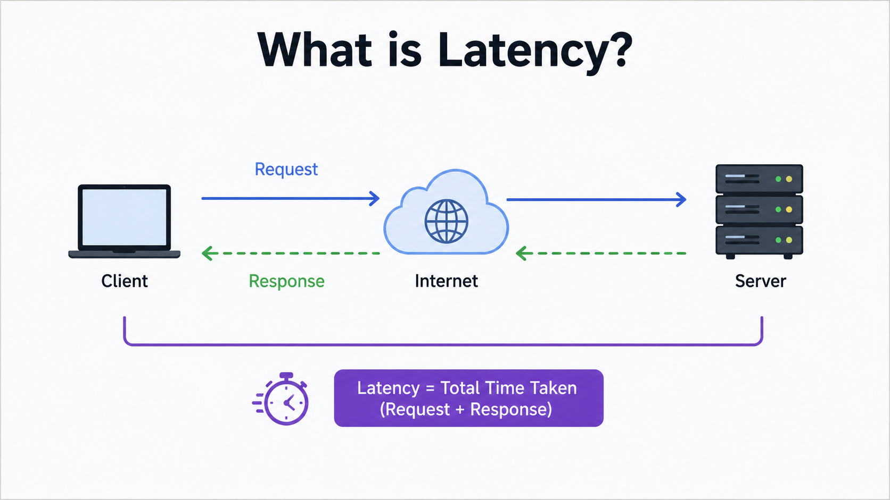
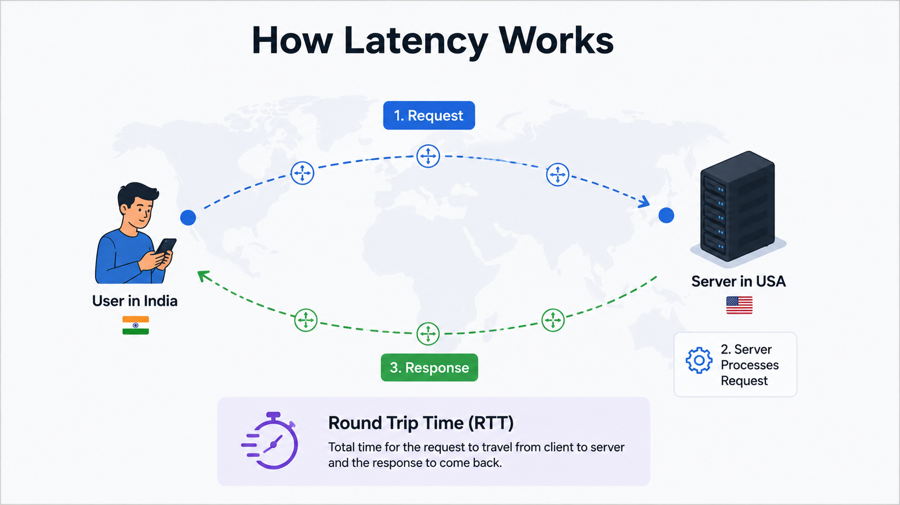
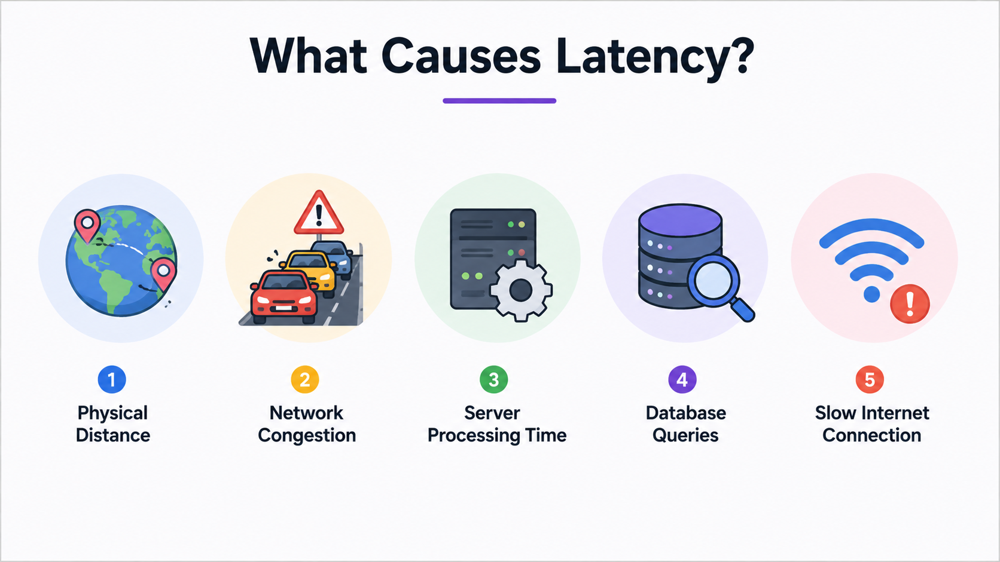
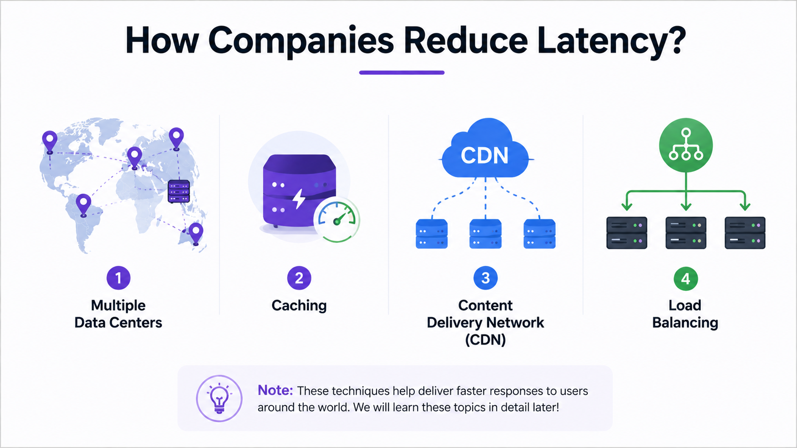
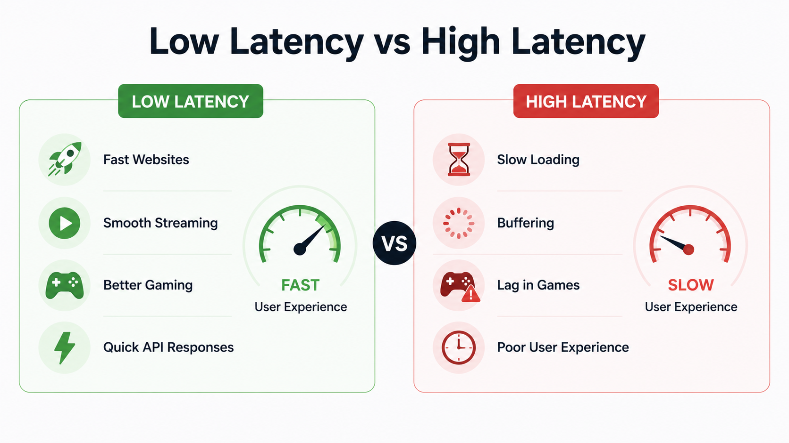

# Latency

## 1. Why do we need to understand Latency?

So far, we've learned how a client communicates with a server.

The communication flow looks like this:

```text
Client
   │
   ▼
DNS
   │
   ▼
Reverse Proxy
   │
   ▼
Server
```

Everything works correctly.

The client finds the server using DNS.

The request passes through the Reverse Proxy.

The server processes the request and sends the response back.

But another important question arises.

**Why do some websites feel fast while others feel slow?**

For example,

- Why does Instagram sometimes load instantly?
- Why does YouTube sometimes take a few seconds before a video starts?
- Why does Swiggy occasionally take longer to load nearby restaurants?

The answer is **Latency**.

Latency is one of the most important factors that affects the speed and responsiveness of an application.

---

## 2. What is Latency?

Latency is the **time taken for data to travel from the client to the server and back to the client.**

This complete journey is called the **Round Trip Time (RTT).**

The lower the latency,

the faster an application feels.

The higher the latency,

the slower the application feels.

Latency is usually measured in **milliseconds (ms).**

Example:

- 10 ms → Very Fast
- 40 ms → Good
- 100 ms → Noticeable Delay
- 300+ ms → Slow User Experience

---

## 3. What Problem Does It Solve?

Latency doesn't stop communication.

Instead,

it explains **why communication takes time.**

Imagine your server is located in New York.

A user from India opens Instagram.

The request must travel:

```text
India
   │
   ▼
New York
```

After the server processes the request,

the response must travel back.

```text
New York
   │
   ▼
India
```

This entire journey takes time.

That delay is called **Latency.**

The greater the distance,

the higher the latency.

---

## 4. Real-Life Analogy

Imagine you order a pizza.

If the restaurant is only 2 minutes away,

your food arrives quickly.

If the restaurant is 20 kilometers away,

it takes much longer to reach you.

The same thing happens on the Internet.

The farther the server is from the user,

the longer the request and response take to travel.

---

## 5. How Does Latency Work?

Let's understand this using Instagram.

### Step 1

You open Instagram.

### Step 2

Your phone creates a request.

```text
GET /feed
```

### Step 3

The request travels through the Internet.

### Step 4

The request reaches Instagram's server.

### Step 5

The server processes the request.

### Step 6

The server sends the response back.

### Step 7

The response travels through the Internet.

### Step 8

Your phone receives the response and displays your feed.

Every step adds a small amount of delay.

The total delay is called **Latency.**

---

## 6. Step-by-Step Request Flow

```text
User Opens Instagram
        │
        ▼
Request Created
        │
        ▼
Internet
        │
        ▼
Reverse Proxy
        │
        ▼
Backend Server
        │
Processes Request
        ▼
Reverse Proxy
        │
        ▼
Internet
        │
        ▼
User Receives Response
```

---

> [!TIP]
> **💡 Did You Know?**
> 
> Even though data travels through fiber optic cables at nearly the speed of light, your request still passes through multiple routers, switches, DNS servers, reverse proxies, and backend servers before reaching its destination.
> 
> That's why every request takes at least a few milliseconds.

---

## 7. What Causes Latency?

Many people think latency happens only because the server is far away.

Physical distance is one reason, but it is not the only reason.

Let's look at the most common causes of latency.

---

### 1. Physical Distance

The farther the server is from the client, the longer data takes to travel.

Example:

A user in India accesses a server located in New York.

The request must travel thousands of kilometers before reaching the server.

The response must then travel the same distance back.

Longer distance usually means higher latency.

---

### 2. Network Congestion

Just like roads become slow during traffic jams,

computer networks can also become busy.

If thousands of users are sending requests at the same time,

network devices take longer to forward packets.

This increases latency.

---

### 3. Server Processing Time

When a request reaches the server,

the server needs time to process it.

For example, it may need to:

- Validate the user.
- Read data from a database.
- Perform calculations.
- Generate the response.

If the server is busy or overloaded,

the response takes longer.

This increases latency.

---

### 4. Database Queries

Most applications store data in databases.

If a database query is slow,

the server has to wait before sending the response.

For example,

Instagram needs to retrieve your posts,

friends,

stories,

and reels from the database.

If the database is slow,

the entire request becomes slower.

---

### 5. Slow Internet Connection

Sometimes the server is fast,

but the user's internet connection is slow.

For example,

using a weak mobile network or poor Wi-Fi connection.

This also increases latency.

---

## 8. How Do Companies Reduce Latency?

Large companies work hard to reduce latency because even a small delay can affect user experience.

Here are some common techniques.

---

### 1. Deploy Multiple Data Centers

Instead of having one server in one country,

companies deploy servers around the world.

Example:

```text
USA

India

Germany

Singapore

Australia
```

When a user opens Instagram,

they are connected to the nearest server instead of a server on another continent.

This greatly reduces latency.

> 📘 We'll learn more about distributed systems and data centers in later chapters.

---

### 2. Caching

Instead of generating the same response every time,

applications store frequently accessed data in a cache.

When another user requests the same data,

it is returned directly from the cache.

This reduces response time.

> 📘 We'll study Caching in detail in a separate chapter.

---

### 3. Content Delivery Network (CDN)

A CDN stores copies of static files closer to users.

For example:

- Images
- Videos
- CSS
- JavaScript

Instead of downloading these files from one central server,

users receive them from the nearest CDN server.

This significantly reduces latency.

> 📘 We'll study CDN in detail in a later chapter.

---

### 4. Load Balancing

When millions of users access a website,

sending every request to one server would make it slow.

Instead,

Load Balancers distribute requests across multiple backend servers.

This prevents server overload and improves response time.

> 📘 We'll learn Load Balancing in detail in an upcoming chapter.

---

## 9. Real-World Examples

### Instagram

Suppose Instagram has servers in:

- India
- Singapore
- USA

If you're in India,

your request is usually handled by the Indian server.

This reduces latency and loads your feed faster.

---

### YouTube

When you watch a video,

YouTube delivers it from a nearby server whenever possible.

This reduces buffering and improves video playback.

---

### Netflix

Netflix stores popular movies and TV shows on servers located close to users.

As a result,

videos start quickly and play smoothly.

---

### Swiggy

When you open Swiggy,

the application connects to servers closest to your location.

This helps display nearby restaurants and menus more quickly.

---

> [!TIP]
> **💡 Did You Know?**
> 
> Google has data centers in many regions around the world.
> 
> When you search on Google, your request is usually handled by the nearest available server instead of one located on another continent.
> 
> This is one reason why Google Search feels so fast.

---

## 10. Advantages of Low Latency

- Faster website loading.
- Better user experience.
- Smooth video streaming.
- Faster online gaming.
- Quicker API responses.
- Better real-time communication.
- Higher customer satisfaction.

---

## 11. Problems Caused by High Latency

- Slow websites.
- Video buffering.
- Delayed online games.
- Lag during video calls.
- Slow API responses.
- Poor user experience.
- Increased waiting time.

---

## 12. Common Interview Questions

### Q1. What is Latency?

Latency is the time taken for data to travel from the client to the server and back to the client.

---

### Q2. How is Latency measured?

Latency is measured in milliseconds (ms).

---

### Q3. Is Latency the same as Internet Speed?

No.

Internet speed measures how much data can be transferred.

Latency measures how long data takes to travel.

---

### Q4. What is Round Trip Time (RTT)?

Round Trip Time is the total time taken for a request to travel from the client to the server and for the response to return to the client.

---

### Q5. Name some common causes of Latency.

- Physical distance
- Network congestion
- Slow server processing
- Slow database queries
- Poor internet connection

---

### Q6. How do companies reduce Latency?

Companies reduce latency by:

- Deploying multiple data centers
- Using caching
- Using CDNs
- Using Load Balancers

---

## 13. Summary

Latency is the time taken for data to travel between the client and the server.

Every request experiences some delay while travelling through the network, being processed by the server, and returning to the client.

Low latency makes applications feel fast and responsive, while high latency leads to delays, buffering, and poor user experience.

Modern applications reduce latency using multiple data centers, caching, CDNs, and load balancing to deliver faster responses to users around the world.

---

## What's Next?

So far we've learned:

- Client-Server Architecture
- IP Address
- DNS
- Proxy Server
- Reverse Proxy
- Latency

Now we know **how requests travel** and **how long they take**.

But another important question remains.

**How do the client and server actually communicate once the connection is established?**

What language do they use to exchange requests and responses?

The answer is **HTTP and HTTPS**.

In the next chapter, we'll learn how browsers and servers communicate using HTTP, why HTTPS is more secure, and why almost every modern website uses HTTPS today.

---
## Reference Images





