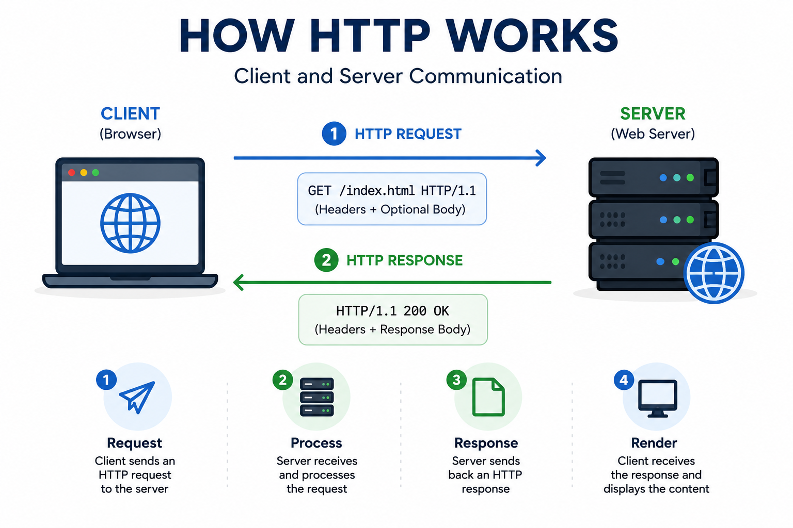
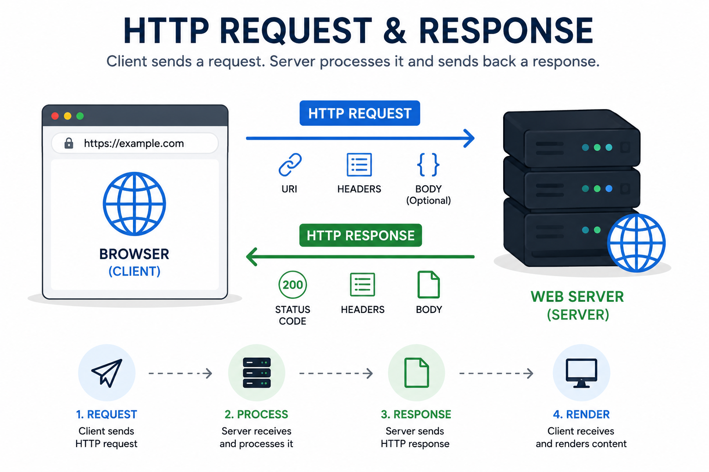
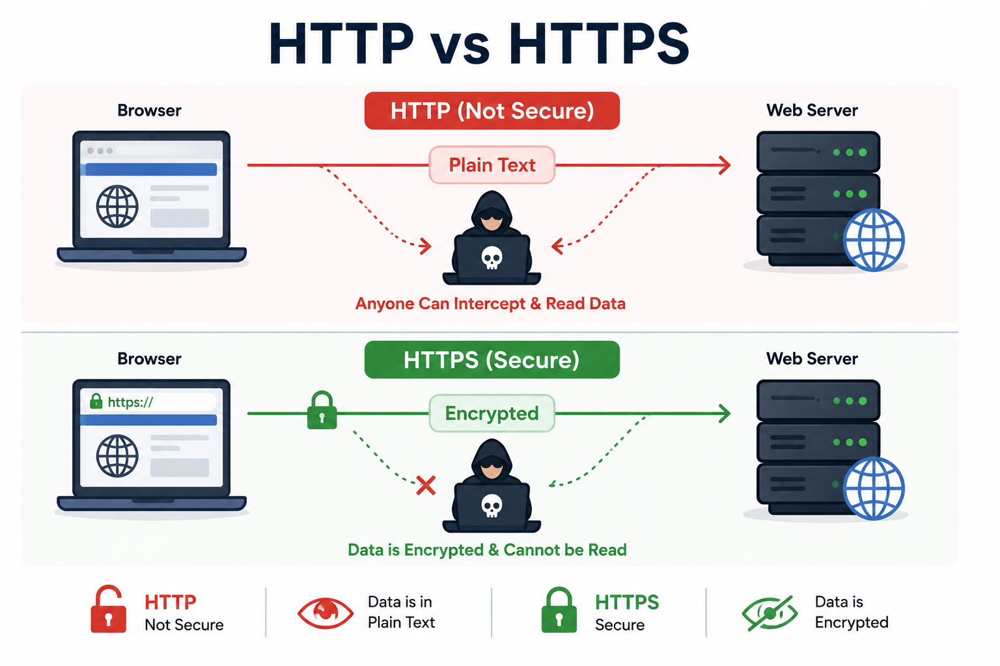
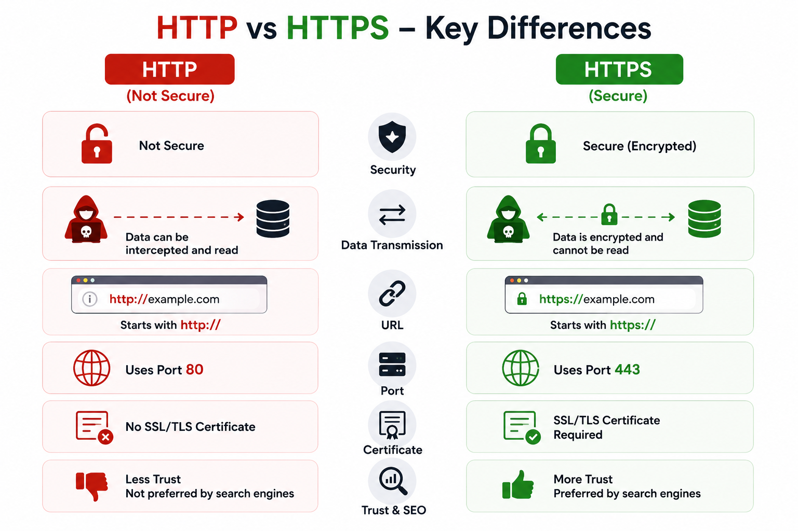

# HTTP / HTTPS

## 1. Why do we need HTTP?

So far, we've learned how a client communicates with a server.

The communication flow looks like this:

```text
Client
   │
   ▼
DNS
   │
   ▼
Reverse Proxy
   │
   ▼
Server
```

The client now knows where the server is.

The server receives the request.

But another important question arises.

**How do the client and server actually communicate?**

How does the browser ask the server:

- Give me the homepage.
- Show my Instagram feed.
- Log me into my account.
- Search for "Python Tutorial" on YouTube.

The client and server need a common language that both understand.

This common language is called **HTTP (Hypertext Transfer Protocol).**

HTTP defines a standard set of rules that allows clients and servers to exchange requests and responses.

Without HTTP, browsers and servers would not know how to communicate with each other.

---

## 2. What Problem Does It Solve?

Imagine two people.

One speaks English.

The other speaks Japanese.

Without a common language,

they cannot communicate.

Now imagine both of them know English.

Communication becomes easy.

The same thing happens on the Internet.

Browsers and servers also need a common language.

HTTP provides that common language.

It defines:

- How a client sends a request.
- How a server responds.
- How data should be exchanged.

Without HTTP,

every browser and every server would have to invent their own communication method.

The Internet would become incompatible.

---

## 3. Real-Life Analogy

Imagine you visit a restaurant.

```text
Customer
     │
     ▼
Waiter
     │
     ▼
Kitchen
```

The customer tells the waiter what they want.

The waiter carries the order to the kitchen.

The kitchen prepares the food.

The waiter brings the food back.

Similarly,

- Customer → Client
- Kitchen → Server
- Food Order → HTTP Request
- Prepared Food → HTTP Response

HTTP works like the waiter.

It carries requests from the client to the server and brings responses back to the client.

---

## 4. How Does HTTP Work?

Let's understand this using Instagram.

### Step 1

You open Instagram.

### Step 2

Your browser creates an HTTP request.

```http
GET /feed
```

### Step 3

The request is sent to Instagram's server.

### Step 4

The server receives the request.

### Step 5

The server processes the request.

It retrieves your feed from the database.

### Step 6

The server creates an HTTP response.

Example:

```http
HTTP/1.1 200 OK
```

along with your Instagram feed.

### Step 7

The response travels back to your browser.

### Step 8

Your browser displays your latest posts, stories, and reels.

This entire communication happens using HTTP.

---

## 5. Step-by-Step Request Flow

```text
User Opens Instagram
        │
        ▼
Browser Creates HTTP Request
        │
        ▼
Internet
        │
        ▼
Reverse Proxy
        │
        ▼
Backend Server
        │
Processes Request
        ▼
Creates HTTP Response
        │
        ▼
Reverse Proxy
        │
        ▼
Internet
        │
        ▼
Browser Displays Feed
```

---

## 6. Structure of an HTTP Request

Every HTTP request contains different parts.

### Request Line

The request line tells the server what the client wants.

Example:

```http
GET /feed HTTP/1.1
```

Here,

- **GET** → HTTP Method
- **/feed** → Resource
- **HTTP/1.1** → HTTP Version

---

### Request Headers

Headers provide additional information about the request.

Example:

```http
Host: instagram.com
User-Agent: Chrome
Authorization: Bearer Token
Content-Type: application/json
```

Headers help the server understand:

- Which browser is making the request.
- Which website is being accessed.
- Whether the user is authenticated.
- What type of data is being sent.

---

### Request Body

Some requests also contain a body.

The request body carries additional data.

Example:

```json
{
  "username": "john",
  "password": "mypassword"
}
```

Usually,

- GET requests do not have a request body.
- POST, PUT, PATCH, and QUERY requests may contain a request body.

---

## 7. Structure of an HTTP Response

After processing the request,

the server sends an HTTP response.

A response also contains different parts.

### Status Line

The status line tells whether the request was successful.

Example:

```http
HTTP/1.1 200 OK
```

---

### Response Headers

Headers provide information about the response.

Example:

```http
Content-Type: application/json
Content-Length: 512
Cache-Control: no-cache
```

These headers tell the browser:

- What type of data is being returned.
- How large the response is.
- Whether the response should be cached.

---

### Response Body

The response body contains the actual data requested by the client.

Example:

```json
{
  "posts": [
    {
      "username": "alice",
      "caption": "Beautiful Sunset"
    }
  ]
}
```

The browser reads this data and displays it to the user.

---

> [!TIP]
> **💡 Did You Know?**
>
> Every time you open a website, your browser sends multiple HTTP requests—not just one.
>
> For example, opening Instagram may require separate requests for:
> - HTML
> - CSS
> - JavaScript
> - Images
> - User profile
> - Posts
> - Stories
>
> A single webpage often involves dozens or even hundreds of HTTP requests behind the scenes.

---

## 8. Common HTTP Methods

HTTP provides different methods for performing different operations.

Each method tells the server what action the client wants to perform.

---

### GET

The **GET** method is used to retrieve data from the server.

It only requests information and does not modify anything.

Example:

```http
GET /feed
```

Real-world examples:

- Loading Instagram feed.
- Searching videos on YouTube.
- Viewing products on Amazon.
- Loading nearby restaurants on Swiggy.

---

### POST

The **POST** method is used to send new data to the server.

It is commonly used when creating a new resource.

Example:

```http
POST /login
```

Real-world examples:

- Logging into Instagram.
- Creating a new Facebook post.
- Registering a new account.
- Placing an order on Swiggy.

---

### PUT

The **PUT** method replaces an existing resource with new data.

If the resource does not exist, some servers may create it.

Example:

```http
PUT /profile
```

Real-world examples:

- Updating your complete profile information.
- Replacing an existing document.
- Updating all user details.

---

### PATCH

The **PATCH** method updates only specific fields of a resource.

Unlike PUT, it does not replace the entire resource.

Example:

```http
PATCH /profile
```

Real-world examples:

- Updating only your profile picture.
- Changing your password.
- Editing only your bio.

---

### DELETE

The **DELETE** method removes a resource from the server.

Example:

```http
DELETE /post/101
```

Real-world examples:

- Deleting an Instagram post.
- Removing a YouTube playlist.
- Deleting a comment.
- Cancelling a saved address.

---

## 9. The New HTTP QUERY Method

For many years, developers mainly used:

- GET
- POST
- PUT
- PATCH
- DELETE

Recently, HTTP introduced another method called **QUERY**.

The QUERY method is used when a client wants to retrieve data but also needs to send a request body containing complex search filters.

Imagine an e-commerce website.

A user searches for laptops using multiple filters:

- Brand
- RAM
- Storage
- Price
- Rating

Using GET, the URL becomes very long.

Example:

```text
/products?brand=Apple&ram=16GB&storage=512GB&price=1000
```

Instead,

the QUERY method allows these filters to be sent inside the request body.

Example:

```json
{
    "brand":"Apple",
    "ram":"16GB",
    "storage":"512GB",
    "price":1000
}
```

Unlike POST,

QUERY is intended only for retrieving data.

It should not modify any data stored on the server.

> **Note:** QUERY is a relatively new HTTP method. Most existing applications still use GET or POST for search operations, so support for QUERY is still growing.

---

## 10. Common HTTP Status Codes

Whenever a server processes a request,

it sends back a status code indicating whether the request was successful.

Here are some of the most common status codes.

### 200 OK

The request was successful.

Example:

Loading your Instagram feed successfully.

---

### 201 Created

A new resource was successfully created.

Example:

Creating a new Instagram post.

---

### 400 Bad Request

The server could not understand the request because it was invalid.

Example:

Sending incorrect data while registering.

---

### 401 Unauthorized

The client is not authenticated.

Example:

Trying to access your profile without logging in.

---

### 403 Forbidden

The client is authenticated but does not have permission.

Example:

Trying to access an admin dashboard as a normal user.

---

### 404 Not Found

The requested resource does not exist.

Example:

Opening a deleted YouTube video.

---

### 500 Internal Server Error

Something went wrong on the server.

Example:

The server crashes while processing your request.

---

> [!TIP]
> **💡 Did You Know?**
>
> HTTP status codes are grouped into five categories.
>
> | Range | Meaning |
> |--------|----------|
> | 1xx | Informational |
> | 2xx | Success |
> | 3xx | Redirection |
> | 4xx | Client Errors |
> | 5xx | Server Errors |
>
> This numbering system helps developers quickly identify the type of response returned by the server.

---

## 11. The Problem with HTTP

HTTP works well for communication,

but it has one major problem.

**HTTP sends data as plain text.**

Imagine you log into your bank account.

You enter:

```text
Username

Password
```

Using HTTP,

this information travels across the network without encryption.

If an attacker intercepts the request,

they may be able to read your sensitive information.

This creates serious security risks.

Sensitive information such as:

- Passwords
- Credit Card Details
- Banking Information
- Personal Data

should never be transmitted as plain text.

This is why modern websites no longer use plain HTTP for sensitive communication.

---

## 12. What is HTTPS?

HTTPS stands for

**Hypertext Transfer Protocol Secure.**

HTTPS is simply HTTP with an additional security layer.

Instead of sending data as plain text,

HTTPS encrypts all communication between the client and the server.

Even if someone intercepts the data,

they cannot understand or modify it.

This makes HTTPS much safer than HTTP.

Today,

almost every modern website uses HTTPS to protect user data.

---

## 13. How Does HTTPS Work?

The communication process is almost the same as HTTP.

The only difference is that all data is encrypted before it leaves the client.

### Step 1

The browser creates an HTTP request.

### Step 2

HTTPS encrypts the request using SSL/TLS.

### Step 3

The encrypted request is sent to the server.

### Step 4

The server decrypts the request.

### Step 5

The server processes the request.

### Step 6

The server encrypts the response.

### Step 7

The browser decrypts the response and displays the data.

Throughout the entire communication,

the transmitted data remains encrypted.


## 14. What is SSL/TLS?

SSL (Secure Sockets Layer) and TLS (Transport Layer Security) are security protocols used to encrypt communication between a client and a server.

Today, TLS is the modern and more secure version of SSL, but people still commonly use the term "SSL Certificate."

When you visit a website using HTTPS,

SSL/TLS ensures that:

- Data is encrypted before being sent.
- Only the client and server can read the data.
- Attackers cannot easily steal sensitive information.
- The client can verify that it is communicating with the correct server.

This is why websites ask for an **SSL/TLS Certificate** before enabling HTTPS.

> 📘 We'll learn SSL/TLS and encryption in much more detail in later networking and security topics.

---

## 15. HTTP vs HTTPS

| HTTP | HTTPS |
|-------|--------|
| Hypertext Transfer Protocol | Hypertext Transfer Protocol Secure |
| Data is sent as plain text | Data is encrypted |
| Not secure for sensitive data | Secure for sensitive data |
| Uses Port 80 | Uses Port 443 |
| No SSL/TLS required | Requires SSL/TLS Certificate |
| Faster because there is no encryption | Slightly more processing due to encryption |
| URL starts with **http://** | URL starts with **https://** |

---

## 16. Real-World Examples

### Instagram

When you log into Instagram,

your username and password travel through HTTPS.

This prevents attackers from reading your login credentials.

---

### Amazon

When you purchase a product,

your payment details are protected using HTTPS.

Without HTTPS,

credit card information could be exposed.

---

### Online Banking

Banks always use HTTPS.

Your account details,

password,

and transaction information remain encrypted during communication.

---

### Google

Whenever you search on Google,

the communication between your browser and Google's servers is protected using HTTPS.

---

### Government Websites

Most government portals also use HTTPS to protect citizens' personal information and official documents.

---

> [!TIP]
> **💡 Did You Know?**
>
> If you click the **🔒 lock icon** next to a website's address in your browser, you can view information about its HTTPS connection and SSL/TLS certificate.
>
> This helps verify that your connection to the website is secure.

---

## 17. Advantages

### HTTP

- Simple communication protocol.
- Easy to implement.
- Slightly lower processing overhead.

---

### HTTPS

- Encrypts all communication.
- Protects passwords and personal information.
- Prevents attackers from reading transmitted data.
- Builds trust with users.
- Required for modern websites and online payments.
- Improves overall security.

---

## 18. Limitations

### HTTP

- Data is transmitted as plain text.
- Vulnerable to eavesdropping.
- Not suitable for sensitive information.

---

### HTTPS

- Requires an SSL/TLS certificate.
- Encryption introduces a small processing overhead.
- Certificates must be managed and renewed.

Although HTTPS has a small performance cost, the security benefits are far more important.

---

## 19. Common Interview Questions

### Q1. What is HTTP?

HTTP (Hypertext Transfer Protocol) is a communication protocol that defines how clients and servers exchange requests and responses.

---

### Q2. What is HTTPS?

HTTPS is the secure version of HTTP that encrypts communication using SSL/TLS.

---

### Q3. What is the main difference between HTTP and HTTPS?

HTTP sends data as plain text, while HTTPS encrypts the data before transmission.

---

### Q4. Why is HTTPS more secure?

HTTPS encrypts communication, making it difficult for attackers to read or modify transmitted data.

---

### Q5. What is SSL/TLS?

SSL/TLS is a security protocol that encrypts communication between the client and the server.

---

### Q6. Which ports do HTTP and HTTPS use?

- HTTP → Port 80
- HTTPS → Port 443

---

### Q7. Why do modern websites use HTTPS?

Modern websites use HTTPS to protect user data, improve security, and establish trust between users and servers.

---

### Q8. What is the QUERY HTTP Method?

QUERY is a newer HTTP method designed for retrieving data using complex search criteria in the request body without modifying server data.

It provides a safer alternative for advanced search operations where GET URLs would become too large.

---

## 20. Summary

HTTP (Hypertext Transfer Protocol) is the standard protocol that allows clients and servers to communicate by exchanging requests and responses.

It defines how requests are sent and how responses are returned.

However, HTTP sends data as plain text, making it unsuitable for transmitting sensitive information.

HTTPS improves security by encrypting all communication using SSL/TLS.

Today, almost every modern website uses HTTPS to protect user data and ensure secure communication.

Understanding HTTP and HTTPS is essential because they form the foundation of communication on the World Wide Web.

---

## ✅ Key Takeaway

- HTTP defines **how clients and servers communicate.**
- HTTPS is simply **HTTP protected with SSL/TLS encryption.**
- Modern web applications almost always use **HTTPS** to keep user data secure.

---

## 🚀 What's Next?

Now we know **how clients and servers communicate** using HTTP and HTTPS.

But another important question remains.

**How does a client know which URL to call?**

**How does the server expose its functionality to other applications?**

**How can a mobile app communicate with a backend server?**

The answer is **APIs (Application Programming Interfaces).**

In the next chapter, we'll learn what APIs are, why they are important, how they work, and how they enable different applications to communicate with each other.

---
## Reference Images





