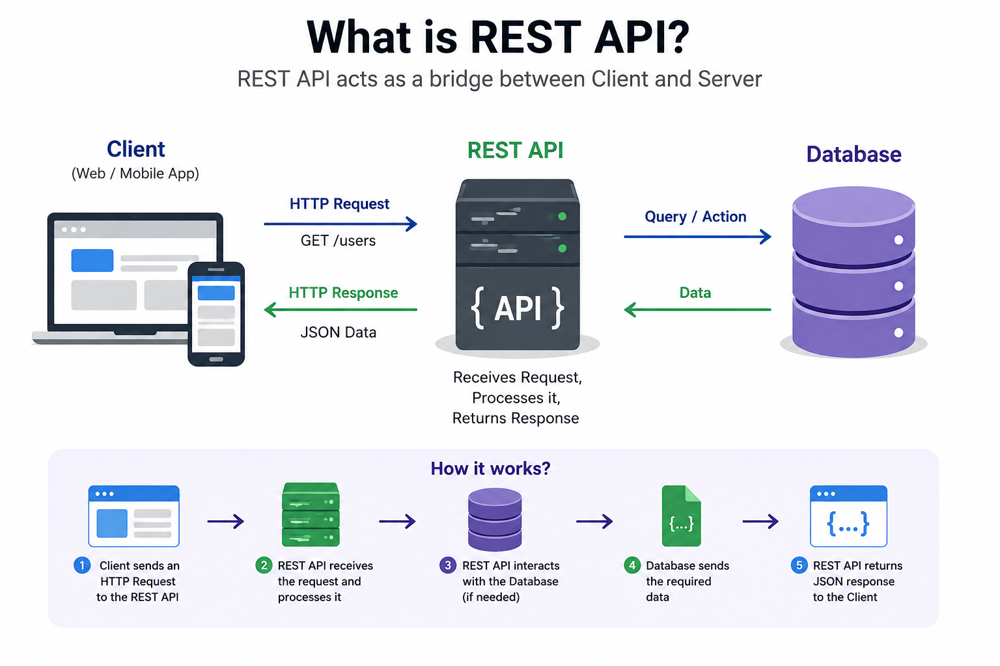
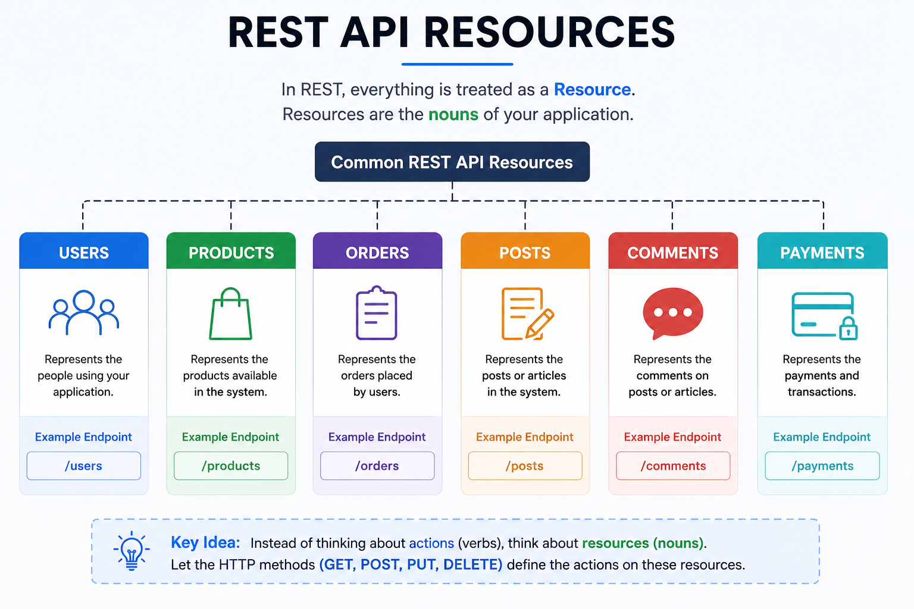
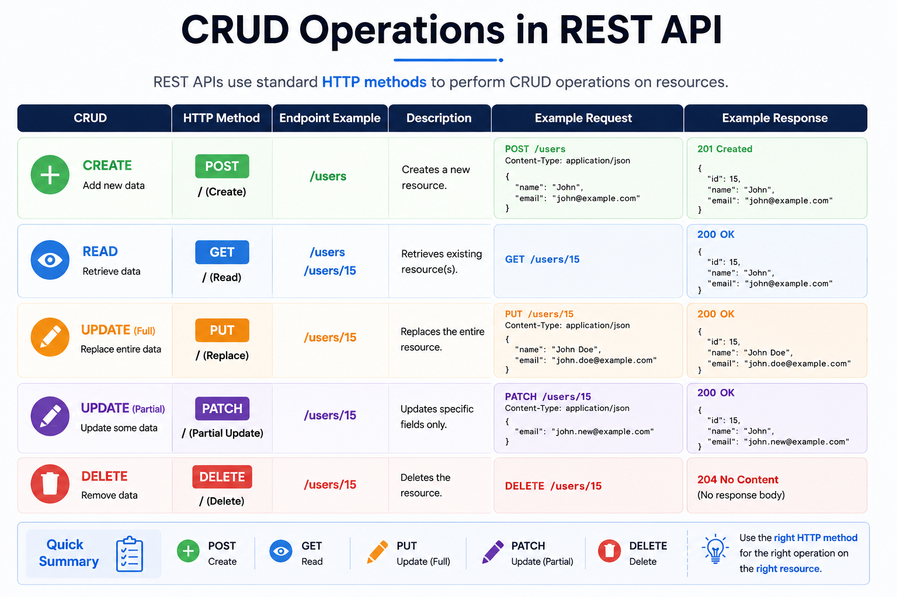
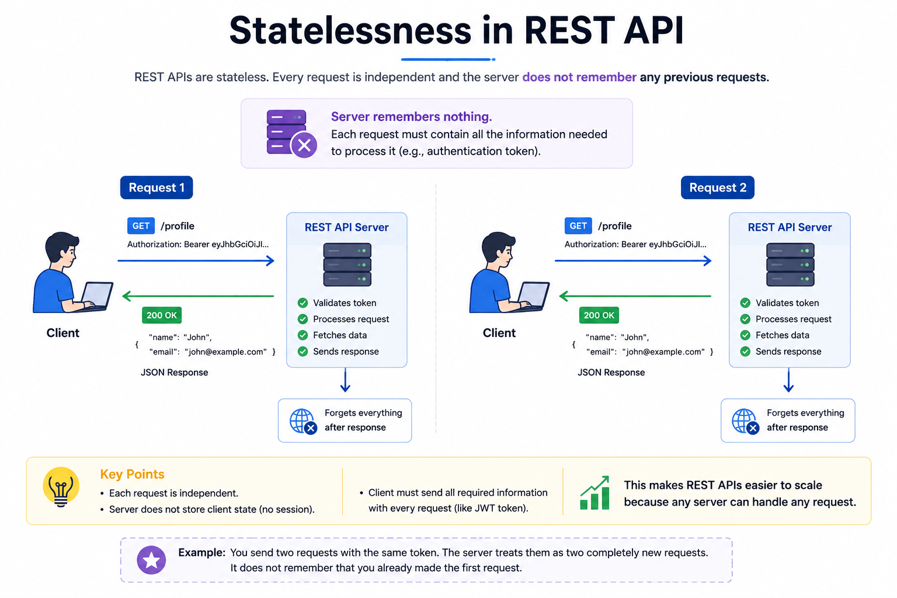
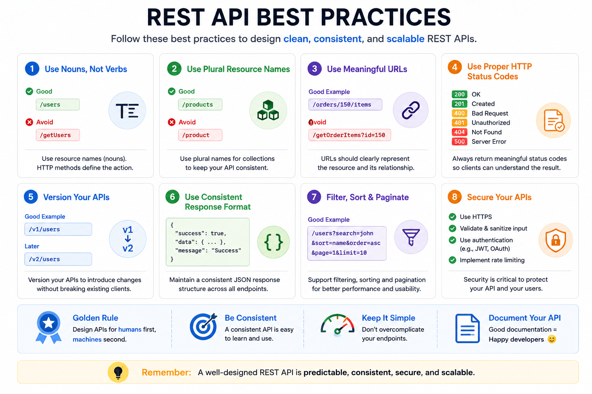

# REST API (Representational State Transfer)

## 1. Why do We Need REST APIs?

In the previous chapter, we learned about **APIs**.

An API allows different software applications to communicate with each other.

For example,

- Instagram provides APIs to load your feed.
- YouTube provides APIs to search videos.
- Amazon provides APIs to view products.
- Swiggy provides APIs to fetch nearby restaurants.

Now imagine if every company designed their APIs in completely different ways.

Instagram:

```text
/loadMyFeed
```

YouTube:

```text
/getVideosNow
```

Amazon:

```text
/showProductsList
```

Swiggy:

```text
/fetchRestaurantsNearMe
```

Every application would use different URL structures, naming conventions, and request formats.

Developers would need to learn a different API design for every company.

This would make development difficult and inconsistent.

To solve this problem,

an architectural style called **REST (Representational State Transfer)** was introduced.

REST provides a common set of principles for designing APIs so that they are consistent, predictable, and easy to understand.

Today,

most modern web applications expose their APIs using REST.

---

## 2. What is REST API?

REST stands for **Representational State Transfer**.

A REST API is an API that follows the principles of REST.

It defines a standard way for clients and servers to communicate over HTTP.

A REST API treats everything as a **resource**.

For example,

```text
/users
/products
/orders
/posts
/comments
```

Each resource can be created, retrieved, updated, or deleted using standard HTTP methods.

One important thing to remember is that REST is **not**:

- A programming language
- A framework
- A protocol

REST is an **architectural style** that provides guidelines for building APIs.

---

## 3. What Problem Does REST Solve?

Imagine three different companies.

Each company builds its own API.

Without REST,

they may use completely different endpoint names.

Company A

```text
/getAllUsers
```

Company B

```text
/loadUsers
```

Company C

```text
/fetchUserInformation
```

Although all three APIs perform the same task,

they use different naming conventions.

This makes APIs difficult to learn and maintain.

REST introduces consistency.

Instead of inventing random endpoint names,

REST encourages developers to use meaningful resource names.

Example:

```text
/users
```

This makes APIs easier to understand because most REST APIs follow similar patterns.

Developers can quickly understand a new API without learning completely new conventions.

---

## 4. Real-Life Analogy

Imagine a library.

The library contains many resources.

- Books
- Newspapers
- Magazines

You don't need to know where the books are stored.

You simply tell the librarian what you want.

For example,

"I want Book 25."

The librarian retrieves the book and gives it to you.

Similarly,

REST APIs expose resources.

The client requests a resource,

and the server returns it.

The client doesn't need to know how the server stores or processes the data internally.

---

## 5. How Does a REST API Work?

Let's continue using Instagram as an example.

### Step 1

You open Instagram.

### Step 2

The app wants to load your feed.

### Step 3

The app sends an HTTP request to the REST API.

```http
GET /posts
```

### Step 4

The REST API receives the request.

### Step 5

The API validates the request.

If required,

it checks authentication and permissions.

### Step 6

The API executes the business logic.

### Step 7

The API retrieves the requested posts from the database.

### Step 8

The data is converted into JSON.

Example:

```json
[
  {
    "username": "john",
    "caption": "Beautiful Sunset"
  }
]
```

### Step 9

The API sends the JSON response back to the client.

### Step 10

Instagram displays your feed.

Notice that the client never communicates directly with the database.

Everything happens through the REST API.

---

## 6. REST Architecture

A typical REST architecture looks like this.

```text
Client
   │
HTTP Request
   │
   ▼
REST API
   │
Business Logic
   │
   ▼
Database
   │
JSON Response
   ▼
Client
```

Each component has its own responsibility.

**Client**

Creates requests and displays responses.

**REST API**

Receives requests, validates them, and processes them.

**Business Logic**

Implements the application's rules and functionality.

**Database**

Stores and retrieves data.

This separation makes applications easier to maintain and scale.

---
## 7. Resources

One of the most important concepts in REST is the idea of **Resources**.

A resource is any piece of data that the server manages.

Everything in REST is treated as a resource.

Examples:

```text
/users
/products
/orders
/posts
/comments
/payments
```

Instead of thinking about functions,

REST encourages us to think about **resources**.

For example,

Instead of creating an endpoint like this:

```text
/getAllUsers
```

REST recommends:

```text
/users
```

Similarly,

Instead of:

```text
/createProduct
```

REST recommends:

```text
/products
```

The HTTP method tells the server what action should be performed on the resource.

This keeps APIs simple and consistent.

---

## 8. Endpoints

An endpoint is a specific URL through which a client interacts with a resource.

Examples:

```text
GET /users
```

Returns all users.

---

```text
GET /users/15
```

Returns the user whose ID is 15.

---

```text
POST /users
```

Creates a new user.

---

```text
PATCH /users/15
```

Updates some information about user 15.

---

```text
DELETE /users/15
```

Deletes user 15.

Notice something interesting.

The resource remains the same.

```text
/users
```

Only the HTTP method changes.

This is one of the biggest advantages of REST.

---

## 9. CRUD Operations

Most applications perform four basic operations on data.

These operations are called **CRUD**.

| Operation | Meaning |
|-----------|---------|
| Create | Add new data |
| Read | Retrieve existing data |
| Update | Modify existing data |
| Delete | Remove existing data |

REST maps these operations to HTTP methods.

| CRUD | HTTP Method |
|------|-------------|
| Create | POST |
| Read | GET |
| Update | PUT / PATCH |
| Delete | DELETE |

Example:

```text
POST /users
```

Create a user.

---

```text
GET /users
```

Read users.

---

```text
PATCH /users/15
```

Update user 15.

---

```text
DELETE /users/15
```

Delete user 15.

Almost every REST API follows this pattern.

---

## 10. HTTP Methods in REST

REST uses standard HTTP methods to perform different operations on resources.

### GET

Used to retrieve data.

Example:

```text
GET /products
```

Returns all products.

---

### POST

Used to create new data.

Example:

```text
POST /products
```

Creates a new product.

---

### PUT

Used to replace an entire resource.

Example:

```text
PUT /products/5
```

Replaces all information about product 5.

---

### PATCH

Used to update only specific fields.

Example:

```text
PATCH /products/5
```

Updates only selected information.

For example,

only changing the product price.

---

### DELETE

Used to remove a resource.

Example:

```text
DELETE /products/5
```

Deletes product 5.

Because REST uses standard HTTP methods,

developers immediately understand what an endpoint does.

---

## 11. Statelessness

One of the most important principles of REST is **Statelessness**.

Stateless means:

Every request is completely independent.

The server does not remember previous requests.

Each request must contain all the information needed to process it.

For example,

Suppose you request your profile.

```text
GET /profile
```

The request includes your JWT token.

The server verifies the token,

returns your profile,

and forgets everything after sending the response.

If you send another request,

the server again checks the JWT token.

It does not remember that you already logged in earlier.

Every request starts fresh.

This makes REST APIs easier to scale because any server can process any request.

---

## 12. Client-Server Principle

REST separates the client from the server.

The client is responsible for:

- Displaying the user interface.
- Collecting user input.
- Sending requests.

The server is responsible for:

- Processing requests.
- Executing business logic.
- Accessing the database.
- Returning responses.

Example:

```text
Mobile App
      │
      ▼
REST API
      │
      ▼
Database
```

This separation allows both the client and server to evolve independently.

For example,

the backend can change its database without affecting the mobile application,

as long as the API remains the same.

---

## 13. Cacheability

REST supports caching.

Caching allows frequently requested data to be stored temporarily.

Instead of asking the server every time,

the client or browser can use the cached data.

Example:

Suppose thousands of users visit the same product page.

Instead of querying the database for every request,

the response can be cached.

This reduces:

- Database load.
- Server load.
- Response time.

Caching makes REST APIs much faster.

---

## 14. Uniform Interface

REST APIs should follow a consistent design.

This is called the **Uniform Interface** principle.

For example,

good REST endpoints:

```text
/users
/products
/orders
/comments
```

Poor endpoint names:

```text
/getUserData
/loadProductsNow
/fetchOrdersImmediately
```

REST encourages developers to use simple,

resource-based URLs.

Because of this,

developers can easily understand a new REST API without reading extensive documentation.

---

## 15. Layered System

REST APIs are usually part of a layered architecture.

Example:

```text
Client
   │
   ▼
Load Balancer
   │
   ▼
API Gateway
   │
   ▼
REST API
   │
   ▼
Microservice
   │
   ▼
Database
```

Each layer performs a specific responsibility.

For example,

the API Gateway may handle authentication,

the REST API processes requests,

and the database stores information.

The client only communicates with the first layer.

It does not know how many layers exist behind the scenes.

This separation improves security,

maintainability,

and scalability.
## 16. REST Request

Whenever a client wants to interact with a resource,

it sends a REST request.

A REST request usually contains:

- URL (Endpoint)
- HTTP Method
- Headers
- Optional Request Body

Example:

```http
GET /users/15
Host: api.example.com
Authorization: Bearer Token
Accept: application/json
```

In this request,

- **GET** tells the server what action to perform.
- **/users/15** identifies the resource.
- **Headers** provide additional information such as authentication and the expected response format.

For methods like **POST**, **PUT**, and **PATCH**, a request body is usually included.

Example:

```json
{
  "name": "John",
  "email": "john@example.com"
}
```

The server reads the request and performs the required operation.

---

## 17. REST Response

After processing the request,

the server returns a REST response.

A response usually contains:

- Status Code
- Response Headers
- Response Body

Example:

```http
HTTP/1.1 200 OK
Content-Type: application/json
```

Response Body:

```json
{
    "id": 15,
    "name": "John",
    "email": "john@example.com"
}
```

The client reads this response and displays the information to the user.

Most REST APIs return responses in **JSON** because it is lightweight, easy to read, and supported by almost every programming language.

---

## 18. REST API Best Practices

Although REST does not enforce strict rules,

developers follow several best practices to keep APIs clean and consistent.

### Use Nouns Instead of Verbs

Good:

```text
/users
/products
/orders
```

Avoid:

```text
/getUsers
/createUser
/deleteProduct
```

The HTTP method already describes the action.

---

### Use Plural Resource Names

Good:

```text
/users
/products
```

Instead of:

```text
/user
/product
```

Plural names make APIs more consistent.

---

### Use Meaningful URLs

A URL should clearly represent the resource.

Example:

```text
/orders/150/items
```

This is easier to understand than vague endpoint names.

---

### Use Proper HTTP Status Codes

Always return meaningful status codes.

Examples:

```text
200 OK
201 Created
400 Bad Request
401 Unauthorized
404 Not Found
500 Internal Server Error
```

This helps clients understand the result of the request.

---

### Version Your APIs

As applications evolve,

APIs also change.

Instead of breaking existing applications,

developers create new versions.

Example:

```text
/v1/users
```

Later,

```text
/v2/users
```

This allows old applications to continue working while new features are introduced.

---

## 19. Advantages of REST APIs

REST has become the most popular API architecture because of its simplicity and flexibility.

Some of its advantages include:

### Simple

REST APIs are easy to understand and implement.

Developers only need to understand HTTP methods and resources.

---

### Stateless

Each request is independent.

This makes REST APIs easier to scale across multiple servers.

---

### Platform Independent

Any application that understands HTTP can use a REST API.

Examples:

- Web Applications
- Mobile Applications
- Desktop Applications
- IoT Devices

---

### Cache Friendly

GET requests can be cached,

reducing response time and server load.

---

### Widely Supported

Almost every programming language and framework provides excellent support for REST APIs.

---

## 20. Limitations of REST APIs

Although REST is widely used,

it also has some limitations.

### Over-fetching

Sometimes the server returns more data than the client actually needs.

Example:

The client only needs a user's name,

but the API returns the complete profile.

---

### Under-fetching

Sometimes one API response is not enough.

The client needs to make multiple API calls to collect all the required information.

Example:

One request for the user,

another for posts,

another for comments.

---

### Multiple Network Requests

Complex applications often require several REST requests.

More requests increase network traffic and latency.

---

### Version Management

As APIs evolve,

developers must maintain multiple API versions,

which increases maintenance effort.

---

These limitations led to the development of other API architectures like **GraphQL**.

---

## 21. REST API vs API

Many beginners think REST API and API are the same thing.

They are not.

An **API** is a general concept.

It defines how different software applications communicate.

A **REST API** is one specific way of designing APIs.

Think of it like this:

```text
API
│
├── REST API
├── GraphQL API
├── SOAP API
└── gRPC API
```

Every REST API is an API.

But not every API follows REST principles.

REST is simply one architectural style among many.

---

## 22. Real-World Examples

Many popular applications provide REST APIs.

### GitHub REST API

Allows developers to:

- View repositories
- Create issues
- Manage pull requests
- Access commits

---

### Spotify REST API

Allows applications to:

- Search songs
- Fetch playlists
- View albums
- Retrieve artist information

---

### Stripe REST API

Processes:

- Payments
- Refunds
- Customer information

---

### OpenWeather API

Returns:

- Temperature
- Humidity
- Weather forecasts

---

### OpenAI API

Allows developers to integrate AI capabilities into their applications.

---

## 23. Common Interview Questions

### Q1. What is REST?

REST (Representational State Transfer) is an architectural style for designing APIs that communicate over HTTP.

---

### Q2. Is REST a protocol?

No.

REST is an architectural style.

HTTP is the communication protocol.

---

### Q3. What is a resource in REST?

A resource is any piece of data exposed by the server.

Examples:

- Users
- Products
- Orders
- Posts

---

### Q4. What is an endpoint?

An endpoint is the URL through which clients access a resource.

Example:

```text
/users
```

---

### Q5. Why is REST called Stateless?

Because every request is independent.

The server does not remember previous requests.

---

### Q6. Which HTTP methods are commonly used in REST?

- GET
- POST
- PUT
- PATCH
- DELETE

---

### Q7. What are CRUD operations?

CRUD stands for:

- Create
- Read
- Update
- Delete

---

### Q8. Why is REST popular?

Because it is:

- Simple
- Scalable
- Stateless
- Easy to cache
- Widely supported

---

### Q9. What are the limitations of REST?

- Over-fetching
- Under-fetching
- Multiple network requests
- Version management

---

### Q10. What is the difference between an API and a REST API?

An API defines communication between software systems.

A REST API is an API that follows REST architectural principles.

---

## 24. Summary

REST (Representational State Transfer) is one of the most widely used architectural styles for designing APIs.

REST treats everything as a resource and uses standard HTTP methods such as GET, POST, PUT, PATCH, and DELETE to interact with those resources.

Its stateless nature, simple design, and widespread support make it the preferred choice for building modern web APIs.

Although REST has many advantages,

it also has limitations such as over-fetching and multiple network requests, which led to the development of newer API architectures like GraphQL.

---

## ✅ Key Takeaway

- REST is an architectural style for designing APIs.
- REST APIs communicate using HTTP.
- Everything is treated as a resource.
- Standard HTTP methods perform CRUD operations.
- Every request is stateless and independent.
- REST APIs are simple, scalable, and widely used.

---

## 🚀 What's Next?

REST APIs work well for most applications,

but they have some limitations.

Sometimes the server returns more data than required.

Other times,

the client must make multiple API requests to retrieve related data.

To solve these problems,

Facebook introduced **GraphQL** in 2015.

In the next chapter,

we'll learn how GraphQL allows clients to request exactly the data they need using a single endpoint.

---
## Reference Images





