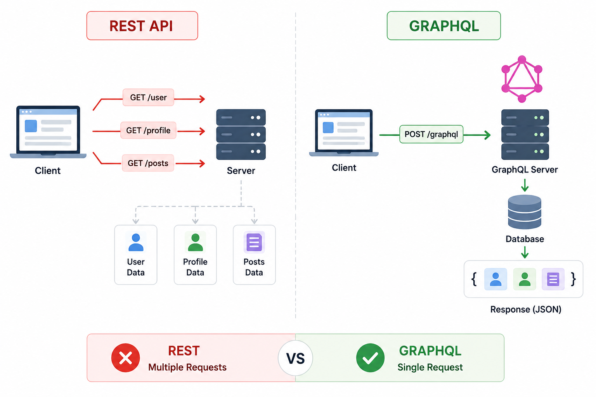
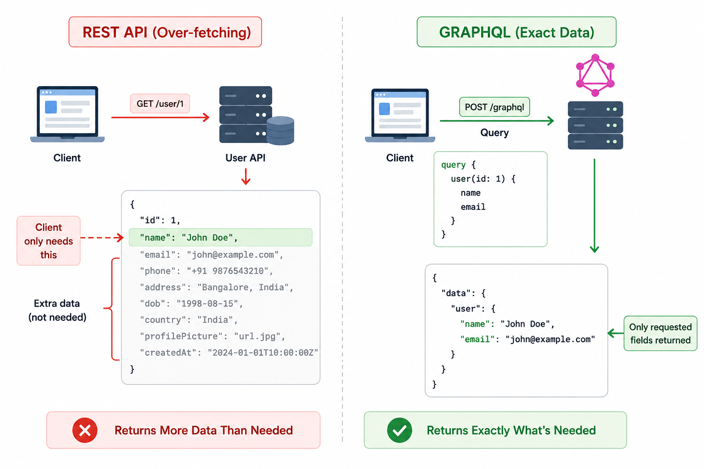
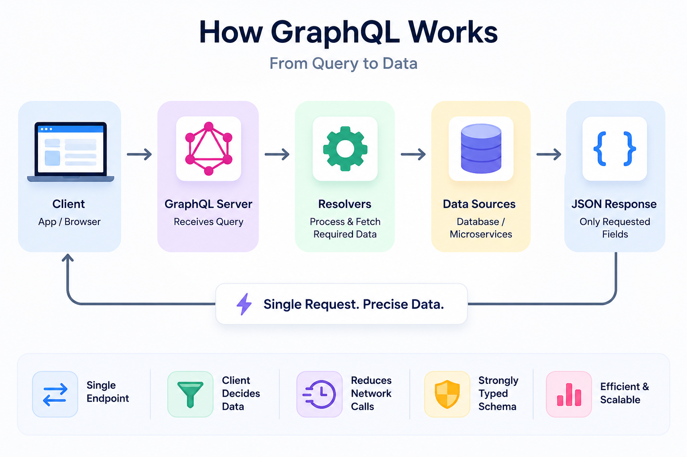
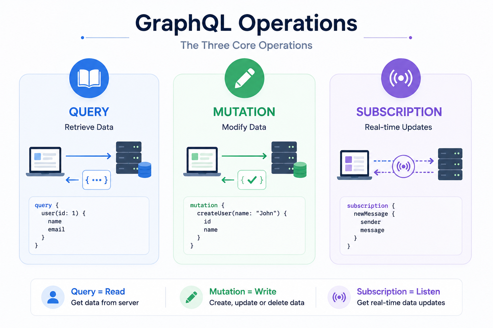
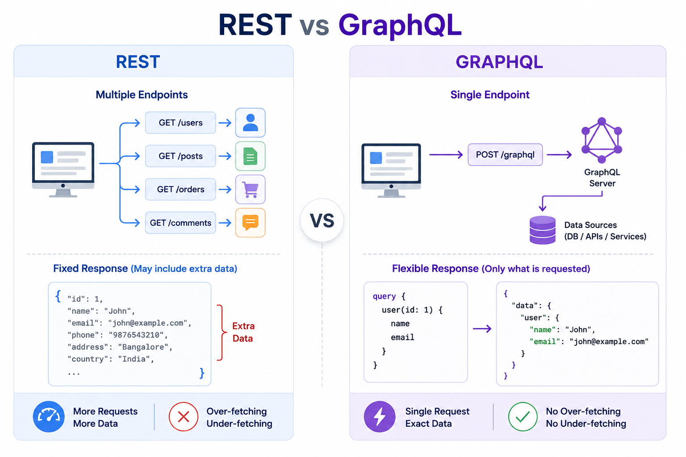

# GraphQL

## 1. Why Do We Need GraphQL?

In the previous chapter, we learned about **REST APIs**.

REST is one of the most popular architectural styles for building APIs.

It is simple,

easy to understand,

and widely used by modern applications.

However,

as applications became larger and more complex,

developers started facing some challenges with REST APIs.

Imagine you're building a social media application.

To display a user's profile page,

you need:

- User Details
- Profile Information
- Recent Posts

Using a typical REST API,

the client may need to make multiple requests.

```text
GET /users/123

GET /users/123/profile

GET /users/123/posts
```

Each request travels across the network,

gets processed by the server,

and returns a response.

Making multiple requests increases:

- Network latency
- Loading time
- Server overhead

Another common problem is that REST APIs often return more data than the client actually needs.

For example,

suppose the client only needs:

```text
Name
Profile Picture
```

But the REST API returns:

```text
Name
Email
Phone
Address
Date of Birth
Country
Profile Picture
Created Date
Updated Date
```

This means unnecessary data is transferred over the network.

As applications became more sophisticated,

especially mobile applications,

developers wanted a better solution.

To solve these problems,

Facebook introduced **GraphQL** in **2015**.

GraphQL allows clients to request **exactly the data they need**.

Nothing more.

Nothing less.

---

> [!TIP]
> **💡 Did You Know? #1**
> 
> GraphQL was developed by **Facebook** and officially released as an open-source project in **2015**.
> 
> It was originally created to improve the performance of Facebook's mobile applications, where network bandwidth and latency were major concerns.
> 
> Today, GraphQL is used by companies such as GitHub, Shopify, Airbnb, Pinterest, and many others.

---

## 2. What is GraphQL?

GraphQL is a **query language for APIs** and a **runtime for executing those queries**.

Unlike REST,

where the server decides what data to return,

GraphQL allows the **client** to decide exactly what data it wants.

Instead of exposing many endpoints,

GraphQL usually exposes a **single endpoint**.

The client sends a query describing the required data,

and the server returns exactly that data.

GraphQL helps solve many of the common limitations of REST APIs,

such as:

- Over-fetching
- Under-fetching
- Multiple API requests

One important thing to remember is that GraphQL is **not**:

- A database
- A programming language
- A replacement for HTTP

GraphQL is simply another way of designing and querying APIs.

Most GraphQL APIs still communicate using HTTP.

---

## 3. REST vs GraphQL

Let's understand the difference using an example.

Suppose a client needs:

- User Name
- Email
- Recent Posts

### Using REST

The client might send multiple requests.

```text
GET /users/123

GET /users/123/posts
```

Each endpoint returns a predefined response.

Sometimes,

the client receives more data than needed.

Sometimes,

the client needs additional requests.

---

### Using GraphQL

The client sends a single query.

```graphql
query {
  user(id: 123) {
    name
    email
    posts {
      title
    }
  }
}
```

The server returns only:

- Name
- Email
- Post Titles

No unnecessary fields are included.

Everything is returned in a single response.

This makes GraphQL much more efficient for complex applications.

---

## 4. Problems with REST APIs

GraphQL was created to solve two major problems found in REST APIs.

### Over-fetching

Over-fetching happens when the server returns more data than the client actually needs.

Example.

The client only wants:

```text
Name
```

But the server returns:

```text
Name
Email
Phone
Address
Country
Age
Profile Picture
```

Most of this data is never used.

This wastes:

- Network bandwidth
- Processing time
- Mobile data

---

### Under-fetching

Under-fetching happens when one REST API response is not enough.

The client must make multiple API requests.

Example.

To display a profile page,

the client needs:

- User
- Posts
- Comments

REST:

```text
GET /users/123

GET /users/123/posts

GET /posts/15/comments
```

Three separate requests.

GraphQL combines everything into a single request.

This reduces:

- Network calls
- Latency
- Loading time

GraphQL was specifically designed to eliminate both over-fetching and under-fetching.

## 5. How Does GraphQL Work?

Let's understand GraphQL using Instagram.

Suppose you open your profile.

The app needs:

- Your Name
- Profile Picture
- Followers Count
- Recent Posts

Instead of making multiple REST API requests,

the client sends a single GraphQL query.

### Step 1

You open Instagram.

### Step 2

The app creates a GraphQL query.

### Step 3

The query is sent to the GraphQL server.

### Step 4

The GraphQL server analyzes the query.

### Step 5

The server fetches data from one or more databases or services.

### Step 6

The GraphQL server combines all the required data.

### Step 7

Only the requested fields are returned.

### Step 8

The Instagram app displays the data.

Unlike REST,

the client receives exactly the information it requested.

Nothing more.

Nothing less.

---

## 6. GraphQL Architecture

A typical GraphQL architecture looks like this.

```text
Client
   │
GraphQL Query
   │
   ▼
GraphQL Server
   │
Resolvers
   │
Business Logic
   │
Database
   │
JSON Response
   ▼
Client
```

Each component has a specific responsibility.

**Client**

Creates GraphQL queries and displays the response.

**GraphQL Server**

Receives the query and decides what data should be fetched.

**Resolvers**

Fetch the requested data from databases or other services.

**Business Logic**

Processes the request.

**Database**

Stores the application data.

---

## 7. GraphQL Schema

Every GraphQL API starts with a **Schema**.

The schema defines:

- What data is available.
- What fields each object contains.
- Which operations clients are allowed to perform.

Example:

```graphql
type User {
    id: ID!
    name: String!
    email: String!
}
```

Here,

a User has:

- id
- name
- email

The schema acts like a contract between the client and the server.

Clients can only request fields that are defined in the schema.

---

## 8. Queries

Queries are used to **retrieve data**.

They are similar to **GET** requests in REST.

Example:

```graphql
query {
    user(id: 1) {
        name
        email
    }
}
```

The client is asking only for:

- Name
- Email

The server returns exactly those fields.

Example Response:

```json
{
    "data": {
        "user": {
            "name": "John",
            "email": "john@example.com"
        }
    }
}
```

Notice that the response does not include unnecessary fields.

---

## 9. Mutations

Mutations are used to **modify data**.

They are similar to:

- POST
- PUT
- PATCH
- DELETE

in REST APIs.

Example:

```graphql
mutation {
    createUser(
        name: "John"
        email: "john@example.com"
    ) {
        id
        name
    }
}
```

This creates a new user.

Just like REST,

GraphQL also supports:

- Creating data
- Updating data
- Deleting data

The only difference is that all of these operations happen through the same GraphQL endpoint.

---

## 10. Subscriptions

Subscriptions allow clients to receive **real-time updates**.

Instead of repeatedly asking the server,

the server automatically sends updates whenever data changes.

Example use cases:

- Chat applications
- Live notifications
- Stock market updates
- Live sports scores
- Real-time dashboards

Example:

```graphql
subscription {
    newMessage {
        sender
        message
    }
}
```

Whenever a new message arrives,

the server immediately sends it to all subscribed clients.

This makes GraphQL ideal for real-time applications.

---

## 11. Single Endpoint

One of the biggest differences between REST and GraphQL is the number of endpoints.

REST APIs usually expose many endpoints.

Example:

```text
/users

/posts

/comments

/orders
```

GraphQL usually exposes only one endpoint.

```text
/graphql
```

The endpoint never changes.

Instead,

the client changes the query.

Different queries can request different data,

even though they all use the same endpoint.

---

> [!TIP]
> **💡 Did You Know? #2**
> 
> Most GraphQL applications expose only **one endpoint**.
> 
> ```text
> /graphql
> ```
> 
> Unlike REST, where different resources have different URLs, GraphQL uses the same endpoint for every request.
> 
> The query itself determines what data will be returned.

---

## 12. GraphQL Request

A GraphQL request contains:

- The query
- Variables (optional)
- Operation Name (optional)

Example:

```graphql
query {
    user(id: 25) {
        name
        email
    }
}
```

The client tells the server exactly which fields it wants.

Nothing else is requested.

---

## 13. GraphQL Response

The server returns only the requested data.

Example:

```json
{
    "data": {
        "user": {
            "name": "John",
            "email": "john@example.com"
        }
    }
}
```

Unlike many REST APIs,

GraphQL responses do not include unnecessary fields.

This makes data transfer more efficient,

especially for mobile applications with limited bandwidth.

## 14. Advantages of GraphQL

GraphQL has become increasingly popular because it provides clients with greater flexibility and efficiency when fetching data.

### Fetch Exactly What You Need

One of GraphQL's biggest advantages is that clients request only the fields they need.

Example:

```graphql
query {
    user(id: 1) {
        name
        email
    }
}
```

The server returns only:

- Name
- Email

No unnecessary data is transferred.

This reduces bandwidth usage and improves application performance.

---

### No Over-fetching

REST APIs sometimes return more information than required.

GraphQL solves this by allowing clients to specify exactly which fields they want.

This makes GraphQL especially useful for mobile applications where network bandwidth is limited.

---

### No Under-fetching

With REST,

clients often make multiple API requests to collect related information.

GraphQL allows all related data to be fetched in a single request.

This reduces:

- Network latency
- Number of API calls
- Loading time

---

### Single Endpoint

Unlike REST,

GraphQL usually exposes only one endpoint.

```text
/graphql
```

Clients simply change the query to request different data.

---

### Strongly Typed Schema

GraphQL APIs define a schema.

This schema describes:

- Available data
- Supported operations
- Relationships between objects

Because of this,

developers know exactly what data can be requested.

---

### API Evolution Without Versioning

REST APIs often introduce new versions.

Example:

```text
/v1/users

/v2/users
```

GraphQL usually avoids versioning.

Instead,

new fields are added to the schema without breaking existing clients.

Older applications continue to work while newer applications can request additional fields.

---

### Built-in Real-Time Support

GraphQL supports **Subscriptions**,

making it easier to build:

- Chat Applications
- Live Notifications
- Live Sports Scores
- Stock Market Dashboards

without designing separate real-time APIs.

---

## 15. Limitations of GraphQL

Although GraphQL solves many REST problems,

it also introduces new challenges.

### More Complex Server Implementation

GraphQL servers must understand and process client queries.

This makes backend implementation more complex than REST.

---

### Harder to Cache

REST works very well with HTTP caching.

GraphQL queries are dynamic,

making caching more difficult.

Additional caching strategies are often required.

---

### Increased Server Load

Clients can request deeply nested data.

Poorly designed queries may consume significant server resources.

Servers often need:

- Query depth limits
- Complexity analysis
- Rate limiting

to prevent performance problems.

---

### More Learning Curve

Compared to REST,

GraphQL introduces new concepts such as:

- Schemas
- Queries
- Mutations
- Subscriptions
- Resolvers

Developers need time to learn these concepts.

---

### Security Considerations

Because clients control the query,

GraphQL servers must validate requests carefully.

Without proper restrictions,

large or deeply nested queries can slow down the server.

---

## 16. REST vs GraphQL

Both REST and GraphQL are excellent choices.

The best option depends on your application's requirements.

| Feature | REST | GraphQL |
|---------|------|----------|
| API Structure | Multiple Endpoints | Single Endpoint |
| Data Fetching | Fixed Response | Client Chooses Fields |
| Over-fetching | Possible | Eliminated |
| Under-fetching | Possible | Eliminated |
| HTTP Caching | Easy | More Difficult |
| Versioning | Often Required | Usually Not Required |
| Real-time Support | Requires Additional Technologies | Built-in Subscriptions |
| Learning Curve | Easier | Slightly More Complex |

Neither REST nor GraphQL is universally better.

Many companies use both together depending on the use case.

---

## 17. Real-World Examples

Many well-known companies use GraphQL in production.

### Facebook

GraphQL was originally developed by Facebook to improve the performance of its mobile applications.

---

### GitHub

GitHub provides both REST and GraphQL APIs.

Developers often prefer GraphQL when retrieving repositories, issues, pull requests, and user information because it reduces the number of API calls.

---

### Shopify

Shopify uses GraphQL extensively for its Admin API,

allowing developers to efficiently manage products, orders, and customers.

---

### Airbnb

Airbnb uses GraphQL to efficiently serve data to different client applications.

---

### Pinterest

Pinterest uses GraphQL to optimize data fetching for its mobile applications.

---

## 18. Common Interview Questions

### Q1. What is GraphQL?

GraphQL is a query language for APIs and a runtime that allows clients to request exactly the data they need.

---

### Q2. Who developed GraphQL?

Facebook developed GraphQL and released it as an open-source project in 2015.

---

### Q3. Why was GraphQL created?

GraphQL was created to solve common REST API problems such as:

- Over-fetching
- Under-fetching
- Multiple API requests

---

### Q4. What are the three core operations in GraphQL?

- Query
- Mutation
- Subscription

---

### Q5. What is a GraphQL Schema?

A schema defines the available types,

fields,

and operations that clients can perform.

---

### Q6. What is the difference between a Query and a Mutation?

A Query retrieves data.

A Mutation creates,

updates,

or deletes data.

---

### Q7. Why does GraphQL usually use only one endpoint?

Because clients specify the required data inside the query itself.

The endpoint remains the same.

```text
/graphql
```

---

### Q8. What are the advantages of GraphQL?

- Precise data fetching
- Single request
- No over-fetching
- No under-fetching
- Strong typing
- No API versioning

---

### Q9. What are the disadvantages of GraphQL?

- Harder caching
- Increased server complexity
- More processing overhead
- Security considerations

---

### Q10. Can REST and GraphQL be used together?

Yes.

Many companies use:

- REST for simple services and public APIs.
- GraphQL for complex client-facing applications requiring flexible data fetching.

---

## 19. Summary

GraphQL is a modern API query language that gives clients complete control over the data they retrieve.

Unlike REST,

which exposes multiple endpoints and predefined responses,

GraphQL typically uses a single endpoint and allows clients to request only the fields they need.

This solves common REST limitations such as over-fetching,

under-fetching,

and multiple API requests.

Although GraphQL offers greater flexibility,

it also introduces additional complexity in caching,

security,

and server implementation.

Choosing between REST and GraphQL depends on the requirements of your application.

---

## ✅ Key Takeaway

- GraphQL was introduced by Facebook in 2015.
- Clients request exactly the data they need.
- Most GraphQL APIs expose a single endpoint.
- GraphQL uses Queries, Mutations, and Subscriptions.
- It solves over-fetching and under-fetching.
- GraphQL is powerful but more complex than REST.

---

## 🚀 What's Next?

So far, we've learned how clients communicate with servers and how APIs retrieve or modify data.

But one important question still remains.

**Where is all this data actually stored?**

To answer that,

we'll move to the next chapter:

**Databases**, where we'll learn how applications store, organize, retrieve, and manage data efficiently.

---
## Reference Images





