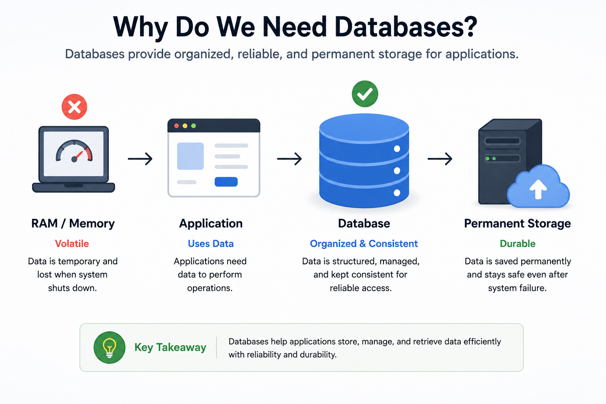
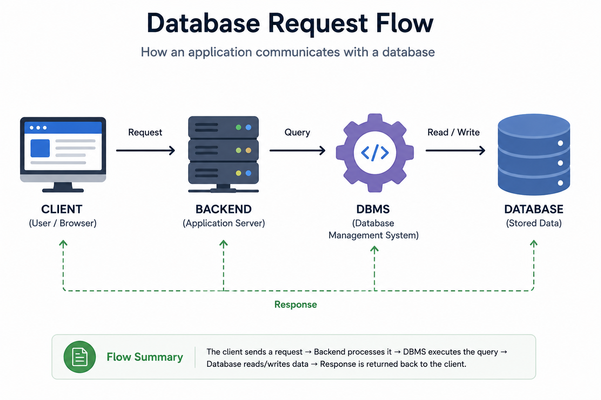
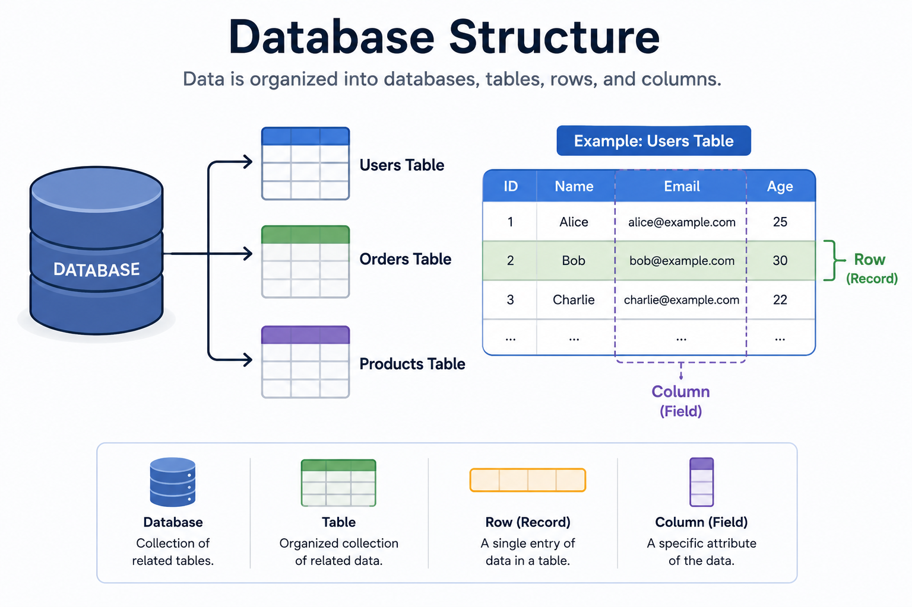
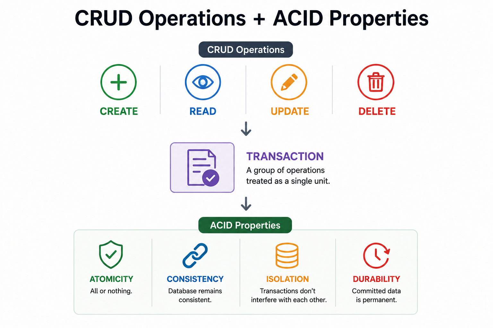
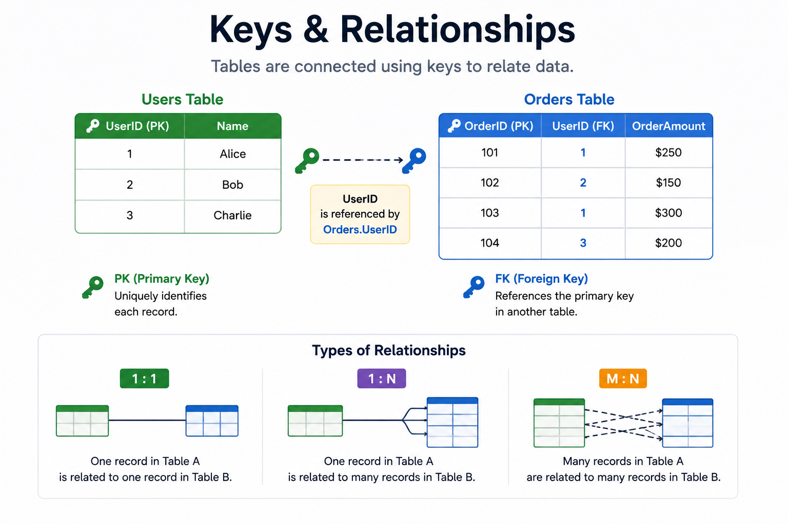

# Databases

## 1. Why Do We Need Databases?

Almost every application we use today works with data.

For example,

- Instagram stores user accounts, posts, comments, likes, and followers.
- Amazon stores products, customers, orders, payments, and reviews.
- WhatsApp stores users, messages, chats, and groups.
- Netflix stores movies, watch history, recommendations, and subscriptions.

Every time a user performs an action,

the application either creates new data, retrieves existing data, updates information, or deletes old data.

Imagine Instagram without a database.

You upload a photo.

The photo appears for a few seconds.

The server restarts.

Your photo disappears forever.

That would make the application unusable.

Modern applications generate enormous amounts of data every second.

Millions of users continuously:

- Create accounts
- Send messages
- Upload photos
- Watch videos
- Place orders
- Make payments

Applications need a safe and reliable way to store all this information permanently.

This is why databases exist.

A database provides a centralized place where applications can store, organize, retrieve, update, and manage data efficiently.

Without databases,

modern applications like Google, Amazon, Netflix, WhatsApp, or Instagram simply could not exist.

---

## 2. What is a Database?

A **Database** is an organized collection of data stored electronically.

Its primary purpose is to store data safely and allow applications to retrieve, update, and manage that data whenever required.

Think of a database as a digital warehouse.

Instead of storing physical files inside cabinets,

applications store information inside databases.

For example,

an online shopping application stores:

- Customers
- Products
- Orders
- Payments
- Reviews

A social media application stores:

- User Profiles
- Posts
- Comments
- Followers
- Messages

A banking application stores:

- Customer Accounts
- Transactions
- Balances
- Loans

The database becomes the central storage system for the entire application.

---

## 3. Why Can't We Store Everything in Memory?

This is one of the most common beginner questions.

Why can't we simply store all application data inside RAM?

For very small applications,

this may work temporarily.

However,

modern applications require permanent and reliable storage.

There are several reasons why RAM cannot replace a database.

### RAM is Volatile

RAM is temporary memory.

If the server crashes,

loses power,

or restarts,

everything stored in RAM disappears.

Databases store data permanently on storage devices such as SSDs or HDDs,

allowing data to survive server restarts.

---

### RAM Has Limited Capacity

RAM is expensive.

A server might have:

- 16 GB RAM
- 32 GB RAM
- 64 GB RAM
- 128 GB RAM

Large applications store terabytes or even petabytes of information.

Examples include:

- Billions of Instagram photos
- Millions of Amazon products
- Years of YouTube videos

This amount of data simply cannot fit into RAM.

---

### Data Must Persist

Users expect their data to remain available.

Imagine placing an order on Amazon.

If the server restarted and your order disappeared,

you would lose trust in the application.

Databases ensure data remains available even after crashes or restarts.

---

### Efficient Data Management

Applications constantly perform operations such as:

- Searching
- Filtering
- Sorting
- Updating
- Deleting

Databases are specifically designed to perform these operations efficiently,

even with millions of records.

Trying to manage all of this manually in memory would quickly become slow and difficult.

---

## 4. Database vs Memory (RAM)

Although both RAM and databases store data,

they serve very different purposes.

| Memory (RAM) | Database |
|--------------|----------|
| Temporary Storage | Permanent Storage |
| Very Fast | Slower than RAM |
| Limited Capacity | Can Store Massive Data |
| Data Lost After Restart | Data Survives Restarts |
| Used While Program Runs | Used for Long-Term Storage |

Think of it this way.

RAM is like your study desk.

You keep the books you're currently reading on the desk because they're easy to access.

A database is like a library.

It stores thousands of books safely for years,

and you can retrieve any book whenever you need it.

Applications use both together.

Frequently used data is loaded into RAM for speed,

while the database stores the permanent copy.

---

## 5. How Does a Database Work?

Let's understand the complete flow using an example.

Suppose a customer places an order on Amazon.

### Step 1

The customer clicks **Place Order**.

---

### Step 2

The application sends the request to the backend server.

---

### Step 3

The backend validates the request.

For example,

it checks:

- User authentication
- Product availability
- Payment status

---

### Step 4

The backend communicates with the database.

The database stores:

- Order Details
- Payment Information
- Customer Information

---

### Step 5

The database successfully saves the information.

---

### Step 6

The database returns the result to the backend.

---

### Step 7

The backend prepares an appropriate response.

---

### Step 8

The customer receives a confirmation message.

A simplified architecture looks like this.

```text
Client
   │
HTTP / API
   │
Backend Server
   │
Database
   │
Response
   ▼
Client
```

Notice something important.

The client never communicates directly with the database.

Every request passes through the backend server.

This allows the backend to perform:

- Validation
- Authentication
- Authorization
- Business Logic

before interacting with the database.

---

## 6. Database Architecture

A typical application architecture looks like this.

```text
Frontend
      │
      ▼
Backend API
      │
      ▼
Database Management System (DBMS)
      │
      ▼
Database
```

Each layer has a specific responsibility.

### Frontend

Collects user input and displays information.

Examples include:

- React
- Angular
- Vue
- Mobile Applications

---

### Backend

Processes client requests.

Implements business logic.

Communicates with the database.

Examples include:

- Django
- Spring Boot
- Express.js
- FastAPI

---

### Database Management System (DBMS)

The DBMS receives database requests from the backend,

processes them,

and manages the stored data.

---

### Database

The actual place where application data is permanently stored.

---

## 7. What is a DBMS?

A **Database Management System (DBMS)** is software that allows applications to create, manage, retrieve, update, and secure databases.

Think of the DBMS as the **manager** of the database.

Applications never directly modify database files.

Instead,

they communicate with the DBMS,

and the DBMS performs all database operations safely.

A DBMS is responsible for:

- Creating databases
- Reading data
- Writing new records
- Updating existing records
- Deleting records
- Managing security
- Handling multiple users
- Performing backups
- Recovering data after failures

Some of the most popular DBMS software include:

- MySQL
- PostgreSQL
- Oracle Database
- Microsoft SQL Server
- MongoDB

Without a DBMS,

developers would have to manually manage storage,

file organization,

security,

and concurrency,

which would be extremely difficult for modern applications.

---

> [!TIP]
> **💡 Did You Know? #1**
> 
> The relational database model was introduced by **Edgar F. Codd** in **1970** while working at IBM.
> 
> His research introduced the idea of organizing data into tables with relationships, which became the foundation of modern relational databases used by millions of applications today.

---

## 8. What Can Databases Store?

A database can store almost any type of information required by an application.

Examples include:

- User Accounts
- Products
- Orders
- Payments
- Messages
- Comments
- Videos
- Images (or references to images)
- Notifications
- Application Logs

Different applications store different kinds of data.

For example,

### Instagram stores:

- Users
- Posts
- Comments
- Followers
- Likes
- Messages

### Amazon stores:

- Products
- Customers
- Orders
- Payments
- Reviews

### WhatsApp stores:

- Users
- Chats
- Messages
- Groups

Although the type of data changes from one application to another,

the purpose of the database remains the same—

to store and manage data efficiently.

---

## 9. Database Components

To understand how databases work,

you first need to understand three basic building blocks:

- Tables
- Rows
- Columns

### Tables

A table stores information about a specific type of data.

For example,

instead of storing everything together,

an application creates separate tables.

Example:

```text
Users Table

+----+---------+----------------------+
| ID | Name    | Email                |
+----+---------+----------------------+
| 1  | John    | john@email.com       |
| 2  | Alice   | alice@email.com      |
+----+---------+----------------------+
```

Another table stores orders.

```text
Orders Table

+------+---------+----------+
| ID   | UserID  | Amount   |
+------+---------+----------+
|101   |1        |₹500      |
|102   |2        |₹1200     |
+------+---------+----------+
```

Each table stores one type of information.

---

### Rows

A row represents a single record inside a table.

Example:

```text
ID : 1

Name : John

Email : john@email.com
```

This entire row represents one user.

Every new user creates another row.

---

### Columns

Columns define what information each row contains.

Example:

```text
ID

Name

Email
```

Every row follows the same column structure.

You can think of columns as the attributes of an object.

---

## 10. CRUD Operations

Almost every application performs four basic operations on data.

These operations are called **CRUD**.

| Operation | Meaning |
|-----------|---------|
| Create | Insert new data |
| Read | Retrieve existing data |
| Update | Modify existing data |
| Delete | Remove existing data |

Let's understand each operation.

### Create

A new customer creates an account.

↓

A new row is inserted into the Users table.

---

### Read

The customer logs in.

↓

The database retrieves the customer's information.

---

### Update

The customer changes their phone number.

↓

The existing record is updated.

---

### Delete

The customer permanently deletes their account.

↓

The corresponding record is removed from the database.

CRUD operations are the foundation of almost every application you use today.

---

## 11. Transactions

Sometimes,

a single database operation is not enough.

Multiple operations need to happen together.

Consider a bank transfer.

Suppose you transfer ₹1000 to your friend.

The database performs two operations.

Step 1:

Deduct ₹1000 from your account.

Step 2:

Add ₹1000 to your friend's account.

Now imagine the server crashes after Step 1.

Your money has been deducted,

but your friend never receives it.

This creates inconsistent data.

To prevent this,

databases use **Transactions**.

A transaction is a group of database operations that execute as a single unit.

Either:

✅ Every operation succeeds.

or

❌ Every operation is cancelled (rolled back).

This ensures data remains accurate and consistent.

---

## 12. ACID Properties

Transactions become reliable because databases follow four important properties known as **ACID**.

ACID stands for:

- Atomicity
- Consistency
- Isolation
- Durability

Let's understand each one.

---

### A — Atomicity

Atomicity means:

**All operations happen, or none of them happen.**

Returning to the bank example,

Either:

- Money is deducted.
- Money is credited.

OR

Neither operation happens.

There is no partial transaction.

Think of Atomicity as:

**All or Nothing.**

---

### C — Consistency

Consistency ensures that the database always remains in a valid state.

Before the transaction,

the database is correct.

After the transaction,

the database should also remain correct.

For example,

if your bank initially has:

₹10,000

After transferring:

₹1,000

The final balance should become:

₹9,000

The database should never produce invalid or impossible values.

---

### I — Isolation

Many users may access the database at the same time.

Isolation ensures that one transaction does not interfere with another.

Example.

Two customers try to purchase the last product simultaneously.

The database processes transactions in a way that prevents conflicts,

ensuring only one customer successfully purchases the item.

---

### D — Durability

Once a transaction is successfully completed,

its data is permanently saved.

Even if the server crashes immediately afterward,

the committed transaction will not be lost.

This guarantees that important information remains safe.

---

Together,

ACID properties make database transactions reliable,

consistent,

and fault-tolerant.

---

## 13. Primary Key

Every record inside a table should be uniquely identifiable.

A **Primary Key** is a column whose value uniquely identifies every row.

Example:

```text
Users

+----+--------+
| ID | Name   |
+----+--------+
|1   |John    |
|2   |Alice   |
|3   |David   |
+----+--------+
```

Here,

**ID** is the Primary Key.

No two users can have the same ID.

Primary Keys help databases quickly locate individual records.

---

## 14. Foreign Key

Applications usually contain multiple tables.

These tables often need to be connected.

A **Foreign Key** creates a relationship between two tables.

Example.

Users Table

```text
+----+--------+
| ID | Name   |
+----+--------+
|1   |John    |
|2   |Alice   |
+----+--------+
```

Orders Table

```text
+------+---------+
| ID   | UserID  |
+------+---------+
|101   |1        |
|102   |2        |
+------+---------+
```

Here,

**UserID** is a Foreign Key.

It points to the **ID** column in the Users table.

This tells the database:

Order 101 belongs to John.

Order 102 belongs to Alice.

Foreign Keys help maintain relationships between related data.

---

## 15. Relationships Between Tables

Real-world databases contain many related tables.

These relationships generally fall into three categories.

### One-to-One (1:1)

One record is related to exactly one record.

Example:

One User

↓

One Passport

---

### One-to-Many (1:N)

One record is related to multiple records.

Example:

One Customer

↓

Many Orders

This is one of the most common relationships.

---

### Many-to-Many (M:N)

Multiple records are related to multiple records.

Example:

Students

↓

Courses

One student can enroll in many courses.

One course can have many students.

These relationships help databases organize information efficiently while avoiding unnecessary duplication.

## 16. Popular Databases

Today, many Database Management Systems (DBMS) are available.

Each database is designed for different use cases.

Some of the most popular databases include:

### MySQL

One of the world's most widely used relational databases.

It is popular for web applications because it is reliable, fast, and open source.

Commonly used by:

- WordPress
- PHP Applications
- E-commerce Websites

---

### PostgreSQL

PostgreSQL is an advanced open-source relational database.

It offers powerful features such as advanced indexing, JSON support, and strong reliability.

It is widely used in enterprise applications and modern backend systems.

---

### MongoDB

MongoDB is one of the most popular NoSQL databases.

Instead of storing data in tables,

it stores information as flexible JSON-like documents.

It is commonly used for applications where the data structure changes frequently.

---

### SQLite

SQLite is a lightweight embedded database.

Unlike MySQL or PostgreSQL,

it does not require a separate database server.

It is commonly used in:

- Android Applications
- iOS Applications
- Desktop Applications

---

### Redis

Redis is an in-memory database.

It stores data in RAM,

making it extremely fast.

Redis is commonly used for:

- Caching
- Session Storage
- Real-time Applications

---

### Oracle Database

Oracle Database is a powerful enterprise-grade relational database.

It is widely used by:

- Banks
- Government Organizations
- Large Enterprises

because of its reliability, security, and scalability.

---

Each database has different strengths.

Choosing the right database depends on the application's requirements.

We'll study different database types in detail in the upcoming chapters.

---

## 17. Advantages of Databases

Databases provide many benefits that make them essential for modern applications.

### Permanent Storage

Unlike RAM,

databases permanently store information.

Even if the server restarts,

the data remains safe.

---

### Fast Data Retrieval

Databases are optimized to quickly retrieve data,

even when storing millions of records.

---

### Data Consistency

Databases ensure information remains accurate,

especially during complex operations like financial transactions.

---

### Security

Databases provide built-in security features such as:

- Authentication
- Authorization
- Access Control
- Encryption
- Backup and Recovery

---

### Scalability

As applications grow,

databases can also scale to handle increasing users and data.

We'll learn about database scaling in later chapters.

---

### Concurrent Access

Modern databases allow thousands of users to access the same data simultaneously,

while maintaining consistency and preventing conflicts.

---

## 18. Limitations of Databases

Although databases are extremely powerful,

they also have some limitations.

### Storage Cost

As data grows,

applications require larger storage infrastructure,

which increases cost.

---

### Performance Challenges

Poor database design can lead to:

- Slow queries
- High response times
- Poor application performance

---

### Complexity

Managing large databases involves advanced concepts such as:

- Indexing
- Replication
- Sharding
- Backup
- Recovery
- Security

As applications grow,

database management becomes more complex.

---

### Scaling Challenges

Scaling databases is often more difficult than scaling application servers.

Large systems require advanced techniques to maintain performance and availability.

We'll study these techniques in upcoming chapters.

---

> [!TIP]
> **💡 Did You Know? #1**
> 
> The relational database model was proposed by **Edgar F. Codd** in **1970** while working at IBM.
> 
> His revolutionary research introduced the concept of organizing data into related tables, which became the foundation of modern relational databases.

---

> [!TIP]
> **💡 Did You Know? #2**
> 
> Large technology companies rarely use a single database.
> 
> For example, an e-commerce platform might use:
> - MySQL for customer orders.
> - Redis for caching.
> - Elasticsearch for product search.
> - Amazon S3 for storing product images.
> - MongoDB for flexible product catalogs.
> 
> Each database is chosen because it is best suited for a particular task.
> 
> This approach is known as **Polyglot Persistence**—using multiple database technologies within the same application.

---

## 19. Real-World Examples

Every modern application relies on databases.

### Instagram

Stores:

- User Accounts
- Posts
- Comments
- Followers
- Likes
- Messages

---

### Amazon

Stores:

- Products
- Customers
- Orders
- Payments
- Reviews

---

### Netflix

Stores:

- Movies
- TV Shows
- User Profiles
- Watch History
- Recommendations

---

### WhatsApp

Stores:

- Users
- Chats
- Messages
- Groups
- Media References

---

### Banking Applications

Store:

- Customer Accounts
- Transactions
- Balances
- Loans
- Payment History

Without databases,

none of these applications would be able to store or retrieve information reliably.

---

## 20. Common Interview Questions

### Q1. What is a database?

A database is an organized collection of data that allows applications to efficiently store, retrieve, update, and manage information.

---

### Q2. Why do applications use databases?

Applications use databases because they provide permanent, reliable, secure, and efficient storage for large amounts of data.

---

### Q3. What is the difference between RAM and a database?

RAM stores temporary data,

while databases store data permanently.

Data in RAM is lost after a restart,

whereas database data remains available.

---

### Q4. What is a DBMS?

A Database Management System (DBMS) is software that manages databases and allows applications to safely store, retrieve, update, and delete data.

---

### Q5. What are CRUD operations?

CRUD stands for:

- Create
- Read
- Update
- Delete

These are the four fundamental operations performed on database records.

---

### Q6. What is a transaction?

A transaction is a group of database operations that execute as a single unit.

Either all operations succeed,

or all operations are rolled back.

---

### Q7. What are ACID properties?

ACID stands for:

- Atomicity
- Consistency
- Isolation
- Durability

These properties ensure reliable and consistent database transactions.

---

### Q8. What is a Primary Key?

A Primary Key uniquely identifies every record inside a table.

---

### Q9. What is a Foreign Key?

A Foreign Key creates a relationship between two tables by referencing the Primary Key of another table.

---

### Q10. What is the difference between a Database and a DBMS?

A **Database** is the collection of stored data.

A **DBMS** is the software used to manage that data.

---

## 21. Summary

Databases are the foundation of almost every modern application.

They provide a secure, reliable, and efficient way to store, retrieve, update, and manage data.

Applications interact with databases through a **Database Management System (DBMS)**, which handles storage, security, transactions, and data management.

Databases organize information using tables, rows, and columns, support CRUD operations, maintain relationships using keys, and ensure reliable transactions through ACID properties.

As applications grow,

databases become increasingly important for maintaining performance, reliability, and scalability.

---

## ✅ Key Takeaway

- Databases permanently store application data.
- Applications communicate with databases through a DBMS.
- Tables, rows, and columns organize data.
- CRUD operations manage records.
- Transactions ensure multiple operations execute safely.
- ACID properties guarantee reliable transactions.
- Primary Keys uniquely identify records.
- Foreign Keys connect related tables.
- Databases are essential for building modern, scalable applications.

---

## 🚀 What's Next?

Now that we understand **what a database is** and **how it works**,

the next question is:

**Are all databases built the same way?**

The answer is **No**.

Different applications have different requirements.

Some applications need strong consistency,

while others need flexible schemas or massive scalability.

To understand these differences,

we'll explore the next chapter:

# SQL vs NoSQL

where we'll compare the two major categories of databases and learn when each one should be used.

---
## Reference Images





