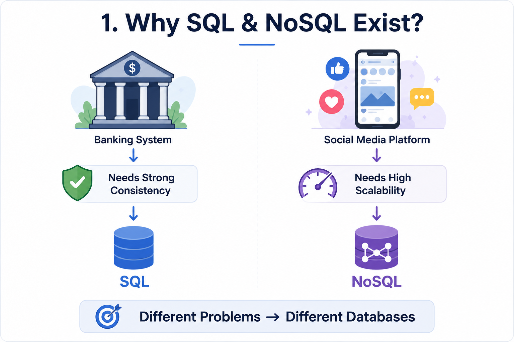
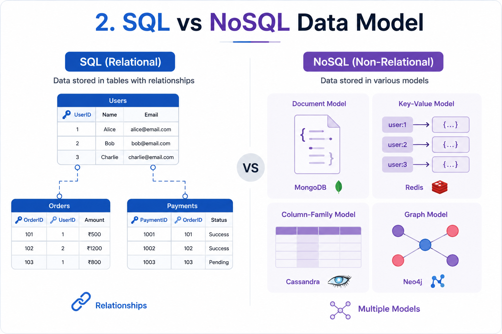
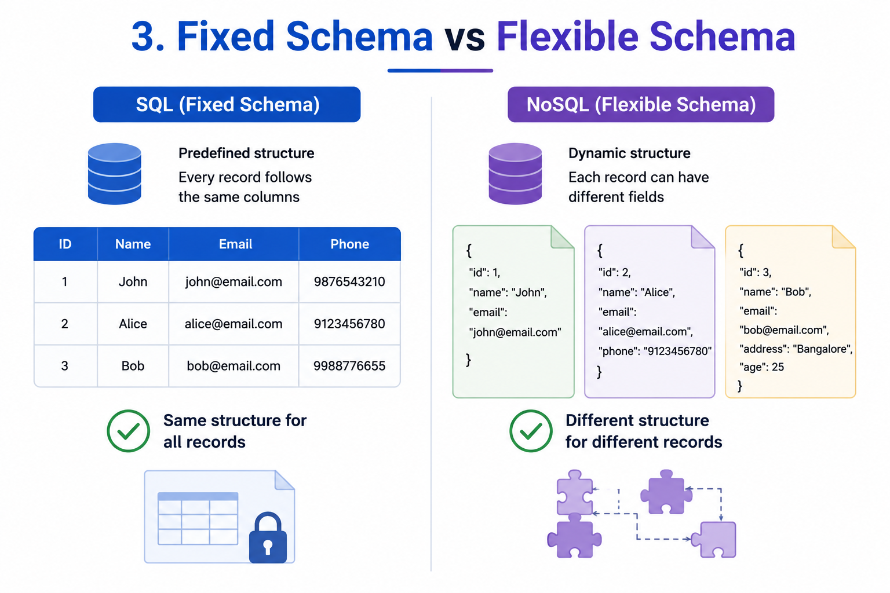
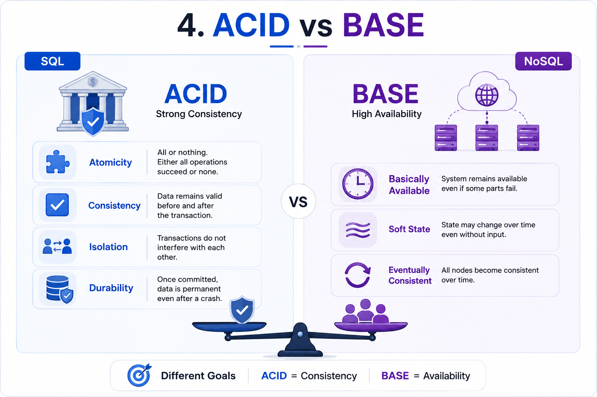
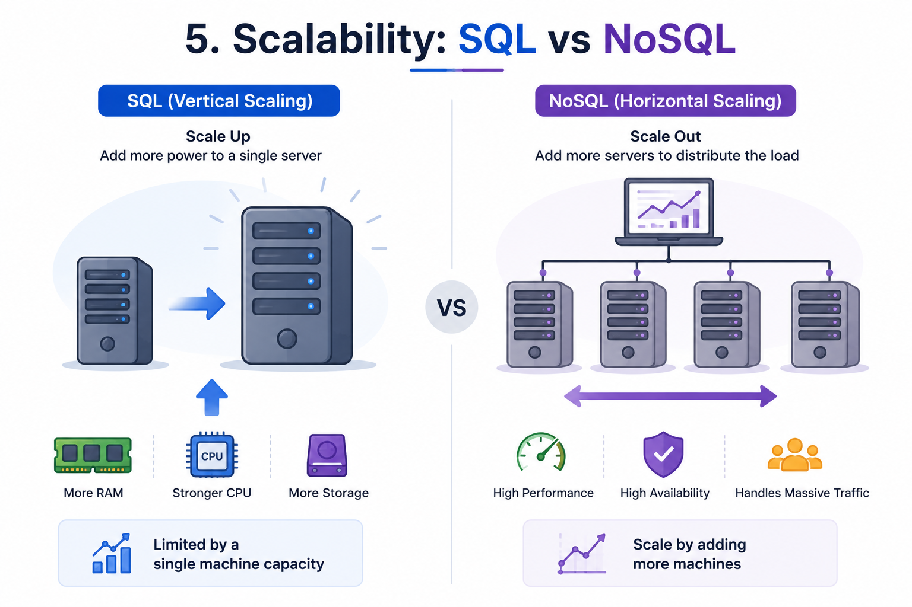
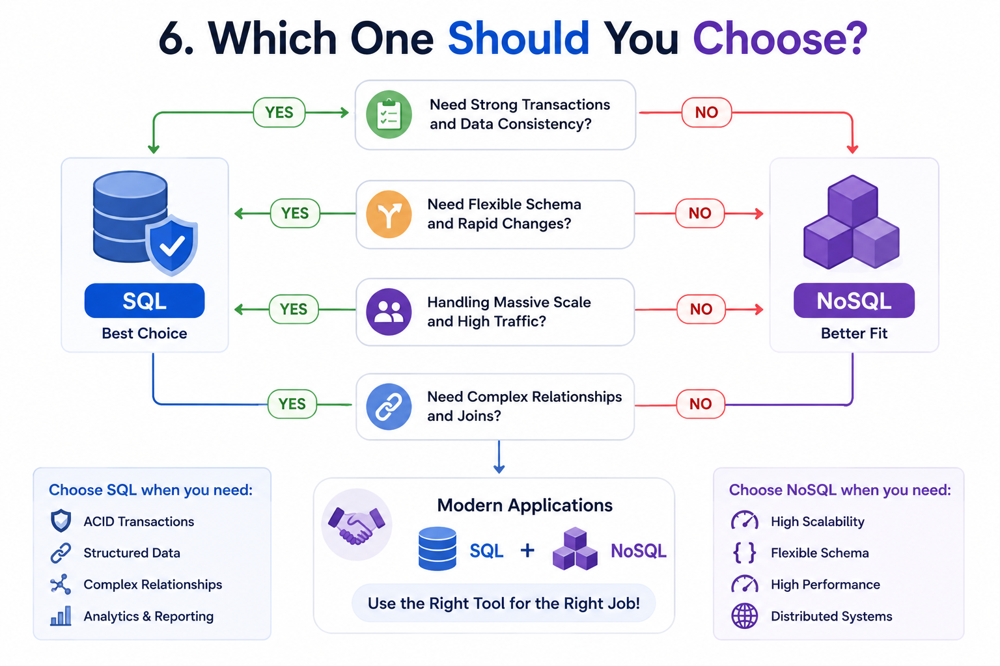

# SQL vs NoSQL

## 1. Why Do We Need Different Types of Databases?

In the previous chapter, we learned what a database is and why modern applications rely on databases to store and manage data.

A common question now is:

**If databases already exist, why do we have different types of databases?**

The answer is simple.

Not every application has the same requirements.

Consider these applications:

- A banking system
- Instagram
- Amazon
- WhatsApp
- Netflix

All of them store data.

However, they store different kinds of data and have different priorities.

A banking system requires:

- Accurate transactions
- Strong consistency
- Structured relationships

On the other hand,

a social media platform needs:

- High scalability
- Fast read/write operations
- Flexible data structures

A single type of database cannot efficiently satisfy all these requirements.

This led to the development of two major categories of databases:

- SQL Databases
- NoSQL Databases

Each one is designed to solve different problems.

Choosing the right database depends on the application's requirements.

---

## 2. What is SQL?

**SQL (Structured Query Language)** is a type of relational database that stores data in **tables**.

Each table consists of:

- Rows (Records)
- Columns (Fields)

Example:

```text
Users

+----+--------+----------------------+
| ID | Name   | Email                |
+----+--------+----------------------+
| 1  | John   | john@email.com       |
| 2  | Alice  | alice@email.com      |
+----+--------+----------------------+
```

Different tables can be connected using:

- Primary Keys
- Foreign Keys

This allows SQL databases to model complex relationships efficiently.

SQL databases follow a **fixed schema**, meaning the structure of the data must be defined before storing any records.

They also follow the **ACID properties**, ensuring reliable and consistent transactions.

Because of these characteristics,

SQL databases are ideal for applications where data accuracy and consistency are critical.

Examples include:

- Banking Systems
- Hospital Management Systems
- Airline Reservation Systems
- Payment Systems
- ERP Applications

Some popular SQL databases are:

- MySQL
- PostgreSQL
- Oracle Database
- Microsoft SQL Server

---

## 3. What is NoSQL?

**NoSQL (Not Only SQL)** is a category of databases designed to handle large-scale, distributed, and flexible data.

Unlike SQL databases,

NoSQL databases do not require a fixed schema.

Each record can have a different structure.

For example,

Document 1

```json
{
  "name": "John",
  "email": "john@email.com"
}
```

Document 2

```json
{
  "name": "Alice",
  "email": "alice@email.com",
  "phone": "9876543210",
  "city": "Bangalore"
}
```

Both documents are valid,

even though they contain different fields.

This flexibility makes NoSQL databases well suited for applications where the data structure changes frequently.

NoSQL databases are designed for:

- High Scalability
- High Availability
- Fast Read/Write Operations
- Distributed Systems

Unlike SQL,

NoSQL is not limited to one data model.

Different NoSQL databases use different storage models, including:

- Key-Value
- Document
- Column-Family
- Graph

We'll study each of these models in detail in the **Types of Databases** chapter.

Some popular NoSQL databases include:

- MongoDB
- Redis
- Cassandra
- Neo4j

---

## 4. SQL vs NoSQL at a Glance

| SQL | NoSQL |
|------|--------|
| Relational Database | Non-Relational Database |
| Stores data in Tables | Stores data using multiple models |
| Fixed Schema | Flexible Schema |
| Supports ACID Transactions | Usually follows BASE principles |
| Best for Structured Data | Best for Semi-Structured & Unstructured Data |
| Vertical Scaling | Horizontal Scaling |
| Strong Consistency | High Availability & Scalability |
| Uses SQL Language | Database-specific Query Languages |

There is no universally "better" database.

The right choice depends entirely on the application's requirements.

---

> [!TIP]
> **💡 Did You Know? #1**
> 
> The first relational database model was introduced by **Edgar F. Codd** at IBM in **1970**.
> 
> His relational model became the foundation of modern SQL databases used around the world today.

---

## 5. Data Model

One of the biggest differences between SQL and NoSQL databases is **how they store data**.

### SQL Data Model

SQL databases use a **Relational Data Model**.

Data is stored inside **tables**, where:

- Each row represents a record.
- Each column represents an attribute.
- Tables are connected using relationships.

Example:

```text
Users Table

+----+--------+----------------------+
| ID | Name   | Email                |
+----+--------+----------------------+
| 1  | John   | john@email.com       |
| 2  | Alice  | alice@email.com      |
+----+--------+----------------------+

Orders Table

+------+---------+----------+
| ID   | UserID  | Amount   |
+------+---------+----------+
|101   |1        |₹500      |
|102   |2        |₹1200     |
+------+---------+----------+
```

Here,

**UserID** is a Foreign Key that connects the Orders table with the Users table.

This relational structure makes SQL databases excellent for handling complex relationships and JOIN operations.

---

### NoSQL Data Model

Unlike SQL,

NoSQL databases do not rely on a single relational model.

Instead,

they support multiple data models.

### Key-Value Model

Stores data as simple key-value pairs.

Example:

```text
Key: user_101

Value:
{
   Name: "John",
   Age: 25
}
```

Popular Database:

- Redis

---

### Document Model

Stores data as JSON-like documents.

Example:

```json
{
   "name":"John",
   "email":"john@email.com",
   "age":25
}
```

Popular Database:

- MongoDB

---

### Column-Family Model

Stores data in rows,

but each row can contain different columns.

It is optimized for distributed systems and high write throughput.

Popular Database:

- Cassandra

---

### Graph Model

Stores data using:

- Nodes
- Relationships (Edges)

Instead of tables.

It is ideal for highly connected data such as:

- Social Networks
- Recommendation Systems
- Fraud Detection

Popular Database:

- Neo4j

We'll explore each of these models in detail in the **Types of Databases** chapter.

---

## 6. Schema

A **Schema** defines how data is organized inside a database.

It specifies:

- Tables
- Columns
- Data Types
- Relationships
- Constraints

---

### SQL Schema

SQL databases use a **Fixed Schema**.

The database structure must be defined before storing data.

Example:

```text
Users

ID

Name

Email

Phone
```

Every record must follow this structure.

If a new field needs to be added,

the schema must be modified.

Example:

Adding a new column called Address requires changing the table structure.

This ensures consistency,

but makes schema changes more difficult.

---

### NoSQL Schema

NoSQL databases use a **Flexible Schema**.

Different records can have different fields.

Example:

```json
{
   "name":"John",
   "email":"john@email.com"
}
```

```json
{
   "name":"Alice",
   "email":"alice@email.com",
   "phone":"9876543210",
   "city":"Bangalore"
}
```

Both documents are valid,

even though their structure is different.

This flexibility makes NoSQL databases ideal for rapidly changing applications.

---

## 7. Query Language

Applications interact with databases using a query language.

---

### SQL Query Language

SQL databases use **Structured Query Language (SQL)**.

SQL provides standard commands such as:

```sql
SELECT

INSERT

UPDATE

DELETE
```

These commands are supported by almost every SQL database.

Because SQL is standardized,

developers can easily move between databases like:

- MySQL
- PostgreSQL
- SQL Server

with only minor syntax changes.

---

### NoSQL Query Language

Unlike SQL,

NoSQL databases do not have a single standard query language.

Each database provides its own query mechanism.

Examples:

MongoDB

Uses JSON-style queries.

Redis

Uses Key-Based Commands.

Neo4j

Uses Cypher Query Language.

Cassandra

Uses Cassandra Query Language (CQL).

This gives NoSQL databases greater flexibility,

but also means developers must learn different query syntaxes for different databases.

---

## 8. Transactions

A **Transaction** is a group of operations executed as a single unit.

Transactions are essential for applications such as:

- Banking
- Online Payments
- Inventory Management

---

### SQL Transactions

SQL databases fully support **ACID Transactions**.

ACID ensures:

### Atomicity

Either every operation succeeds,

or none of them happen.

---

### Consistency

The database always remains valid.

---

### Isolation

Multiple transactions never interfere with each other.

---

### Durability

Committed data is never lost,

even after a crash.

Because of ACID,

SQL databases are ideal for financial applications where accuracy is critical.

---

### NoSQL Transactions

Many NoSQL databases prioritize:

- Availability
- Scalability
- Performance

instead of strict consistency.

Instead of ACID,

many NoSQL databases follow the **BASE Model**.

BASE stands for:

- Basically Available
- Soft State
- Eventually Consistent

Unlike ACID,

BASE accepts temporary inconsistency in exchange for better performance and scalability.

Eventually,

all database replicas become consistent.

This trade-off makes NoSQL databases suitable for:

- Social Media
- Chat Applications
- Analytics Systems
- Recommendation Engines

---

## 9. Scalability

As applications grow,

their databases must also scale.

There are two common approaches.

---

### SQL Scaling

SQL databases are traditionally scaled **Vertically**.

Vertical Scaling means:

Adding more resources to a single server.

Example:

- More RAM
- Faster CPU
- Larger Storage

Advantages:

- Easy to manage
- Strong consistency

Limitations:

Eventually,

one server reaches its hardware limit.

---

### NoSQL Scaling

NoSQL databases are designed for **Horizontal Scaling**.

Horizontal Scaling means:

Adding more servers.

Instead of one powerful server,

multiple servers share the workload.

Advantages:

- Handles massive traffic
- Better fault tolerance
- Easier to scale

This is one reason why large internet companies often prefer NoSQL databases for highly distributed systems.

---

## 10. Performance

Performance depends entirely on the workload.

Neither SQL nor NoSQL is universally faster.

### SQL performs better when:

- Complex JOIN operations
- Multi-table relationships
- Financial Transactions
- Structured Data

---

### NoSQL performs better when:

- Massive datasets
- High write throughput
- Flexible documents
- Distributed applications
- Real-time systems

Choosing the right database depends on the application's requirements,

not on which database is "faster."

---

> [!TIP]
> **💡 Did You Know? #2**
> 
> Many of the world's largest companies—including **Amazon**, **Netflix**, and **Meta**—use **both SQL and NoSQL databases together**.
> 
> Instead of choosing one database for everything,
> 
> they select the most suitable database for each specific workload.
> 
> This approach improves scalability, performance, and reliability.

---

## 11. Advantages of SQL

SQL databases have been around for decades and are widely used in industries where data accuracy and consistency are critical.

Some of their major advantages include:

### Strong Data Consistency

SQL databases follow the **ACID properties**, ensuring that every transaction is reliable and the database always remains in a valid state.

This makes SQL ideal for applications like banking, payment gateways, and healthcare systems.

---

### Structured Data

SQL databases use a predefined schema.

Every record follows the same structure, making data easier to validate and manage.

---

### Powerful Query Language

SQL provides a standardized query language capable of handling:

- Complex Queries
- JOIN Operations
- Aggregations
- Sorting
- Filtering
- Reporting

This makes SQL an excellent choice for applications that frequently analyze or retrieve related data.

---

### Strong Relationships

SQL databases excel at managing relationships between tables using:

- Primary Keys
- Foreign Keys

This makes them suitable for applications with interconnected data.

---

### Mature Ecosystem

SQL databases have existed for many years.

They offer:

- Excellent Documentation
- Stable Tools
- Large Communities
- Enterprise Support

---

## 12. Limitations of SQL

Despite its strengths,

SQL is not the best solution for every application.

### Difficult to Scale Horizontally

Traditional SQL databases are designed for vertical scaling.

Distributing relational databases across many servers is more complex.

---

### Fixed Schema

Changing the database structure often requires schema migrations.

As applications evolve,

this can become difficult to manage.

---

### Complex Joins at Massive Scale

Although SQL handles joins efficiently,

very large datasets with many complex joins can impact performance.

---

### Less Flexible

Applications with rapidly changing data structures may find SQL too restrictive.

---

## 13. Advantages of NoSQL

NoSQL databases were designed to solve challenges faced by large-scale distributed systems.

### Flexible Schema

Each document or record can have a different structure.

This allows applications to evolve without constantly modifying database schemas.

---

### Horizontal Scalability

NoSQL databases can easily scale by adding more servers.

This makes them ideal for applications serving millions of users.

---

### High Performance

Many NoSQL databases are optimized for:

- High Write Throughput
- Fast Reads
- Massive Datasets

---

### High Availability

Distributed NoSQL databases continue operating even if some servers fail.

This improves fault tolerance.

---

### Multiple Data Models

NoSQL databases support several storage models, including:

- Key-Value
- Document
- Graph
- Column-Family

Developers can choose the model that best fits their application.

---

## 14. Limitations of NoSQL

NoSQL databases also have trade-offs.

### Eventual Consistency

Many NoSQL databases prioritize availability over immediate consistency.

This means different servers may temporarily contain different data until synchronization is complete.

---

### No Standard Query Language

Unlike SQL,

every NoSQL database has its own query language or API.

Developers often need to learn different syntaxes.

---

### Limited JOIN Support

Most NoSQL databases do not support SQL-style JOIN operations efficiently.

Applications often duplicate related data to improve performance.

---

### Data Duplication

Because relationships are not emphasized,

the same information may be stored in multiple places.

This increases storage usage but improves read performance.

---

## 15. When Should You Use SQL?

SQL is the better choice when your application requires:

- Strong Consistency
- ACID Transactions
- Structured Data
- Complex Relationships
- Frequent JOIN Operations
- Financial Accuracy

Common use cases include:

- Banking Systems
- Payment Gateways
- Hospital Management
- Airline Reservation Systems
- ERP Software
- Government Applications

---

## 16. When Should You Use NoSQL?

NoSQL is the better choice when your application requires:

- Massive Scalability
- Flexible Data Models
- High Read/Write Performance
- Distributed Architecture
- Rapid Development

Common use cases include:

- Social Media Platforms
- Chat Applications
- IoT Systems
- Recommendation Engines
- Real-time Analytics
- Gaming Platforms

---

## 17. Can We Use SQL and NoSQL Together?

Yes.

In fact,

many modern applications combine both.

This approach allows each database to perform the task it is best suited for.

### Example: E-commerce Platform

SQL Database

Stores:

- Customers
- Orders
- Payments
- Inventory

These require strong consistency.

---

NoSQL Database

Stores:

- Product Recommendations
- User Activity
- Search History
- Recently Viewed Products

These require flexibility and fast access.

Using both databases allows the application to achieve high performance without sacrificing data integrity.

---

## 18. Popular SQL and NoSQL Databases

### Popular SQL Databases

- MySQL
- PostgreSQL
- Oracle Database
- Microsoft SQL Server
- MariaDB

---

### Popular NoSQL Databases

- MongoDB
- Redis
- Cassandra
- Neo4j
- Couchbase

We'll study each of these databases in detail in the **Types of Databases** chapter.

---

## 19. SQL vs NoSQL Comparison Table

| Feature | SQL | NoSQL |
|----------|-----|--------|
| Database Type | Relational | Non-Relational |
| Data Model | Tables | Multiple Models |
| Schema | Fixed | Flexible |
| Relationships | Strong | Limited |
| Query Language | SQL | Database Specific |
| Transactions | ACID | BASE (Generally) |
| Scalability | Vertical | Horizontal |
| Performance | Complex Queries | Massive Scale |
| Best For | Structured Data | Flexible Data |
| Examples | MySQL, PostgreSQL | MongoDB, Redis |

---

## 20. Common Interview Questions

### Q1. What is the difference between SQL and NoSQL?

SQL stores structured data in tables using a fixed schema.

NoSQL stores data using flexible data models such as documents, key-value pairs, graphs, and column families.

---

### Q2. Which database is faster?

Neither.

Performance depends entirely on the application's workload.

---

### Q3. Which database supports ACID transactions?

SQL databases provide full ACID transaction support.

Many NoSQL databases instead prioritize the BASE model.

---

### Q4. Which database scales better?

NoSQL databases are generally designed for horizontal scaling.

Traditional SQL databases primarily scale vertically.

---

### Q5. Can SQL databases scale horizontally?

Yes.

Modern SQL databases can support horizontal scaling,

but implementing it is generally more complex than with NoSQL databases.

---

### Q6. Can an application use both SQL and NoSQL?

Yes.

Many modern applications use SQL for transactional data and NoSQL for highly scalable or flexible workloads.

---

### Q7. Is NoSQL replacing SQL?

No.

SQL and NoSQL solve different problems.

Modern systems often combine both technologies instead of replacing one with the other.

---

## 21. Summary

SQL and NoSQL are two different approaches to storing and managing data.

SQL databases focus on structured data, strong consistency, and reliable transactions, making them ideal for applications where accuracy is critical.

NoSQL databases prioritize scalability, flexibility, and performance, making them suitable for modern distributed systems handling massive amounts of data.

Choosing between SQL and NoSQL depends on the application's specific requirements rather than which database is "better."

In many real-world systems, both technologies are used together to leverage their respective strengths.

---

## ✅ Key Takeaway

- SQL stores structured data in relational tables.
- NoSQL supports multiple flexible data models.
- SQL uses fixed schemas, while NoSQL uses flexible schemas.
- SQL follows ACID for reliable transactions.
- Many NoSQL databases follow BASE to improve scalability and availability.
- SQL is best for structured, transactional systems.
- NoSQL is best for large-scale, distributed applications.
- Modern applications often combine SQL and NoSQL databases.

---

## 🚀 What's Next?

Now that we understand the difference between **SQL and NoSQL**,

the next step is to explore the various **database types** used in modern applications.

In the next chapter, we'll study:

- Relational Databases
- Document Databases
- Key-Value Databases
- Graph Databases
- Column-Family Databases
- Time-Series Databases
- Vector Databases
- Blob Storage
- And many more...

You'll learn how each database works, where it's used, and why companies choose one type over another.

---
## Reference Images






