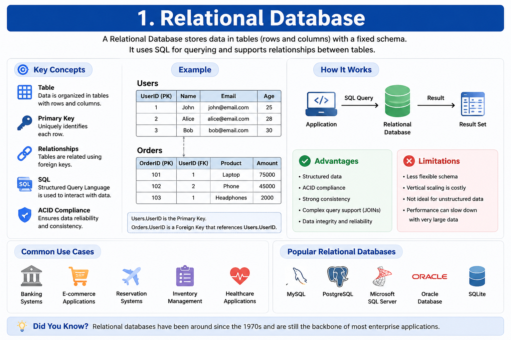
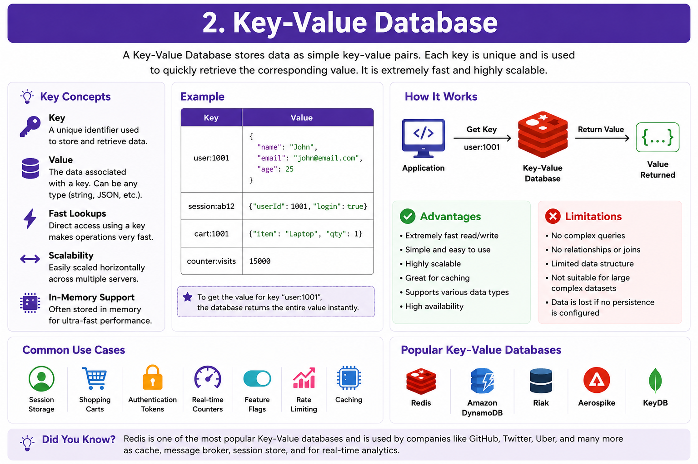
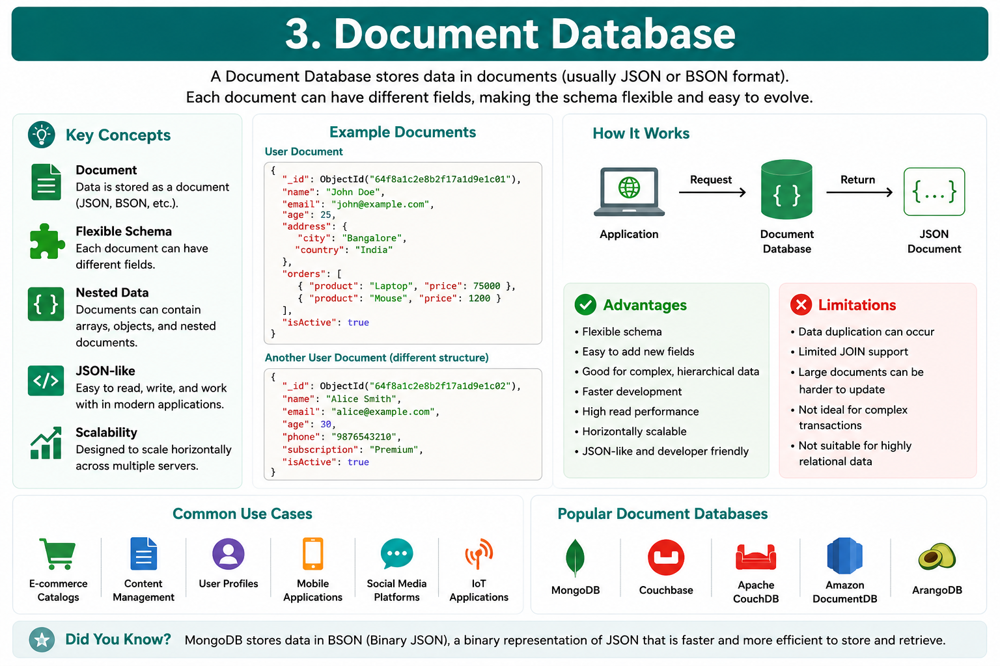
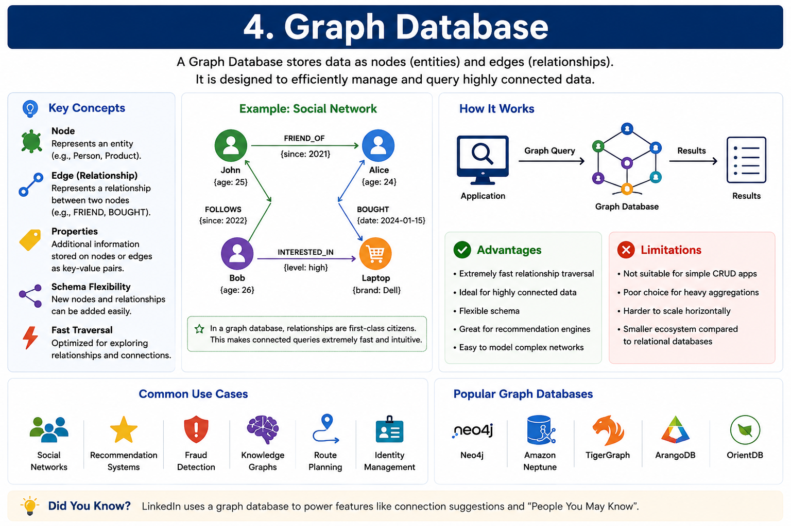
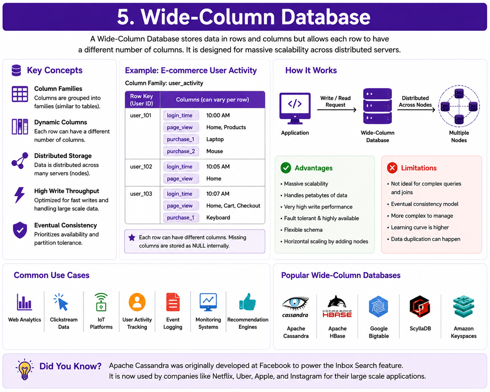
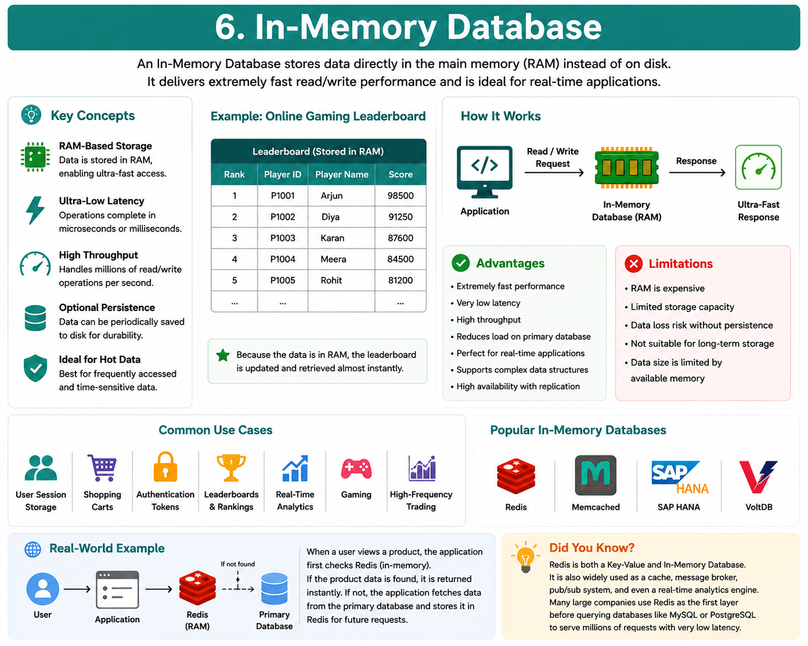
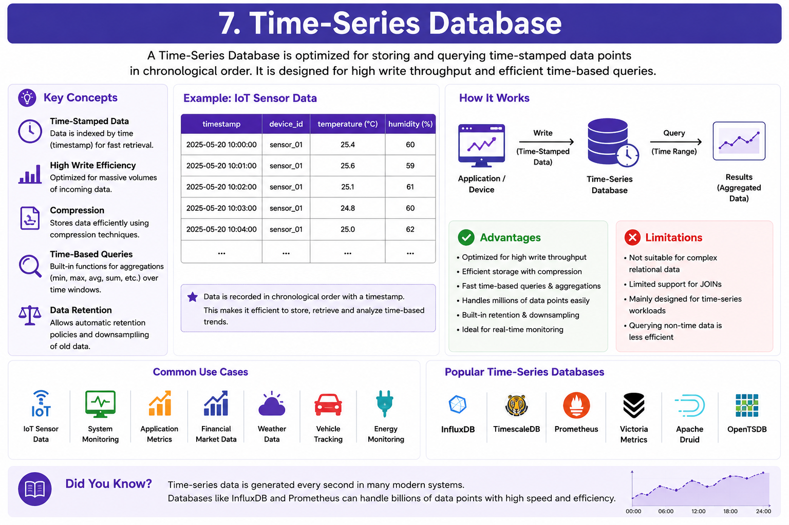
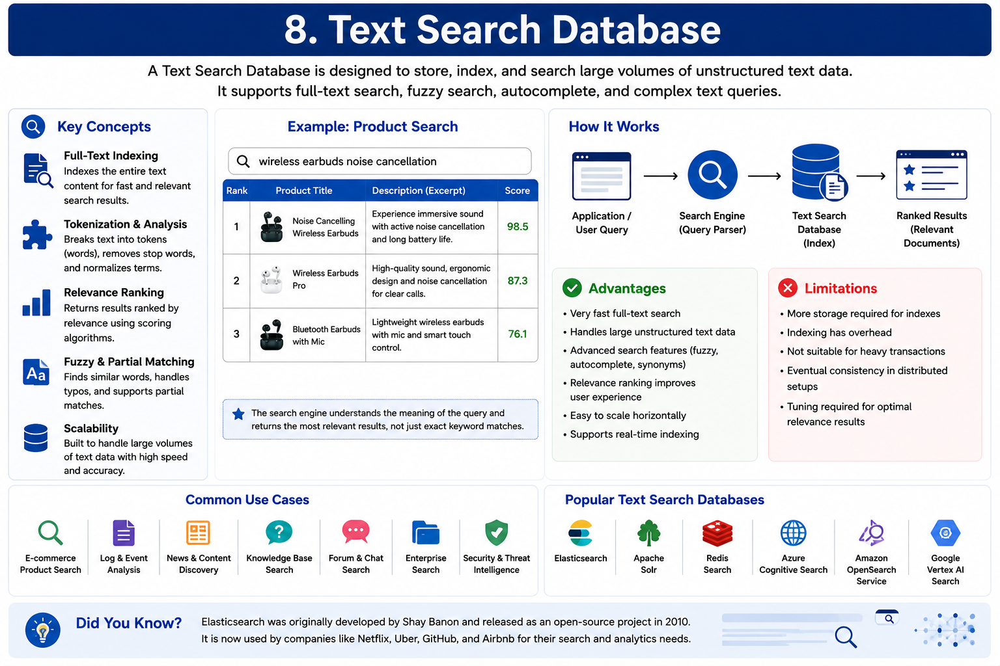

# Types of Databases

## 1. Why Are There Different Types of Databases?

In the previous chapters, we learned:

- What a Database is.
- The difference between SQL and NoSQL databases.

Now another important question arises.

**If SQL and NoSQL already exist, why are there so many different database types?**

The answer is simple.

Different applications have different requirements.

A banking application needs:

- Strong consistency
- Reliable transactions
- Structured relationships

A social media platform needs:

- Massive scalability
- Flexible data
- Fast reads and writes

An IoT platform needs:

- Millions of time-based sensor readings

An AI chatbot needs:

- Similarity search using embeddings

A mapping application needs:

- Geographic locations

Clearly,

one database cannot efficiently solve all these problems.

That's why different database types were developed.

Each database is optimized for a specific kind of workload.

Choosing the correct database can significantly improve an application's:

- Performance
- Scalability
- Reliability
- Cost
- Development Speed

---

## 2. Database Classification

Modern databases can be broadly divided into three categories.

```text
Databases
│
├── Relational Databases (SQL)
│
├── NoSQL Databases
│   ├── Key-Value
│   ├── Document
│   ├── Wide-Column
│   └── Graph
│
└── Specialized Databases
    ├── In-Memory
    ├── Time-Series
    ├── Search
    ├── Spatial
    ├── Blob Storage
    ├── Vector
    ├── Ledger
    ├── Hierarchical
    ├── Object-Oriented
    └── Embedded
```

Let's briefly understand each category.

---

### Relational Databases

Relational databases organize information into tables consisting of rows and columns.

They use SQL to query and manage data.

They are best suited for applications that require:

- Structured data
- Strong consistency
- Complex relationships
- Reliable transactions

Examples:

- MySQL
- PostgreSQL
- Oracle Database
- Microsoft SQL Server

---

### NoSQL Databases

NoSQL databases are designed for scalability, flexibility, and high performance.

Unlike relational databases,

they support multiple data models instead of storing everything in tables.

The four major NoSQL database types are:

- Key-Value Databases
- Document Databases
- Wide-Column Databases
- Graph Databases

Each one solves a different problem.

We'll study them individually in this chapter.

---

### Specialized Databases

Some applications have very unique requirements.

Instead of using general-purpose databases,

they use databases built specifically for certain workloads.

Examples include:

- AI Applications
- GIS Systems
- Search Engines
- IoT Platforms
- Content Delivery Systems
- Blockchain Applications

These specialized databases are optimized for those specific use cases.

---

## 3. Overview of Database Types

The following table summarizes the most common database types.

| Database Type | Best Used For | Popular Examples |
|---------------|--------------|------------------|
| Relational Database | Structured Business Data | MySQL, PostgreSQL |
| Key-Value Database | Caching & Sessions | Redis, DynamoDB |
| Document Database | Flexible JSON Data | MongoDB, Couchbase |
| Graph Database | Connected Data | Neo4j, Amazon Neptune |
| Wide-Column Database | Large Distributed Systems | Cassandra, HBase |
| In-Memory Database | Ultra-Fast Access | Redis, Memcached |
| Time-Series Database | Time-Based Data | InfluxDB, Prometheus |
| Search Database | Full Text Search | Elasticsearch, Solr |
| Spatial Database | Maps & GPS | PostGIS, Oracle Spatial |
| Blob Storage | Images & Videos | Amazon S3, Azure Blob |
| Ledger Database | Immutable Records | Amazon QLDB |
| Hierarchical Database | Tree Structures | IBM IMS |
| Object-Oriented Database | OOP Applications | ObjectDB |
| Vector Database | AI & Machine Learning | Pinecone, Milvus, Faiss |
| Embedded Database | Local Applications | SQLite, RocksDB |

Don't worry if some of these names are unfamiliar.

We'll study every database type one by one in the upcoming sections.

---

## Why Learning Database Types Matters

Modern applications rarely use a single database.

Instead,

they combine multiple database types based on their requirements.

For example,

an e-commerce platform may use:

- MySQL for customer orders.
- Redis for caching.
- MongoDB for product catalogs.
- Elasticsearch for product search.
- Amazon S3 for storing product images.

Each database is responsible for the task it performs best.

Understanding database types helps engineers design systems that are:

- Faster
- More Scalable
- More Reliable
- Easier to Maintain

---

> [!TIP]
> **💡 Did You Know? #1**
> 
> Many large technology companies use **five or more different database types** within the same application.
> 
> Instead of relying on a single database,
> 
> they choose the most appropriate database for each workload.
> 
> This approach is known as **Polyglot Persistence**.

---

## 🚀 What's Next?

We'll now start exploring each database type individually.

The first database we'll study is the **Relational Database (RDBMS)**—the foundation of most traditional business applications.

# 4. Relational Databases (RDBMS)

A **Relational Database Management System (RDBMS)** is a database that stores data in **tables** consisting of rows and columns.

Each table represents a specific type of data, and relationships between tables are established using **Primary Keys** and **Foreign Keys**.

Unlike many NoSQL databases, relational databases follow a predefined schema, ensuring that all records maintain a consistent structure.

Because of their reliability, consistency, and support for ACID transactions, relational databases are one of the most widely used database types in the world.

---

## How Relational Databases Work

Imagine an online shopping application.

Instead of storing everything in one place, the data is divided into multiple related tables.

Example:

```text
Users Table

+----+--------+----------------------+
| ID | Name   | Email                |
+----+--------+----------------------+
| 1  | John   | john@email.com       |
| 2  | Alice  | alice@email.com      |
+----+--------+----------------------+
```

```text
Orders Table

+------+---------+----------+
| ID   | UserID  | Amount   |
+------+---------+----------+
|101   |1        |₹500      |
|102   |2        |₹1200     |
+------+---------+----------+
```

Here,

**UserID** connects each order to the correct user.

Instead of duplicating customer information in every order,

the database simply stores a relationship.

This keeps the data:

- Organized
- Consistent
- Easy to manage

---

## Architecture

A relational database follows a simple flow.

```text
Application

↓

SQL Query

↓

RDBMS

↓

Tables

↓

Response
```

The application sends an SQL query.

The RDBMS processes the query.

It retrieves or updates the required tables.

Finally,

the requested data is returned to the application.

---

## Characteristics of Relational Databases

Relational databases share several common characteristics.

### Table-Based Storage

Data is organized into rows and columns.

Each table stores one type of information.

---

### Fixed Schema

The table structure is defined before storing data.

Every record follows the same format.

---

### Relationships

Different tables can be connected using:

- Primary Keys
- Foreign Keys

This avoids unnecessary duplication of data.

---

### ACID Transactions

Relational databases provide reliable transactions through:

- Atomicity
- Consistency
- Isolation
- Durability

This makes them suitable for applications where data accuracy is essential.

---

### SQL Language

Applications interact with relational databases using SQL.

Common SQL operations include:

- SELECT
- INSERT
- UPDATE
- DELETE

---

## Advantages

Relational databases offer several important benefits.

### Strong Data Integrity

Relationships and constraints help maintain accurate data.

---

### Reliable Transactions

ACID properties ensure data remains consistent even during failures.

---

### Powerful Queries

SQL supports:

- JOINs
- Filtering
- Sorting
- Aggregations
- Reporting

---

### Mature Ecosystem

Relational databases have existed for decades.

They provide:

- Excellent documentation
- Large communities
- Stable tools
- Enterprise support

---

### Security

Most relational databases provide built-in features such as:

- Authentication
- Authorization
- Backup
- Encryption
- Recovery

---

## Limitations

Although powerful,

relational databases also have some limitations.

### Fixed Schema

Changing the database structure requires schema modifications.

---

### Horizontal Scaling is Difficult

Scaling relational databases across many servers is more complex than many NoSQL databases.

---

### Complex Relationships Can Become Expensive

Very large JOIN operations across massive datasets can reduce performance.

---

### Less Flexible

Applications with rapidly changing data structures may find relational databases restrictive.

---

## Common Use Cases

Relational databases are commonly used in applications where data consistency is critical.

Examples include:

- Banking Systems
- E-commerce Platforms
- Hospital Management Systems
- Airline Reservation Systems
- ERP Software
- School Management Systems
- Payroll Systems
- Inventory Management

---

## Popular Relational Databases

Some of the most widely used relational databases include:

- MySQL
- PostgreSQL
- Oracle Database
- Microsoft SQL Server
- MariaDB

Although these databases differ in features,

they all follow the same relational model.

---

## Real-World Example

Consider an online shopping website.

Instead of storing everything inside one table,

the application creates multiple related tables.

```text
Customers

↓

Orders

↓

Payments

↓

Products

↓

Reviews
```

Each table stores only its own information.

Relationships connect all these tables together,

making the system efficient and organized.

---

> [!TIP]
> **💡 Did You Know?**
> 
> Over **80% of enterprise business applications** still rely on relational databases because of their reliability, strong consistency, and mature ecosystem.
> 
> Many banks, governments, hospitals, and Fortune 500 companies continue to use relational databases as the backbone of their critical systems.

# 5. Key-Value Databases

A **Key-Value Database** is a type of NoSQL database that stores data as **key-value pairs**.

Each piece of data is associated with a **unique key**.

The key acts like an identifier,

while the value contains the actual data.

You can think of it like a real-world dictionary.

```text
Word
↓

Meaning
```

Similarly,

a Key-Value database stores:

```text
Key
↓

Value
```

Whenever an application knows the key,

it can retrieve the value almost instantly.

This makes Key-Value databases one of the fastest database types available.

---

## How Key-Value Databases Work

Suppose an application stores user sessions.

```text
Key

session_101

↓

Value

{
  User : John
  LoggedIn : true
}
```

Another user logs in.

```text
Key

session_102

↓

Value

{
  User : Alice
  LoggedIn : true
}
```

Whenever the application needs John's session,

it simply requests:

```text
session_101
```

The database immediately returns:

```text
{
  User : John
  LoggedIn : true
}
```

Instead of searching entire tables,

the database performs a direct lookup,

making retrieval extremely fast.

---

## Architecture

A Key-Value database follows a simple request flow.

```text
Application

↓

Key

↓

Key-Value Database

↓

Value

↓

Application
```

The application sends a key.

The database searches for that key.

If the key exists,

its corresponding value is returned.

---

## Characteristics

Key-Value databases share several important characteristics.

### Unique Keys

Every value is associated with a unique key.

No duplicate keys are allowed.

---

### Extremely Fast Lookups

Since data is retrieved directly using its key,

lookup operations are extremely fast.

Many Key-Value databases store data entirely in memory,

making them even faster.

---

### Flexible Values

The value can store almost anything.

Examples include:

- String
- Number
- JSON
- Image Reference
- Binary Data

The database doesn't care about the structure.

It simply stores the value.

---

### Simple Data Model

Unlike relational databases,

there are:

- No Tables
- No Foreign Keys
- No JOINs

Only Keys and Values.

This simplicity is one reason for their high performance.

---

## Advantages

### Extremely Fast

Key-based lookups are usually performed in milliseconds or even microseconds.

---

### Highly Scalable

Key-Value databases are designed to scale horizontally across multiple servers.

---

### Easy to Use

The data model is very simple.

Applications only need to know the key.

---

### Excellent for Caching

Frequently accessed data can be stored in memory,

greatly reducing database load.

---

### High Availability

Many Key-Value databases replicate data across multiple servers,

improving fault tolerance.

---

## Limitations

Key-Value databases are not suitable for every application.

### No Relationships

They cannot efficiently represent relationships between data.

---

### Limited Queries

Applications must already know the key.

Searching by arbitrary fields is usually not supported.

Example:

❌ Find users whose age is greater than 30.

This type of query is difficult in a Key-Value database.

---

### No JOIN Operations

Unlike SQL databases,

Key-Value databases cannot perform JOINs.

---

### Not Ideal for Reporting

Generating complex reports and analytics is difficult because the database focuses on simple key lookups.

---

## Common Use Cases

Key-Value databases are commonly used for:

- Session Storage
- Authentication Tokens
- Shopping Carts
- Application Cache
- User Preferences
- Feature Flags
- Rate Limiting
- Real-Time Counters

These use cases require extremely fast read and write operations.

---

## Popular Key-Value Databases

Some of the most popular Key-Value databases include:

- Redis
- Amazon DynamoDB
- Riak
- Aerospike

Among them,

**Redis** is the most widely used.

---

## Real-World Example

Consider an e-commerce website.

After a user logs in,

their session information is stored.

```text
session_8457

↓

{
 User : John

 Login : Success

 Cart : 4 Items
}
```

Whenever the user visits another page,

the application simply requests:

```text
session_8457
```

The session data is returned immediately,

allowing the user to stay logged in without repeatedly accessing the primary database.

---

> [!TIP]
> **💡 Did You Know?**
> 
> Many websites use **Redis** as a cache in front of MySQL or PostgreSQL.
> 
> Instead of querying the main database every time,
> 
> frequently accessed data is first checked in Redis.
> 
> This significantly reduces database load and improves application performance.

# 6. Document Databases

A **Document Database** is a type of NoSQL database that stores data as **documents** instead of tables.

These documents are typically stored in formats like:

- JSON
- BSON
- XML

Each document contains all the information related to a single entity.

Unlike relational databases, documents do not need to follow a fixed structure.

This makes document databases highly flexible and easy to adapt as application requirements change.

---

## How Document Databases Work

Imagine an e-commerce application.

Instead of storing user information in one table and orders in another,

a document database can store everything related to a user in a single document.

Example:

```json
{
  "_id": 101,
  "name": "John",
  "email": "john@email.com",
  "orders": [
    {
      "product": "Laptop",
      "price": 75000
    },
    {
      "product": "Mouse",
      "price": 1200
    }
  ]
}
```

Everything about John is stored together.

The application can retrieve the complete document with a single query.

---

## Architecture

A Document Database follows this flow:

```text
Application

↓

Document Request

↓

Document Database

↓

JSON Document

↓

Application
```

Instead of fetching data from multiple related tables,

the database returns a complete document.

---

## Characteristics

Document databases have several unique characteristics.

### Document-Based Storage

Data is stored as self-contained documents.

Each document usually represents one real-world object.

Examples:

- User
- Product
- Order
- Blog Post

---

### Flexible Schema

Every document can have different fields.

Example:

Document 1

```json
{
  "name":"John",
  "email":"john@email.com"
}
```

Document 2

```json
{
  "name":"Alice",
  "email":"alice@email.com",
  "phone":"9876543210",
  "address":"Bangalore"
}
```

Both documents are valid,

even though they have different structures.

---

### Nested Data

Documents can contain other documents or arrays.

Example:

```json
{
   "customer":"John",

   "orders":[
      {...},
      {...}
   ]
}
```

This allows related data to be stored together.

---

### JSON-Like Structure

Most document databases use JSON or BSON,

making them easy to work with in modern programming languages.

---

## Advantages

### Flexible Data Model

Applications can evolve without changing the database schema.

---

### Fast Development

Developers can add new fields without performing database migrations.

---

### Good Read Performance

Since related data is stored together,

applications often retrieve everything with a single query.

---

### Horizontally Scalable

Most document databases support horizontal scaling,

making them suitable for large applications.

---

### Developer Friendly

JSON documents closely resemble objects used in languages like:

- JavaScript
- Python
- Java

This reduces the mismatch between application objects and stored data.

---

## Limitations

Document databases also have some trade-offs.

### Data Duplication

Related information is often stored in multiple documents,

leading to duplicate data.

---

### Limited JOIN Support

Unlike relational databases,

document databases generally avoid JOIN operations.

Applications often store related data together instead.

---

### Large Documents

Very large documents can become difficult to update efficiently.

---

### Not Ideal for Complex Transactions

Although many document databases now support transactions,

they are generally not as powerful as relational databases for highly transactional workloads.

---

## Common Use Cases

Document databases are widely used for:

- E-commerce Product Catalogs
- Content Management Systems (CMS)
- Blogging Platforms
- User Profiles
- Mobile Applications
- Social Media Platforms
- IoT Applications
- Real-Time Analytics

These applications often have data that changes frequently or varies between records.

---

## Popular Document Databases

Some popular document databases include:

- MongoDB
- Couchbase
- Apache CouchDB
- Amazon DocumentDB

Among these,

**MongoDB** is the most widely used.

---

## Real-World Example

Consider an online shopping application.

Every product has different attributes.

A laptop may have:

```json
{
  "brand":"Dell",
  "ram":"16GB",
  "processor":"Intel i7"
}
```

A smartphone may have:

```json
{
  "brand":"Samsung",
  "storage":"256GB",
  "camera":"108MP"
}
```

A relational database would require many optional columns or additional tables.

A document database allows each product to store only the fields it actually needs.

This makes document databases ideal for applications with diverse and evolving data.

---

> [!TIP]
> **💡 Did You Know?**
> 
> **MongoDB** stores data internally in **BSON (Binary JSON)** instead of plain JSON.
> 
> BSON extends JSON by supporting additional data types such as dates, binary data, and ObjectIds, making storage and retrieval more efficient while remaining easy for developers to use.

# 7. Graph Databases

A **Graph Database** is a type of NoSQL database designed to store and query highly connected data.

Instead of storing data in tables or documents, a graph database represents information as a network of **Nodes**, **Edges**, and **Properties**.

This structure makes it extremely efficient for exploring relationships between data.

Graph databases are ideal for applications where connections between entities are more important than the entities themselves.

---

## How Graph Databases Work

A graph database stores data using three core components.

### Nodes

Nodes represent entities or objects.

Examples include:

- Users
- Products
- Movies
- Cities

---

### Edges

Edges represent relationships between nodes.

Examples:

- FRIEND_OF
- PURCHASED
- LIVES_IN
- FOLLOWS

---

### Properties

Properties store additional information about nodes or relationships.

Example:

```text
Node

John

Age : 25

City : Bangalore
```

---

## Example

Imagine a social media platform.

```text
John

│
├── FRIEND_OF ───► Alice
│
└── FOLLOWS ─────► Bob
```

Now suppose Alice purchased a Laptop.

```text
Alice

│
└── PURCHASED ──► Laptop
```

Instead of searching multiple tables,

the graph database simply follows the relationships.

This makes connected queries extremely fast.

---

## Architecture

```text
Application

↓

Graph Query

↓

Graph Database

↓

Nodes + Relationships

↓

Application
```

The application asks a relationship-based question,

and the graph database traverses the graph to find the answer.

---

## Characteristics

### Relationship-Oriented

Relationships are first-class citizens.

Unlike relational databases,

relationships are stored directly.

---

### Fast Graph Traversal

Graph databases quickly navigate from one node to another,

even across millions of connected records.

---

### Flexible Schema

New node types and relationships can be added without redesigning the entire database.

---

### Highly Connected Data

Graph databases are optimized for datasets with complex connections.

---

## Advantages

- Extremely fast relationship queries.
- Excellent for recommendation engines.
- Flexible schema.
- Easy to model complex networks.
- Efficient graph traversal.

---

## Limitations

- Not suitable for traditional business applications.
- Poor choice for simple CRUD systems.
- More difficult to scale horizontally than some NoSQL databases.
- Smaller ecosystem compared to relational databases.

---

## Common Use Cases

Graph databases are widely used for:

- Social Networks
- Recommendation Systems
- Fraud Detection
- Knowledge Graphs
- Network Analysis
- Route Planning
- Identity Management

---

## Popular Graph Databases

Some widely used graph databases include:

- Neo4j
- Amazon Neptune
- TigerGraph
- ArangoDB

Among these,

**Neo4j** is the most popular graph database.

---

## Real-World Example

Imagine Netflix.

```text
User

↓

Watched

↓

Movie

↓

Directed By

↓

Director

↓

Genre

↓

Recommended Movie
```

Instead of joining multiple tables,

the graph database simply follows the relationships,

making recommendations much faster and more efficient.

---

> [!TIP]
> **💡 Did You Know?**
> 
> Companies like **LinkedIn**, **Meta**, and **Netflix** use graph-based techniques to power features such as connection suggestions, content recommendations, and fraud detection because graph traversal is much faster than repeatedly joining relational tables for highly connected data.

# 8. Wide-Column Databases

A **Wide-Column Database** is a type of NoSQL database designed to store and process massive amounts of distributed data across multiple servers.

Although it stores data using rows and columns, it is **not** the same as a relational database.

Unlike SQL databases, where every row follows the same structure, a Wide-Column Database allows each row to have a different number of columns.

This flexibility makes it highly scalable and ideal for applications handling billions of records.

---

## How Wide-Column Databases Work

Imagine a website that tracks user activity.

Instead of forcing every user to have the same columns,

each user stores only the information they actually have.

Example:

```text
UserID: 101

Page1 → Home
Page2 → Products
Purchase1 → Laptop
Purchase2 → Mouse
```

Another user:

```text
UserID: 102

Page1 → Home
Purchase1 → Keyboard
```

Notice that both users have different columns.

The database doesn't require every row to follow the same structure.

This makes storing rapidly changing data much more efficient.

---

## Architecture

```text
Application

↓

Write Request

↓

Wide-Column Database

↓

Distributed Column Families

↓

Application
```

Instead of storing all information on one machine,

the data is distributed across multiple servers,

allowing the system to handle enormous workloads.

---

## Characteristics

### Dynamic Columns

Each row can contain a different number of columns.

There is no requirement for every record to have identical fields.

---

### Column Families

Columns are grouped into **Column Families**.

This helps organize related information together and improves performance.

---

### Distributed Storage

Data is automatically distributed across multiple servers,

allowing the database to scale horizontally.

---

### High Write Throughput

Wide-Column databases are optimized for continuous write operations,

making them excellent for applications that generate huge amounts of data.

---

## Advantages

### Massive Scalability

Can easily handle petabytes of data across hundreds of servers.

---

### High Write Performance

Designed for applications receiving millions of writes every second.

---

### Fault Tolerance

If one server fails,

other servers continue serving requests.

---

### Flexible Structure

Rows are not required to contain identical columns.

---

### Horizontal Scaling

Adding more servers increases capacity without significant downtime.

---

## Limitations

### Complex Queries

Wide-Column databases are not designed for complex JOIN operations.

---

### Eventual Consistency

Many Wide-Column databases prioritize availability over immediate consistency.

---

### Learning Curve

Their architecture is more complex than traditional relational databases.

---

### Limited Relationships

Managing relationships between data is more difficult compared to relational databases.

---

## Common Use Cases

Wide-Column databases are commonly used for:

- Web Analytics
- Clickstream Data
- IoT Platforms
- User Activity Tracking
- Event Logging
- Monitoring Systems
- Recommendation Pipelines
- Large-Scale Distributed Applications

These systems generate enormous amounts of continuously changing data.

---

## Popular Wide-Column Databases

Some of the most widely used Wide-Column databases include:

- Apache Cassandra
- Apache HBase
- Google Bigtable
- ScyllaDB

Among these,

**Apache Cassandra** is one of the most popular.

---

## Real-World Example

Imagine YouTube tracking every user action.

```text
User 101

↓

Watch Video

↓

Like Video

↓

Comment

↓

Share
```

Millions of these events happen every second.

A Wide-Column database stores this continuously growing activity efficiently across many servers,

making it possible to process billions of events every day.

---

> [!TIP]
> **💡 Did You Know?**
> 
> **Apache Cassandra** was originally developed at **Facebook** to power the Inbox Search feature.
> 
> Its distributed architecture later made it popular for companies handling massive-scale applications such as Netflix, Uber, Apple, and Instagram.

# 9. In-Memory Databases

An **In-Memory Database (IMDB)** is a database that stores data directly in the computer's **main memory (RAM)** instead of storing it primarily on disks such as SSDs or HDDs.

Since RAM is much faster than disk storage,

In-Memory databases can retrieve and update data in **microseconds or milliseconds**.

This makes them ideal for applications where speed is more important than storing massive amounts of data.

---

## How In-Memory Databases Work

Traditional databases store data on disk.

Whenever an application requests data,

the database reads it from storage before returning the result.

```text
Application

↓

Database

↓

Disk (SSD/HDD)

↓

Response
```

This process is reliable,

but reading from disk takes time.

---

An In-Memory Database stores data directly in RAM.

```text
Application

↓

In-Memory Database

↓

RAM

↓

Response
```

Since the data is already in memory,

there is no need to access the disk for every request.

This dramatically reduces response time.

---

## Architecture

```text
Application

↓

Read / Write Request

↓

In-Memory Database

↓

RAM

↓

Application
```

Many In-Memory databases also periodically save data to disk,

ensuring that important information is not permanently lost if the server restarts.

---

## Characteristics

### RAM-Based Storage

Data is primarily stored in RAM,

allowing extremely fast access.

---

### Ultra-Low Latency

Most operations complete in microseconds or a few milliseconds.

---

### High Read and Write Speed

Both reading and writing data are significantly faster than traditional disk-based databases.

---

### Optional Persistence

Many In-Memory databases can periodically save snapshots to disk or maintain append-only logs to recover data after failures.

---

### Excellent for Frequently Accessed Data

Applications often use In-Memory databases to store data that is requested repeatedly.

---

## Advantages

### Extremely Fast Performance

RAM is much faster than disk storage,

making data access nearly instantaneous.

---

### Low Latency

Ideal for applications where every millisecond matters.

---

### High Throughput

Can process millions of read and write operations every second.

---

### Reduces Database Load

Frequently accessed data can be served directly from memory,

reducing pressure on the primary database.

---

### Supports Real-Time Applications

Perfect for applications requiring immediate responses.

---

## Limitations

### Expensive Storage

RAM is much more expensive than SSD or HDD storage.

Storing huge datasets entirely in memory is costly.

---

### Limited Capacity

Servers generally have much less RAM than disk storage.

---

### Risk of Data Loss

If persistence is not enabled,

data stored only in RAM can be lost during a crash or power failure.

---

### Not Suitable for Long-Term Storage

In-Memory databases are often used alongside traditional databases,

rather than replacing them.

---

## Common Use Cases

In-Memory databases are widely used for:

- Application Caching
- User Session Storage
- Shopping Carts
- Authentication Tokens
- Leaderboards
- Gaming
- Real-Time Analytics
- High-Frequency Trading

These applications require extremely fast access to frequently used data.

---

## Popular In-Memory Databases

Some of the most popular In-Memory databases include:

- Redis
- Memcached
- SAP HANA
- VoltDB

Among these,

**Redis** is by far the most widely used.

---

## Real-World Example

Imagine an online shopping website.

A product called **iPhone 16** is viewed by thousands of users every minute.

Instead of asking the primary database for the same product details repeatedly,

the application stores the product information in Redis.

```text
User

↓

Application

↓

Redis (RAM)

↓

Product Details

↓

User
```

Only if the data is missing from Redis does the application query the primary database.

This significantly improves response time and reduces the load on the main database.

---

> [!TIP]
> **💡 Did You Know?**
> 
> Although **Redis** is commonly called an In-Memory Database,
> 
> it is also widely used as a **cache**, **message broker**, and **pub/sub system**.
> 
> Many large companies use Redis as the first layer before querying databases like MySQL or PostgreSQL, allowing applications to serve millions of requests with very low latency.

# 10. Time-Series Databases

A **Time-Series Database (TSDB)** is a specialized database designed to store, manage, and analyze **time-stamped data**.

Unlike traditional databases that focus on storing general-purpose data,

Time-Series databases are optimized for data that changes continuously over time.

Each record contains:

- A Timestamp
- A Value
- Optional Metadata

This makes it easy to analyze trends, monitor systems, and track events over time.

---

## How Time-Series Databases Work

Imagine you're monitoring a web server.

Every second,

the server records its CPU usage.

Example:

```text
Time          CPU Usage

10:00:01      25%

10:00:02      27%

10:00:03      24%

10:00:04      30%
```

Each entry represents a measurement taken at a specific point in time.

Over hours, days, or months,

the database collects millions of these measurements,

allowing engineers to analyze patterns and trends.

---

## Architecture

```text
Sensors / Applications

↓

Time-Series Database

↓

Timestamp + Value

↓

Dashboards / Analytics
```

Applications continuously send time-stamped data.

The database stores it in chronological order,

making it efficient to retrieve historical information.

---

## Characteristics

### Time-Stamped Records

Every piece of data includes a timestamp.

Without time,

the data has little meaning.

---

### Optimized for Continuous Writes

Time-Series databases are designed to handle constant streams of incoming data.

Millions of new records can be inserted every second.

---

### Efficient Time-Based Queries

They are optimized for queries like:

- Last 5 Minutes
- Last Hour
- Yesterday
- Last Month

instead of searching entire datasets.

---

### Data Compression

Older time-series data is often compressed,

reducing storage requirements while maintaining historical records.

---

### Automatic Data Retention

Many Time-Series databases automatically remove or archive very old data based on configured retention policies.

---

## Advantages

### Extremely Fast Time-Based Queries

Finding data for a particular time range is highly efficient.

---

### High Write Throughput

Ideal for applications generating continuous streams of data.

---

### Efficient Storage

Specialized compression techniques reduce storage costs.

---

### Built-in Aggregations

Most Time-Series databases provide functions for:

- Average
- Maximum
- Minimum
- Sum
- Count

over time intervals.

---

### Excellent for Monitoring

Designed specifically for metrics and performance monitoring.

---

## Limitations

### Specialized Purpose

Time-Series databases are not suitable for general business applications.

---

### Limited Relationships

They are optimized for time-based data,

not complex relationships between entities.

---

### Less Suitable for Transactions

Applications requiring ACID transactions should generally use relational databases instead.

---

### Large Historical Data

Without proper retention policies,

storage requirements can grow rapidly.

---

## Common Use Cases

Time-Series databases are widely used for:

- Server Monitoring
- Application Performance Monitoring
- IoT Sensor Data
- Weather Monitoring
- Stock Market Prices
- Smart Devices
- Industrial Automation
- Network Monitoring

All of these applications generate continuous streams of time-stamped data.

---

## Popular Time-Series Databases

Some of the most popular Time-Series databases include:

- InfluxDB
- TimescaleDB
- Prometheus
- OpenTSDB

Among these,

**InfluxDB** and **Prometheus** are the most widely used.

---

## Real-World Example

Imagine a smart home.

Every minute,

the temperature sensor sends a reading.

```text
09:00

↓

26°C

09:01

↓

27°C

09:02

↓

26°C

09:03

↓

28°C
```

Over time,

the database builds a complete history of temperature changes.

The homeowner can later view graphs showing:

- Daily Trends
- Weekly Trends
- Monthly Trends

This is exactly what a Time-Series Database is designed to do.

---

> [!TIP]
> **💡 Did You Know?**
> 
> Modern cloud platforms such as **Kubernetes**, **Prometheus**, and **Grafana** rely heavily on Time-Series databases to monitor CPU usage, memory consumption, disk activity, network traffic, and thousands of other system metrics in real time.
> 
> Without Time-Series databases, monitoring large-scale cloud infrastructure would be extremely difficult.

# 11. Text Search Databases

A **Text Search Database** is a specialized database designed to efficiently search through large amounts of text data.

Unlike traditional databases, which search records one by one,

Text Search Databases create **indexes** that allow words, phrases, and documents to be found almost instantly.

They are optimized for **full-text search**, making them ideal for applications where users frequently search for information.

---

## How Text Search Databases Work

Imagine an e-commerce website containing millions of products.

A customer searches for:

```text
Wireless Bluetooth Headphones
```

Instead of scanning every product one by one,

the Text Search Database uses a pre-built search index.

```text
Search Query

↓

Search Index

↓

Matching Documents

↓

Results
```

This allows relevant products to be returned within milliseconds.

---

## Architecture

```text
Application

↓

Search Query

↓

Text Search Database

↓

Search Index

↓

Matching Results

↓

Application
```

The database searches its index instead of the original data,

making searches extremely fast.

---

## Characteristics

### Full-Text Search

Optimized for searching complete words, phrases, and sentences.

---

### Search Indexes

Creates special indexes to accelerate search operations.

---

### Ranking

Results are ranked based on relevance,

so the most useful results appear first.

---

### Fuzzy Search

Can find similar words even when users make spelling mistakes.

Example:

```text
iphne

↓

iPhone
```

---

### Autocomplete

Many Text Search Databases support search suggestions while users are typing.

---

## Advantages

### Extremely Fast Search

Designed specifically for searching large collections of text.

---

### Intelligent Ranking

Returns the most relevant results first.

---

### Typo Tolerance

Can handle spelling mistakes and partial matches.

---

### Scalable

Can search across millions or even billions of documents.

---

### Rich Search Features

Supports:

- Filtering
- Highlighting
- Autocomplete
- Phrase Search
- Fuzzy Search

---

## Limitations

### Not a General Database

It is optimized for searching,

not for storing transactional business data.

---

### Additional Infrastructure

Applications often need both:

- Primary Database
- Search Database

---

### Index Maintenance

Indexes must be updated whenever data changes.

---

## Common Use Cases

Text Search Databases are widely used for:

- Search Engines
- E-commerce Product Search
- Blog Search
- Documentation Search
- Log Analysis
- News Platforms
- Enterprise Search
- AI Knowledge Bases

---

## Popular Text Search Databases

Some of the most popular Text Search Databases include:

- Elasticsearch
- Apache Solr
- OpenSearch
- Meilisearch

Among these,

**Elasticsearch** is the most widely used.

---

## Real-World Example

Imagine Amazon.

A customer searches:

```text
Gaming Laptop
```

The application sends the query to Elasticsearch.

Elasticsearch quickly searches millions of indexed products,

ranks them by relevance,

and returns the best matching results almost instantly.

This provides the fast search experience users expect from modern applications.

---

> [!TIP]
> **💡 Did You Know?**
> 
> Google, Amazon, Netflix, GitHub, and many other large platforms rely on dedicated search technologies instead of searching directly in their primary databases.
> 
> Keeping search separate from the main database significantly improves both search performance and overall application scalability.

---

# 🎉 Part A Completed

In this part, we explored the most commonly used database types in modern software systems, including:

- Relational Databases
- Key-Value Databases
- Document Databases
- Graph Databases
- Wide-Column Databases
- In-Memory Databases
- Time-Series Databases
- Text Search Databases

These databases form the foundation of many real-world applications, from banking systems and e-commerce platforms to cloud infrastructure and search engines.

In **Part B**, we'll continue with more specialized database types, including Spatial, Blob, Ledger, Vector, Embedded, and others, followed by a complete comparison and guidance on choosing the right database for different system design scenarios.

---
## Reference Images








