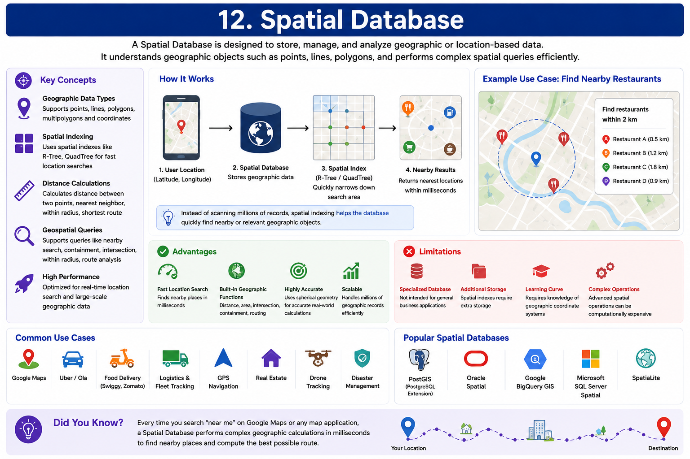
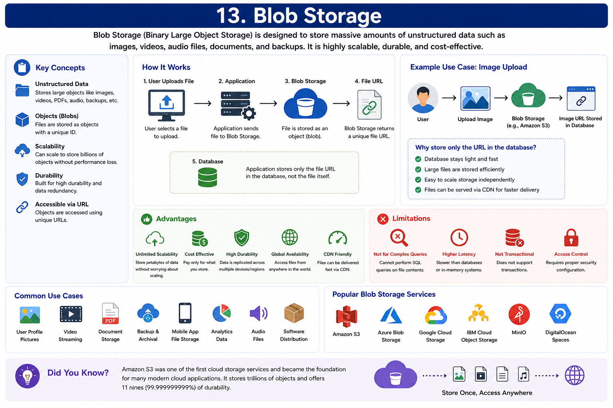
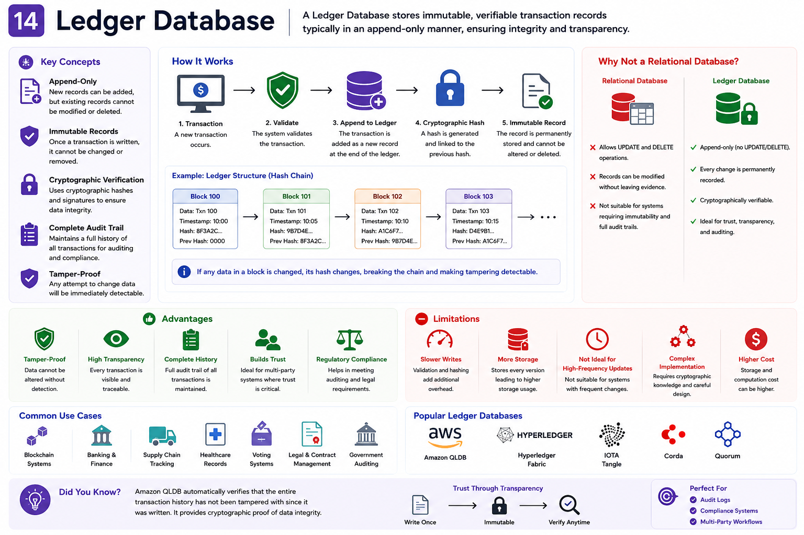
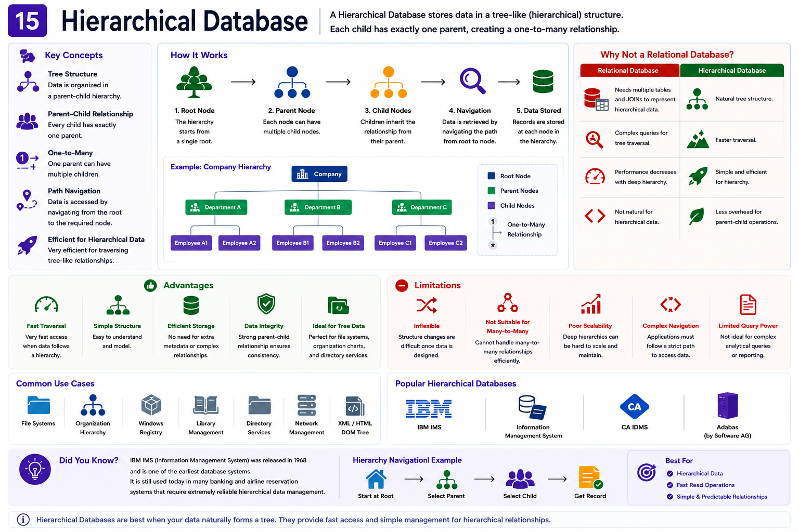
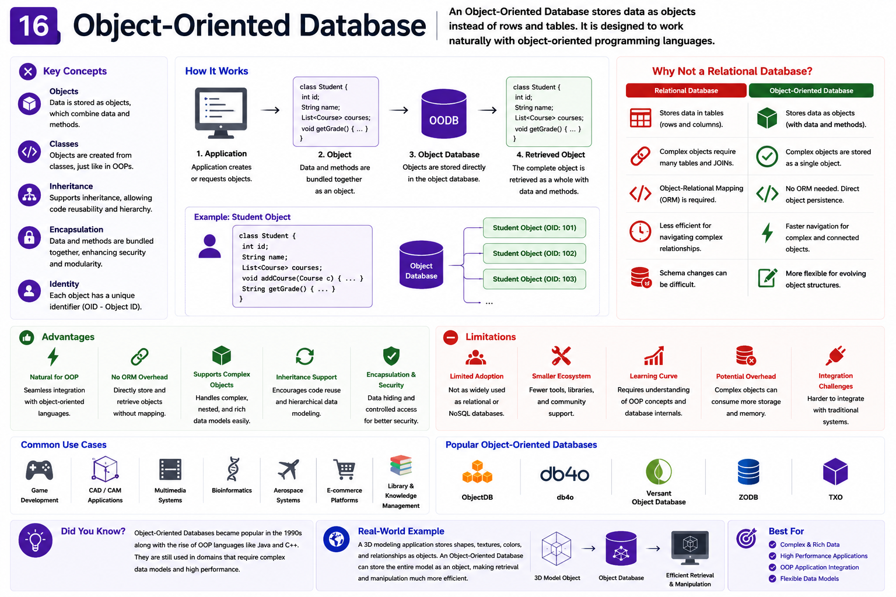
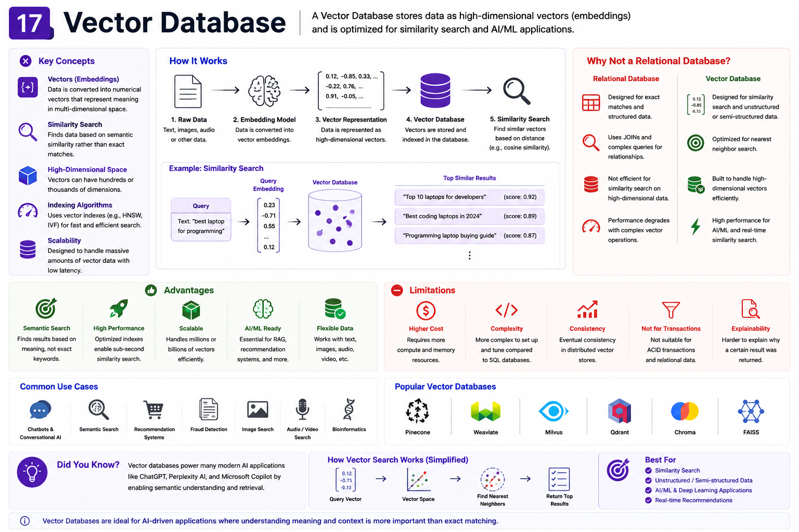
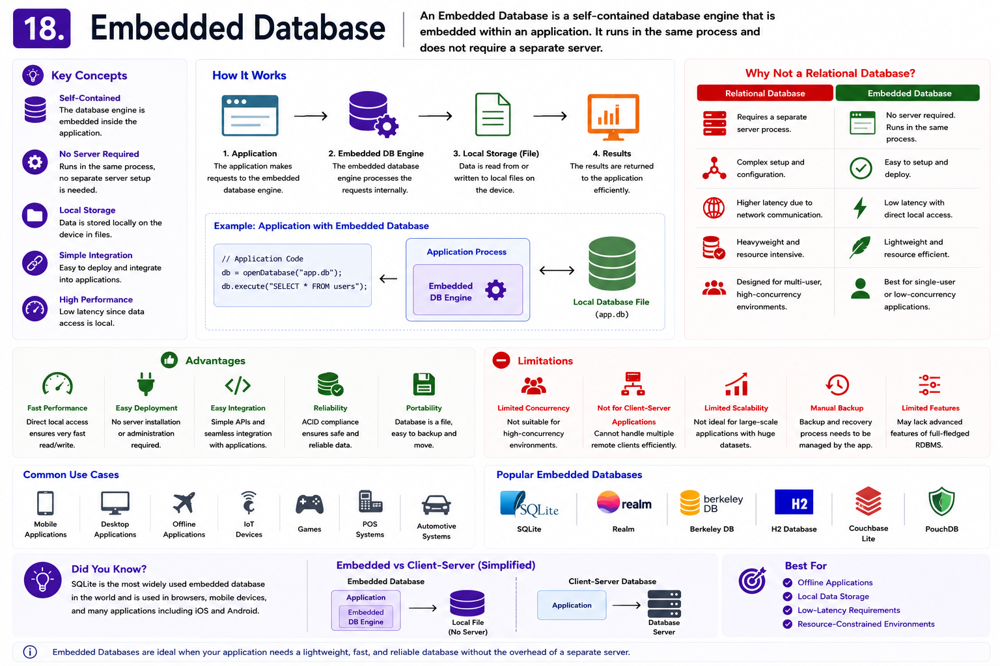

# Types of Databases – Part B

In **Part A**, we explored the most commonly used database types that form the foundation of modern software systems.

We covered:

- Relational Databases
- Key-Value Databases
- Document Databases
- Graph Databases
- Wide-Column Databases
- In-Memory Databases
- Time-Series Databases
- Text Search Databases

These databases are widely used in enterprise applications, web platforms, distributed systems, caching, monitoring, and search engines.

---

Modern applications, however, often require even more specialized storage solutions.

For example,

- **Google Maps** needs to efficiently process geographical locations.
- **Amazon S3** stores billions of images, videos, and documents.
- **Blockchain systems** require immutable transaction records.
- **AI applications** perform similarity searches on embeddings instead of traditional text.
- **Desktop and mobile applications** need lightweight databases that run locally without a separate database server.

Traditional relational or NoSQL databases are not optimized for these workloads.

That's why specialized database types were developed.

Each one is designed to solve a specific problem while providing the performance, scalability, and features required by modern applications.

---

## Database Types Covered in Part B

| Database Type | Primary Purpose |
|---------------|-----------------|
| Spatial Database | Geographic & Location-Based Data |
| Blob Storage | Images, Videos & Large Files |
| Ledger Database | Immutable Transaction Records |
| Hierarchical Database | Tree-Structured Data |
| Object-Oriented Database | Object-Oriented Applications |
| Vector Database | AI Embeddings & Similarity Search |
| Embedded Database | Lightweight Local Storage |

---

## Why Learn These Database Types?

As systems become larger and more specialized, engineers often combine multiple databases within the same application.

For example:

- **Uber** uses Spatial Databases to find nearby drivers.
- **Amazon S3** stores product images and videos.
- **ChatGPT** and other AI systems use Vector Databases for semantic search.
- **Desktop applications** commonly use SQLite as an Embedded Database.
- **Blockchain platforms** rely on Ledger Databases to maintain immutable records.

Understanding these specialized databases helps you choose the right storage solution for the right problem instead of trying to solve every problem with a single database.

---

##  What's Next?

We'll begin with **Spatial Databases**, which power applications like Google Maps, Uber, Zomato, Swiggy, food delivery platforms, GPS navigation systems, logistics software, and many other location-aware applications.

# 12. Spatial Databases

A **Spatial Database** is a specialized database designed to store, manage, and analyze geographic or location-based data.

It understands geographic objects such as:

- Points
- Lines
- Polygons
- Coordinates
- Routes
- Regions

Unlike traditional databases, Spatial Databases can efficiently answer questions like:

- Which restaurant is nearest?
- Which driver is closest?
- What is the fastest route?
- Which users are inside a delivery zone?

## Characteristics

- Geographic Data Types
- Spatial Indexing (R-Tree, QuadTree)
- Distance Calculations
- Radius Search
- Route Planning
- Geospatial Queries

## Advantages

- Fast location search
- Built-in geographic calculations
- Accurate distance measurement
- Optimized for GIS applications

## Limitations

- Specialized database
- Additional storage for indexes
- Complex spatial operations

## Common Use Cases

- Google Maps
- Uber
- Swiggy
- Zomato
- Logistics
- Fleet Tracking
- GPS Navigation

## Popular Databases

- PostGIS
- Oracle Spatial
- BigQuery GIS
- SQL Server Spatial

## Why Not a Relational Database?

Relational databases can store latitude and longitude,

but they cannot efficiently perform nearest-neighbor searches, route calculations, or spatial indexing.

Spatial Databases are specifically optimized for these operations.

> [!TIP]
> **💡 Did You Know?**
> 
> Every Google Maps "Nearby" search uses spatial indexing to search millions of locations within milliseconds.

---

# 13. Blob Storage

Blob Storage (Binary Large Object Storage) is designed to store massive amounts of unstructured data such as:

- Images
- Videos
- PDFs
- Audio Files
- Documents
- Backups

Instead of storing these files inside relational databases,

applications store them inside Blob Storage and keep only the file URL inside the database.

## How it Works

User Uploads File

↓

Application

↓

Blob Storage

↓

File URL

↓

Database

## Characteristics

- Object Storage
- Highly Durable
- Highly Scalable
- Cost Effective
- Accessible via URL

## Advantages

- Unlimited scalability
- Low storage cost
- Optimized for large files
- Global availability
- High durability

## Limitations

- Not suitable for relational queries
- Higher latency than RAM
- Cannot perform SQL queries

## Common Use Cases

- Amazon Photos
- Netflix Videos
- User Profile Pictures
- File Upload Systems
- Backup Systems
- CDN Storage

## Popular Blob Storage

- Amazon S3
- Azure Blob Storage
- Google Cloud Storage
- MinIO

## Why Not a Relational Database?

Databases are optimized for structured records,

not multi-GB files.

Blob Storage stores large files much more efficiently.

> [!TIP]
> **💡 Did You Know?**
> 
> Amazon S3 stores **trillions of objects** worldwide while providing **11 nines (99.999999999%) durability**.

---

# 14. Ledger Databases

A **Ledger Database** is a database that keeps an immutable record of every transaction.

Once data is written,

it cannot be modified or deleted without leaving evidence.

This makes Ledger Databases ideal for systems requiring trust and transparency.

## Characteristics

- Append Only
- Immutable Records
- Cryptographic Verification
- Complete Audit Trail

## Advantages

- Tamper-proof
- High transparency
- Complete history
- Easy auditing

## Limitations

- Slower writes
- More storage required
- Specialized use cases

## Common Use Cases

- Blockchain
- Banking
- Supply Chain
- Healthcare Records
- Voting Systems

## Popular Databases

- Amazon QLDB
- Hyperledger Fabric

## Why Not a Relational Database?

Traditional databases allow UPDATE and DELETE operations.

Ledger databases preserve every historical change permanently.

> [!TIP]
> **💡 Did You Know?**
> 
> Amazon QLDB automatically verifies whether historical records have ever been modified.

---

# 15. Hierarchical Databases

A Hierarchical Database stores data in a tree-like structure.

Every child has exactly one parent,

creating a one-to-many relationship.

## Example

Company

↓

Department

↓

Employee

## Characteristics

- Tree Structure
- Parent-Child Relationship
- One-to-Many

## Advantages

- Very fast hierarchical traversal
- Simple organization
- Efficient for tree data

## Limitations

- Inflexible
- Difficult many-to-many relationships
- Poor scalability

## Common Use Cases

- File Systems
- Organization Charts
- Windows Registry

## Popular Databases

- IBM IMS

## Why Not Relational?

Hierarchical data naturally fits a tree,

making traversal simpler than repeated SQL JOINs.

> [!TIP]
> **💡 Did You Know?**
> 
> IBM IMS, released in 1968, is still used by some banking systems today.

---

# 16. Object-Oriented Databases

Object-Oriented Databases store data as objects instead of rows.

They closely match object-oriented programming languages.

## Characteristics

- Objects
- Classes
- Inheritance
- Encapsulation

## Advantages

- No Object-Relational Mapping
- Natural for OOP
- Supports complex objects

## Limitations

- Limited adoption
- Smaller ecosystem
- Fewer tools

## Common Use Cases

- CAD Software
- Engineering Applications
- Multimedia Systems

## Popular Databases

- ObjectDB
- db4o

## Why Not Relational?

Complex objects often require many relational tables.

Object databases store objects directly.

> [!TIP]
> **💡 Did You Know?**
> 
> Object Databases became popular alongside Java and C++ during the 1990s.

---

# 17. Vector Databases

A **Vector Database** stores high-dimensional vectors instead of traditional records.

These vectors represent embeddings generated by AI models.

Instead of exact matching,

Vector Databases perform **Similarity Search**.

## Example

Image

↓

Embedding Model

↓

Vector

↓

Vector Database

↓

Most Similar Images

## Characteristics

- Embedding Storage
- Similarity Search
- Nearest Neighbor Search
- AI Optimized

## Advantages

- Extremely fast similarity search
- Ideal for AI
- Semantic Search
- Recommendation Systems

## Limitations

- Not suitable for relational data
- High-dimensional indexing
- Requires embedding models

## Common Use Cases

- ChatGPT
- RAG Applications
- Image Search
- Face Recognition
- Product Recommendations

## Popular Databases

- Pinecone
- Milvus
- Weaviate
- Qdrant
- Faiss

## Why Not Relational?

SQL databases compare exact values.

Vector databases compare semantic similarity.

> [!TIP]
> **💡 Did You Know?**
> 
> Every Retrieval-Augmented Generation (RAG) application—including many AI assistants—relies on Vector Databases to retrieve the most relevant information before generating a response.

---

# 18. Embedded Databases

An Embedded Database runs inside the application itself.

It does not require a separate database server.

## Characteristics

- Lightweight
- Local Storage
- Zero Configuration
- Embedded Inside Application

## Advantages

- Extremely fast
- Easy deployment
- No server required
- Small footprint

## Limitations

- Limited scalability
- Single device
- Not suitable for distributed systems

## Common Use Cases

- Mobile Apps
- Desktop Applications
- IoT Devices
- Browser Storage
- Offline Applications

## Popular Databases

- SQLite
- RocksDB
- Berkeley DB

## Why Not Client-Server Databases?

Small applications don't need a dedicated database server.

Embedded databases reduce complexity.

> [!TIP]
> **💡 Did You Know?**
> 
> SQLite is one of the most widely deployed databases in the world, running inside billions of smartphones, browsers, IoT devices, and desktop applications.

# Database Comparison

Each database type is designed to solve a different problem. Choosing the right database depends on the type of data, query patterns, scalability requirements, and application architecture.

| Database Type | Best For | Examples |
|--------------|----------|----------|
| Relational | Structured business data | MySQL, PostgreSQL |
| Key-Value | Caching & Sessions | Redis, DynamoDB |
| Document | Flexible JSON data | MongoDB, Couchbase |
| Graph | Relationships | Neo4j, Amazon Neptune |
| Wide-Column | Massive distributed data | Cassandra, HBase |
| In-Memory | Ultra-fast access | Redis, Memcached |
| Time-Series | Time-stamped data | InfluxDB, Prometheus |
| Text Search | Full-text search | Elasticsearch, Solr |
| Spatial | Geographic data | PostGIS, Oracle Spatial |
| Blob Storage | Images, Videos, Files | Amazon S3, Azure Blob |
| Ledger | Immutable transactions | Amazon QLDB |
| Hierarchical | Tree structures | IBM IMS |
| Object-Oriented | Object persistence | ObjectDB |
| Vector | AI similarity search | Pinecone, Milvus |
| Embedded | Local databases | SQLite, RocksDB |

---

# How to Choose the Right Database

There is no single "best" database.

The best database depends on the problem you are trying to solve.

Below are some common scenarios and the databases that fit them best.

| Requirement | Recommended Database |
|-------------|----------------------|
| Banking System | Relational Database |
| E-commerce Product Catalog | Document Database |
| User Login Sessions | Key-Value Database |
| Real-Time Caching | In-Memory Database |
| Google Maps | Spatial Database |
| AI Chatbot / RAG | Vector Database |
| Product Search | Text Search Database |
| IoT Sensors | Time-Series Database |
| Blockchain | Ledger Database |
| File Upload System | Blob Storage |
| Social Network | Graph Database |
| Desktop Application | Embedded Database |

---

## Can a Single Application Use Multiple Databases?

Yes.

Modern applications often use multiple databases because each database is optimized for different workloads.

For example, an e-commerce platform may use:

| Component | Database |
|-----------|----------|
| User Accounts | PostgreSQL |
| Product Catalog | MongoDB |
| Product Search | Elasticsearch |
| Shopping Cart | Redis |
| Product Images | Amazon S3 |
| AI Recommendations | Pinecone |
| Delivery Tracking | PostGIS |

This approach is called **Polyglot Persistence**, where different database technologies are used together to solve different problems efficiently.

---

# Interview Questions

### 1. What is the difference between SQL and NoSQL databases?

SQL databases use structured tables with predefined schemas and support ACID transactions.

NoSQL databases provide flexible data models and are designed for horizontal scalability.

---

### 2. When should you use a Document Database?

When the application stores semi-structured or frequently changing JSON data, such as product catalogs, user profiles, or content management systems.

---

### 3. What is a Graph Database?

A Graph Database stores data as nodes and relationships, making it ideal for social networks, recommendation engines, and fraud detection.

---

### 4. Why are Key-Value Databases so fast?

Because data is retrieved directly using a unique key, avoiding complex joins and queries.

---

### 5. What is Blob Storage?

Blob Storage stores large unstructured files such as images, videos, documents, and backups.

---

### 6. Why are Vector Databases important in AI?

They store embeddings and perform similarity searches, enabling semantic search, recommendation systems, and Retrieval-Augmented Generation (RAG).

---

### 7. What is Spatial Indexing?

Spatial indexing organizes geographic data so that nearby locations can be found efficiently without scanning every record.

---

### 8. What is an Embedded Database?

An Embedded Database runs inside the application itself without requiring a separate database server.

---

### 9. Can one application use multiple databases?

Yes.

Large-scale applications often use different databases for different workloads. This architectural approach is known as **Polyglot Persistence**.

---

### 10. Which database would you choose for an AI chatbot?

A Vector Database for semantic search, often combined with a Relational Database for structured application data and Blob Storage for uploaded files.

---

# Summary

Databases are not one-size-fits-all solutions.

Different applications require different storage models based on the type of data they manage and the operations they perform.

Throughout this chapter, we explored both traditional and specialized databases, including:

- Relational Databases
- Key-Value Databases
- Document Databases
- Graph Databases
- Wide-Column Databases
- In-Memory Databases
- Time-Series Databases
- Text Search Databases
- Spatial Databases
- Blob Storage
- Ledger Databases
- Hierarchical Databases
- Object-Oriented Databases
- Vector Databases
- Embedded Databases

Each database is optimized for a specific workload, whether it's handling transactions, caching, search, AI, geographic information, or large file storage.

Modern software systems rarely rely on a single database. Instead, they combine multiple databases, selecting the best tool for each task. This strategy improves scalability, performance, reliability, and maintainability.

Understanding the strengths and limitations of each database type is an essential skill for designing modern distributed systems.

---

# 🎯 Key Takeaway

**Choose the right database for the right problem.**

There is no universal database that solves every challenge efficiently.

A well-designed system selects the database that best matches its data model, access patterns, scalability needs, and business requirements.

This principle is one of the foundations of modern system design.

---
## Reference Images

