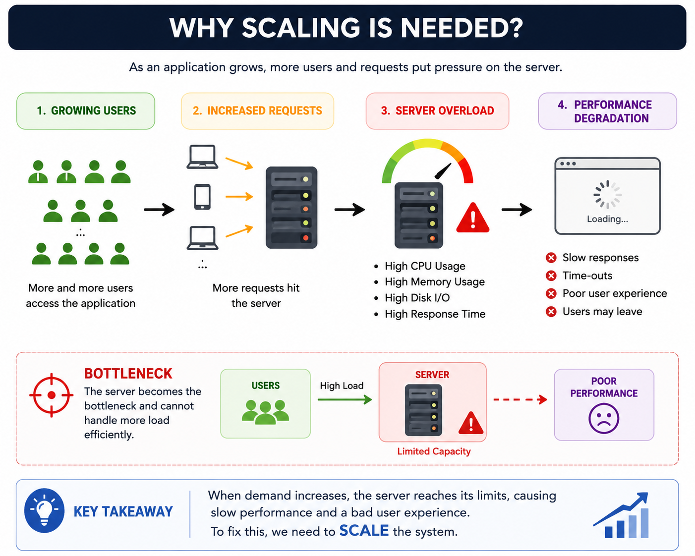
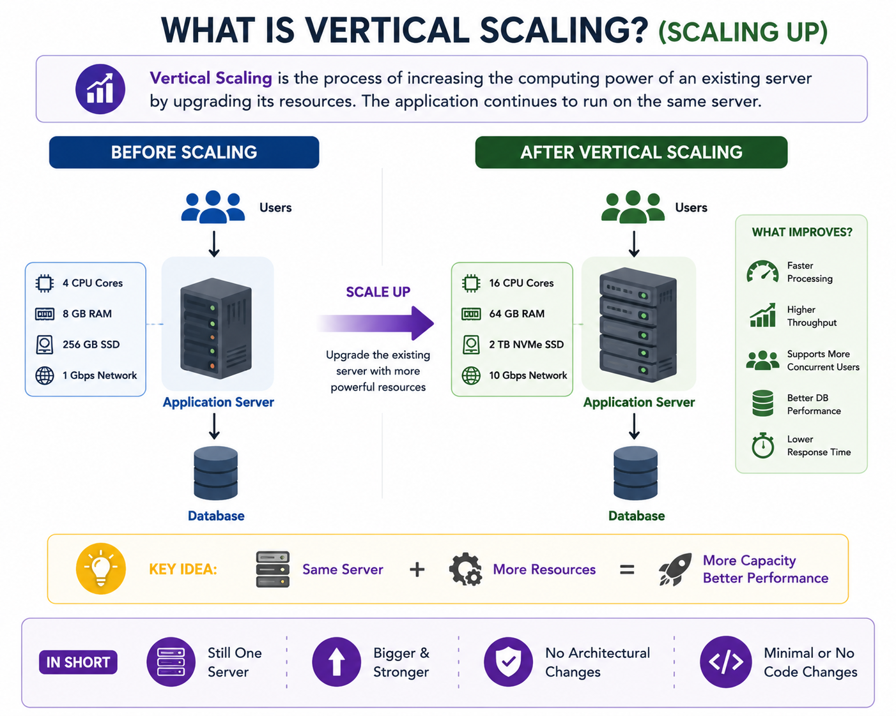
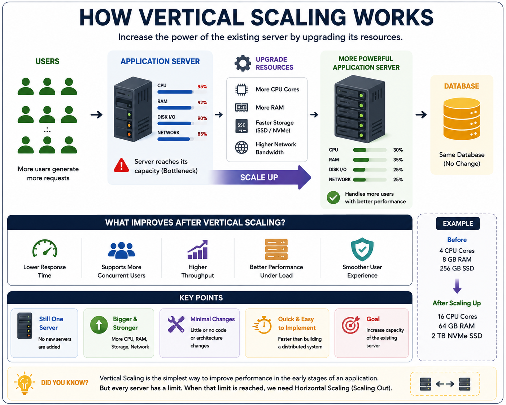
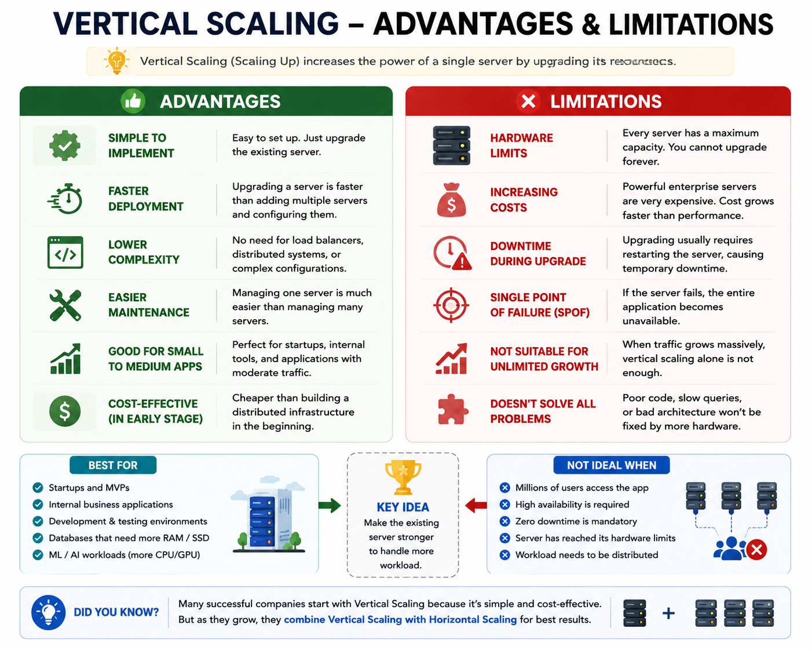
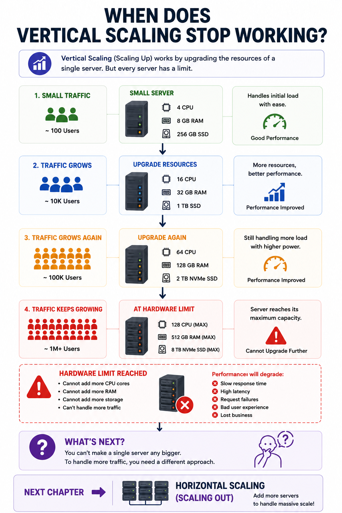

# 13. Vertical Scaling (Scaling Up)

## Introduction

In the previous chapters, we learned how databases store and manage application data. We explored SQL vs NoSQL databases, different database types, and how to choose the right database for different use cases.

At this point, we have a complete application architecture:

```
Users
   │
   ▼
Application Server
   │
   ▼
Database
```

Everything works perfectly when the application has only a small number of users.

Imagine you've built an e-commerce platform, social media application, or online banking system. Initially, only a few hundred users visit your application every day. A single server is more than capable of handling all incoming requests.

However, as your application becomes popular, the situation begins to change.

- Thousands of users start visiting your application.
- More API requests are generated every second.
- More database queries need to be executed.
- More files are uploaded.
- More business logic has to be processed.

Gradually, the server starts struggling to keep up with the increasing workload.

You may begin noticing several problems:

- Pages load more slowly.
- API responses take longer.
- CPU usage remains close to 100%.
- Memory usage keeps increasing.
- Users experience delays and occasional timeouts.

At this point, the database may still be functioning correctly, but the **application server itself has become the bottleneck**.

This naturally raises an important question:

> **How can we increase the capacity of our application without completely redesigning the system?**

The first and simplest solution is **Vertical Scaling**.

In this chapter, we'll understand what Vertical Scaling is, why it's needed, how it works, its advantages, limitations, and why modern distributed systems eventually move beyond it.

---

# What is Scaling?

Before understanding **Vertical Scaling**, it's important to understand what the term **Scaling** actually means.

### Definition

Scaling is the process of increasing a system's capacity so it can handle a larger workload while maintaining good performance.

The workload of an application can increase in many ways, such as:

- More users
- More requests per second
- More data to process
- More database queries
- More background jobs
- More files and media uploads

As demand increases, the existing infrastructure may no longer be able to keep up.

Scaling allows us to expand the system so it can continue serving users efficiently.

Simply put,

> **Scaling means increasing a system's ability to handle more work.**

---

## Why Do Systems Need Scaling?

Every server has limited resources.

No matter how powerful a machine is, it has a fixed amount of:

- CPU
- Memory (RAM)
- Storage
- Network bandwidth

When an application is first launched, these resources are usually more than enough.

For example:

```
Daily Users: 500
CPU Usage: 18%
Memory Usage: 30%

Everything works smoothly.
```

Now imagine your application becomes successful.

```
Daily Users: 100,000
CPU Usage: 98%
Memory Usage: 95%

Response time starts increasing.
```

Nothing about the application's functionality has changed.

The only difference is the number of users.

As more users access the system simultaneously, the server has to perform significantly more work.

Eventually, it reaches its maximum capacity.

Without scaling, the application will continue becoming slower until it can no longer serve users effectively.

---

## Real-World Example

Imagine you own a small restaurant.

Initially, you have:

- 2 chefs
- 5 tables
- 1 cashier

This setup is sufficient because only a small number of customers visit every day.

One day, your restaurant becomes famous after a viral social media post.

Now hundreds of customers arrive every hour.

The existing staff can no longer keep up.

Orders begin piling up.

Customers wait longer.

Some customers leave without placing an order.

The restaurant hasn't changed.

The number of customers has.

Software systems behave in exactly the same way.

As the number of users increases, the workload also increases.

To continue serving everyone efficiently, the system must scale.

---

## Types of Scaling

There are two primary ways to scale an application.

### 1. Vertical Scaling (Scaling Up)

Increase the power of an existing server by upgrading its hardware.

Examples include:

- More CPU cores
- More RAM
- Faster SSD storage
- Better processor
- Higher network bandwidth

The application continues running on a single machine.

---

### 2. Horizontal Scaling (Scaling Out)

Instead of making one server more powerful, we add multiple servers and distribute the workload among them.

This topic will be covered in detail in the next chapter.

For now, we'll focus entirely on Vertical Scaling.

> [!TIP]
> **💡 Did You Know?**
> 
> Many successful companies—including startups that later became global platforms—begin with a **single server**.
> 
> Building a distributed system from day one adds unnecessary complexity.
> 
> Instead, most teams start with a simple architecture and scale only when the application's growth requires it.
> 
> This approach keeps development faster, infrastructure simpler, and operational costs lower during the early stages of a product.

---

# What is Vertical Scaling?

Vertical Scaling is the process of increasing the computing power of an existing server instead of adding more servers.

Rather than changing the architecture of the application, we simply upgrade the hardware of the machine already running the application.

This approach is commonly known as **Scaling Up**.

For example, suppose your application is currently running on a server with:

```
4 CPU Cores
8 GB RAM
256 GB SSD
```

As traffic grows, the server starts becoming overloaded.

Instead of deploying additional servers, you upgrade the existing machine.

After the upgrade:

```
16 CPU Cores
64 GB RAM
2 TB NVMe SSD
```

The application still runs on **one server**.

The only difference is that the server has become significantly more powerful.

As a result, it can process more requests, perform more computations, and support more users than before.

This is Vertical Scaling.

---

## Why is it Called "Scaling Up"?

The term **Scaling Up** comes from increasing the capacity of a single machine.

Imagine a server represented like this:

```
Before

┌──────────────────────┐
│   Application Server │
│                      │
│ 4 CPU               │
│ 8 GB RAM            │
└──────────────────────┘
```

After upgrading the hardware:

```
┌──────────────────────┐
│   Application Server │
│                      │
│ 16 CPU              │
│ 64 GB RAM           │
└──────────────────────┘
```

The server itself becomes stronger.

We are **not adding another server**.

We are improving the existing one.

That's why this approach is called **Scaling Up**.

---

# How Vertical Scaling Works

Vertical Scaling does not change the application's architecture.

The overall system remains exactly the same.

```
Users
   │
   ▼
Application Server
   │
   ▼
Database
```

The only change is that the server receives better hardware.

Examples include:

- More CPU cores for faster processing.
- Additional RAM for handling larger workloads.
- Faster storage devices for quicker data access.
- Higher network bandwidth for increased data transfer.

After upgrading, the architecture still looks like this:

```
Users
   │
   ▼
More Powerful Application Server
   │
   ▼
Database
```

Notice that nothing has changed except the server's capacity.

No additional servers have been introduced.

No load balancer is required.

No distributed architecture is needed.

The application simply becomes capable of handling a larger workload because the existing machine has become more powerful.

This simplicity is one of the biggest reasons why Vertical Scaling is often the first scaling strategy adopted by growing applications.

---

# Resources That Can Be Upgraded

Vertical Scaling is not limited to increasing CPU or RAM.

Different hardware resources can be upgraded depending on where the application's bottleneck exists.

## 1. CPU (Processor)

The CPU performs the actual computations required by the application.

If the CPU is constantly operating near 100% utilization, upgrading to a processor with more cores or better performance allows the server to execute more tasks simultaneously.

This is especially useful for CPU-intensive applications such as data processing, analytics, video encoding, and scientific computing.

---

## 2. Memory (RAM)

RAM stores data that the application is actively using.

Applications with insufficient memory often experience slow performance because they are forced to use disk storage, which is significantly slower.

Increasing RAM allows the application to:

- Handle more concurrent users.
- Cache more data in memory.
- Reduce disk access.
- Improve overall responsiveness.

---

## 3. Storage

Storage affects how quickly data can be read and written.

Replacing traditional hard drives with SSDs or NVMe drives significantly improves:

- Database performance.
- File uploads.
- File downloads.
- Application startup times.

Modern production servers almost always use SSD-based storage because of its superior speed.

---

## 4. Network Bandwidth

Applications serving large amounts of data—such as video streaming platforms, cloud storage services, or gaming servers—often require increased network bandwidth.

Higher bandwidth enables the server to send and receive more data without becoming a bottleneck.

---

## 5. GPU (Specialized Workloads)

Some applications perform tasks that benefit from Graphics Processing Units (GPUs).

Examples include:

- Artificial Intelligence
- Machine Learning
- Image Processing
- Video Rendering
- Scientific Simulations

Instead of increasing CPU resources, these systems may scale vertically by upgrading to more powerful GPUs.

> [!TIP]
> **💡 Did You Know?**
> 
> Not every performance problem can be solved by adding more CPU or RAM.
> 
> Sometimes the real bottleneck is inefficient application code, slow database queries, poor indexing, or unnecessary network calls.
> 
> Before scaling a server, engineers first identify **where the bottleneck actually exists**.
> 
> Upgrading hardware without understanding the root cause can increase infrastructure costs without delivering meaningful performance improvements.

---

# Architecture Before and After Vertical Scaling

One of the biggest advantages of Vertical Scaling is that it does **not** change the application's architecture.

The application continues to run exactly as before.

The only difference is that the existing server becomes more powerful.

### Before Vertical Scaling

```
                 Users
                    │
                    ▼
        ┌────────────────────┐
        │ Application Server │
        │                    │
        │ 4 CPU              │
        │ 8 GB RAM           │
        └────────────────────┘
                    │
                    ▼
             ┌────────────┐
             │  Database  │
             └────────────┘
```

As traffic increases, the server gradually reaches its hardware limits.

Common symptoms include:

- High CPU utilization
- Memory exhaustion
- Slow API responses
- Increased request waiting time
- Higher database response times
- Poor user experience

---

### After Vertical Scaling

```
                 Users
                    │
                    ▼
        ┌────────────────────┐
        │ Application Server │
        │                    │
        │ 16 CPU             │
        │ 64 GB RAM          │
        │ NVMe SSD           │
        └────────────────────┘
                    │
                    ▼
             ┌────────────┐
             │  Database  │
             └────────────┘
```

Notice that the overall architecture remains exactly the same.

No new servers have been added.

No load balancer is required.

No distributed communication exists.

Only the server's computing power has increased.

---

# Before vs After Vertical Scaling

| Before Scaling | After Vertical Scaling |
|----------------|------------------------|
| Limited CPU resources | More CPU cores |
| Less RAM | More RAM |
| Slower storage | Faster SSD/NVMe |
| Lower request capacity | Higher request capacity |
| Higher response time | Lower response time |
| Limited concurrent users | Supports more concurrent users |
| Server reaches bottleneck quickly | Better performance under heavier load |

Vertical Scaling improves the server's ability to process work without modifying the application's architecture.

---

# Characteristics of Vertical Scaling

Vertical Scaling has several important characteristics that distinguish it from other scaling approaches.

---

## 1. Single Server Architecture

The application continues running on a single machine.

There are no additional application servers.

This makes the overall architecture simple and easy to manage.

---

## 2. Hardware Upgrade

Instead of increasing the number of servers, we increase the resources available to one server.

Examples include:

- More CPU
- More RAM
- Faster Storage
- Higher Network Capacity

---

## 3. No Major Code Changes

Most applications require little or no modification when vertically scaled.

Since the architecture remains unchanged, developers usually don't need to redesign their application.

---

## 4. Easy to Implement

Compared to distributed systems, Vertical Scaling is much easier to implement.

In many environments, upgrading a server takes only a few minutes.

---

## 5. Limited Growth

A server cannot be upgraded indefinitely.

Eventually, every machine reaches its maximum hardware capacity.

At that point, another scaling strategy becomes necessary.

---

# How Vertical Scaling Improves Performance

Upgrading hardware improves the application's ability to process requests.

Let's understand how each upgrade contributes to better performance.

---

## Faster Request Processing

A stronger CPU can execute more instructions every second.

As a result:

- API requests finish faster.
- Business logic executes more quickly.
- Overall response time decreases.

---

## Better Multitasking

Additional CPU cores allow multiple processes or threads to execute simultaneously.

This improves the server's ability to handle many users at the same time.

---

## Increased Memory Capacity

More RAM allows the application to keep more data in memory.

Benefits include:

- Faster application performance
- Reduced disk access
- Better caching efficiency
- More concurrent users

---

## Faster Storage Access

Replacing HDDs with SSDs or NVMe drives significantly reduces read and write latency.

This benefits:

- Database queries
- File uploads
- File downloads
- Application startup

---

## Improved Throughput

Because the server can process more requests every second, overall system throughput increases.

This means more users can access the application without experiencing slowdowns.

---

## Better User Experience

From a user's perspective, Vertical Scaling often results in:

- Faster page loading
- Lower waiting time
- Smoother interactions
- Reduced timeout errors

---

> [!TIP]
> **💡 Did You Know?**
> 
> Many people confuse **Latency** and **Throughput**.
> 
> Vertical Scaling often improves **both**, but they are different concepts.
> 
> - **Latency** measures how long a single request takes to complete.
> - **Throughput** measures how many requests the server can process in a given amount of time.
> 
> A stronger server can usually reduce latency while increasing throughput.
> 
> We'll explore these concepts in detail in upcoming chapters.

---

# Advantages of Vertical Scaling

Vertical Scaling is popular because of its simplicity.

Let's explore its major advantages.

---

## 1. Simple to Implement

The application architecture remains unchanged.

Developers usually don't need to rewrite large portions of code.

---

## 2. Faster Deployment

Upgrading an existing server is generally much faster than designing and deploying an entire distributed system.

---

## 3. Lower Development Complexity

Since only one server exists, developers don't need to worry about:

- Load balancing
- Data synchronization
- Distributed caching
- Inter-server communication

This reduces development effort significantly.

---

## 4. Easier Maintenance

Managing one server is much easier than managing dozens of servers.

System monitoring, deployment, debugging, and maintenance become simpler.

---

## 5. Better for Small Applications

Many startups, internal tools, and business applications perform exceptionally well with Vertical Scaling.

There is no need to introduce unnecessary architectural complexity too early.

---

# Limitations of Vertical Scaling

Although Vertical Scaling is simple and effective, it cannot solve every scalability problem.

As applications continue growing, several limitations become apparent.

---

## 1. Hardware Limits

Every server has a maximum capacity.

Eventually, you can no longer add:

- CPU cores
- RAM
- Storage

At this point, Vertical Scaling reaches its limit.

---

## 2. Increasing Costs

Larger enterprise-grade servers become significantly more expensive.

The relationship between price and performance is rarely linear.

Doubling performance often costs much more than double the price.

---

## 3. Downtime During Upgrades

In many environments, upgrading hardware requires restarting or replacing the server.

During this process, users may temporarily lose access to the application.

We'll discuss this in more detail later in this chapter.

---

## 4. Single Point of Failure (SPOF)

No matter how powerful the server becomes, the application still depends on **one machine**.

If that server fails because of:

- Hardware failure
- Power outage
- Operating system crash
- Network failure

the entire application becomes unavailable.

This situation is known as a **Single Point of Failure (SPOF).**

We'll study SPOF in depth in a dedicated chapter because it's one of the most important concepts in System Design.

---

## 5. Not Suitable for Unlimited Growth

If an application grows from thousands of users to millions of users, Vertical Scaling alone is no longer enough.

Eventually, the only practical solution is to distribute the workload across multiple servers.

This is where Horizontal Scaling becomes essential.

> [!TIP]
> **💡 Did You Know?**
> 
> Some of the world's largest applications—including Netflix, Amazon, Google, and Meta—still use **Vertical Scaling** in certain parts of their infrastructure.
> 
> However, they don't rely on it alone.
> 
> Instead, they combine Vertical Scaling with Horizontal Scaling to achieve high performance, scalability, and reliability.

---

# Downtime During Vertical Scaling

One important limitation of Vertical Scaling is that it often requires **downtime**.

When upgrading a server, the operating system or cloud provider may need to restart the machine so the new hardware resources can be allocated.

For example, imagine your application is running on:

- 4 CPU cores
- 8 GB RAM

After monitoring the application for several weeks, you decide to upgrade it to:

- 16 CPU cores
- 64 GB RAM

In many environments, the upgrade process involves:

1. Stopping the application.
2. Upgrading the server resources.
3. Restarting the operating system.
4. Starting the application again.

During this period, users may not be able to access the application.

Although the downtime may last only a few minutes, it can be unacceptable for applications that require continuous availability, such as:

- Banking systems
- Online payment gateways
- Healthcare platforms
- Stock trading applications

For these systems, even a few seconds of downtime can have serious consequences.

This is one of the major reasons why large-scale applications eventually move toward distributed architectures.

---

# Cost Analysis

Vertical Scaling appears simple, but it becomes increasingly expensive as hardware requirements grow.

Consider the following example.

| Server Type | CPU | RAM | Approximate Cost |
|-------------|-----|-----|------------------|
| Small | 2 Cores | 4 GB | Low |
| Medium | 4 Cores | 8 GB | Moderate |
| Large | 16 Cores | 64 GB | High |
| Enterprise | 64+ Cores | 512+ GB | Very High |

As hardware becomes more powerful:

- CPU prices increase.
- Memory costs increase.
- Enterprise motherboards become more expensive.
- Cooling requirements increase.
- Power consumption increases.

The relationship between cost and performance is **not linear**.

For example, a server that delivers twice the performance may cost three or four times as much.

Eventually, buying an even larger server becomes economically impractical.

> [!TIP]
> **💡 Did You Know?**
> 
> Large enterprise servers can cost tens or even hundreds of thousands of dollars.
> 
> Instead of purchasing one extremely powerful machine, many companies prefer using multiple smaller servers because they offer better scalability and fault tolerance.

---

# Vertical Scaling in Cloud Computing

Modern cloud platforms make Vertical Scaling much easier than traditional physical servers.

Instead of replacing hardware manually, cloud providers allow you to change the size of a virtual machine.

For example:

### Amazon Web Services (AWS)

An EC2 instance can be upgraded from a smaller instance type to a larger one with more CPU and memory.

---

### Microsoft Azure

Azure Virtual Machines can be resized to allocate additional computing resources.

---

### Google Cloud Platform (GCP)

Google Compute Engine allows virtual machines to be resized with different CPU and memory configurations.

---

From the application's perspective, nothing changes.

The application continues running on one server.

Only the server's resources become larger.

Cloud platforms have made Vertical Scaling much more convenient than managing physical hardware, although some upgrades may still require restarting the virtual machine.

---

# Real-World Use Cases

Vertical Scaling is widely used in situations where simplicity is more important than supporting massive scale.

Let's look at some common examples.

---

## 1. Startup Applications

Most startups begin with a single application server.

Initially, traffic is relatively low.

Instead of investing time and money in distributed systems, developers simply upgrade the existing server as the user base grows.

---

## 2. Internal Business Applications

Many enterprise applications are used only by employees.

Examples include:

- HR systems
- Payroll software
- Inventory management
- CRM platforms

These applications often perform well on a single powerful server.

---

## 3. Development and Testing Environments

Development environments rarely require multiple servers.

Increasing CPU and memory is usually sufficient to improve build times and testing performance.

---

## 4. Database Servers

Some databases benefit significantly from additional RAM and faster storage.

Increasing memory allows databases to cache more data, reducing disk access and improving query performance.

---

## 5. Machine Learning Workloads

Applications that perform AI or Machine Learning often require additional GPUs, memory, and processing power.

Rather than distributing the workload across multiple machines, organizations may initially scale vertically by upgrading GPU resources.

---

# When Should You Use Vertical Scaling?

Vertical Scaling is an excellent choice in the following situations.

### Your application is still growing.

If traffic is moderate, upgrading one server is often the simplest solution.

---

### You need a quick performance improvement.

Upgrading hardware is usually much faster than redesigning the application's architecture.

---

### Simplicity is important.

Managing one server is easier than managing multiple servers.

---

### Your application isn't highly distributed yet.

If the system doesn't require high availability or global scalability, Vertical Scaling is often sufficient.

---

### Budget is limited.

During the early stages of a project, upgrading an existing server is usually cheaper than building and maintaining an entire distributed infrastructure.

---

# When Should You Avoid Vertical Scaling?

Although Vertical Scaling is useful, it isn't the right solution for every application.

You should consider other approaches when:

- Millions of users access the application simultaneously.
- High availability is required.
- Downtime cannot be tolerated.
- Hardware upgrades have reached their limit.
- One server is no longer capable of handling the workload.

These situations often require **Horizontal Scaling**, where multiple servers work together.

---

# Common Misconceptions

Many beginners misunderstand what Vertical Scaling can actually achieve.

Let's clarify some common misconceptions.

---

## Misconception 1

**"Buying a bigger server solves every performance problem."**

Reality:

Performance problems may also be caused by:

- Poor database indexing
- Slow queries
- Inefficient application code
- Memory leaks
- Network latency

Simply upgrading hardware does not automatically fix software problems.

---

## Misconception 2

**"Vertical Scaling provides unlimited scalability."**

Reality:

Every server has a maximum hardware capacity.

Eventually, no larger upgrade is available.

---

## Misconception 3

**"A powerful server cannot fail."**

Reality:

Even the most expensive enterprise servers can experience:

- Hardware failures
- Operating system crashes
- Power failures
- Network outages

Vertical Scaling does not eliminate the risk of downtime.

---

## Misconception 4

**"Vertical Scaling is outdated."**

Reality:

Not at all.

Even modern cloud-native applications still use Vertical Scaling whenever it makes sense.

Most organizations combine Vertical Scaling with Horizontal Scaling instead of choosing only one approach.

> [!TIP]
> **💡 Did You Know?**
> 
> Many engineers follow a simple principle:
> 
> > **"Optimize first, scale second."**
> 
> Before upgrading hardware, engineers usually profile the application to identify the real bottleneck.
> 
> Sometimes a single optimized database query or efficient caching strategy can provide a larger performance improvement than upgrading the server itself.
> 
> This saves infrastructure costs while improving application performance.

---

# Vertical Scaling vs Hardware Upgrade

The terms **Vertical Scaling** and **Hardware Upgrade** are often used interchangeably, but there is a slight difference in their meaning.

A **hardware upgrade** simply means replacing or improving a computer's hardware components.

Examples include:

- Installing more RAM
- Replacing an HDD with an SSD
- Upgrading the CPU
- Adding a better GPU

People upgrade hardware for many reasons, such as:

- Better gaming performance
- Faster software compilation
- Video editing
- AI model training
- Personal computer improvements

Vertical Scaling, however, is a **system design strategy**.

Its primary goal is to **increase an application's capacity** by upgrading the resources of the server on which the application is running.

In other words:

> **Every Vertical Scaling operation involves a hardware upgrade, but not every hardware upgrade is performed for Vertical Scaling.**

For example:

- Upgrading your personal laptop from 8 GB RAM to 16 GB RAM is a hardware upgrade.
- Upgrading an application server from 8 GB RAM to 64 GB RAM so it can handle more users is Vertical Scaling.

Although both involve improving hardware, the purpose behind them is different.

---

# Vertical Scaling vs Horizontal Scaling (Quick Preview)

After reading this chapter, you might wonder:

> **"If Vertical Scaling has so many limitations, why don't we simply add more servers?"**

That's exactly what Horizontal Scaling does.

Instead of making one server stronger, Horizontal Scaling distributes the workload across multiple servers.

Here's a quick comparison.

| Vertical Scaling | Horizontal Scaling |
|------------------|--------------------|
| Scale Up | Scale Out |
| One powerful server | Multiple servers |
| Simple architecture | Distributed architecture |
| Limited by hardware | Easier to expand |
| Single Point of Failure | Higher availability |
| Easier to manage | More complex to manage |

Don't worry about the details yet.

The next chapter is entirely dedicated to Horizontal Scaling, where we'll learn how multiple servers work together to handle massive traffic.

> [!TIP]
> **💡 Did You Know?**
> 
> Many large-scale applications don't choose **Vertical Scaling** *or* **Horizontal Scaling**.
> 
> They use **both**.
> 
> For example:
> 
> - Each application server may be vertically scaled with more CPU and RAM.
> - At the same time, dozens or even hundreds of these powerful servers work together using Horizontal Scaling.
> 
> This combination provides both high performance and excellent scalability.

---

# Common Interview Questions

Here are some interview questions frequently asked in backend and System Design interviews.

---

### 1. What is Vertical Scaling?

---

### 2. Why is Vertical Scaling also called Scaling Up?

---

### 3. How does Vertical Scaling improve application performance?

---

### 4. What hardware resources can be upgraded during Vertical Scaling?

---

### 5. What are the advantages of Vertical Scaling?

---

### 6. What are the limitations of Vertical Scaling?

---

### 7. Why can't Vertical Scaling support unlimited growth?

---

### 8. What is a Single Point of Failure (SPOF)?

---

### 9. Why does Vertical Scaling often require downtime?

---

### 10. When should you choose Vertical Scaling over Horizontal Scaling?

---

### 11. Is Vertical Scaling still used in modern cloud applications?

---

### 12. Can Vertical Scaling solve every performance problem?

Why or why not?

---

### 13. Explain Vertical Scaling using a real-world example.

---

### 14. What's the difference between Vertical Scaling and simply upgrading hardware?

---

### 15. If your application has reached the hardware limits of a server, what would you do next?

---

# Summary

As applications grow, the number of users and requests also increases. Eventually, a single server may struggle to keep up with the workload, leading to slower response times and reduced performance.

One of the simplest ways to increase an application's capacity is **Vertical Scaling**, also known as **Scaling Up**.

Instead of changing the application's architecture, Vertical Scaling improves the existing server by upgrading resources such as CPU, RAM, storage, or network bandwidth.

This approach offers several advantages:

- Easy to implement
- Minimal architectural changes
- Faster deployment
- Simpler maintenance

However, Vertical Scaling also has important limitations.

Every server has a maximum hardware capacity. Upgrading powerful hardware becomes increasingly expensive, may require downtime, and still leaves the application dependent on a single machine.

Because of these limitations, Vertical Scaling alone cannot support unlimited growth.

As applications continue expanding, organizations eventually need a different scaling strategy.

---

# 🎯 Key Takeaway

Vertical Scaling is one of the simplest and most effective ways to improve application performance during the early stages of growth.

By increasing the resources of a single server, applications can support more users without significant architectural changes.

However, Vertical Scaling has physical and practical limits.

Every server eventually reaches its maximum capacity, and relying on a single machine introduces the risk of downtime and Single Point of Failure (SPOF).

For small and medium-sized applications, Vertical Scaling is often the right choice.

For large-scale systems serving millions of users, it usually becomes just one part of a broader scalability strategy.

---

# What's Next?

Imagine your application has grown beyond what even the most powerful server can handle.

No matter how much CPU, RAM, or storage you add, the server has reached its maximum capacity.

So, what comes next?

Instead of making **one server stronger**, we distribute the workload across **multiple servers**, allowing them to work together as a single system.

This approach is known as **Horizontal Scaling (Scaling Out).**

In the next chapter, we'll explore:

- Why Vertical Scaling eventually reaches its limits.
- How Horizontal Scaling solves these limitations.
- The advantages and challenges of using multiple servers.
- Why technologies like **Load Balancers** become essential in distributed systems.

Let's continue our journey by understanding how modern applications scale beyond a single machine.

---
## Reference Images





