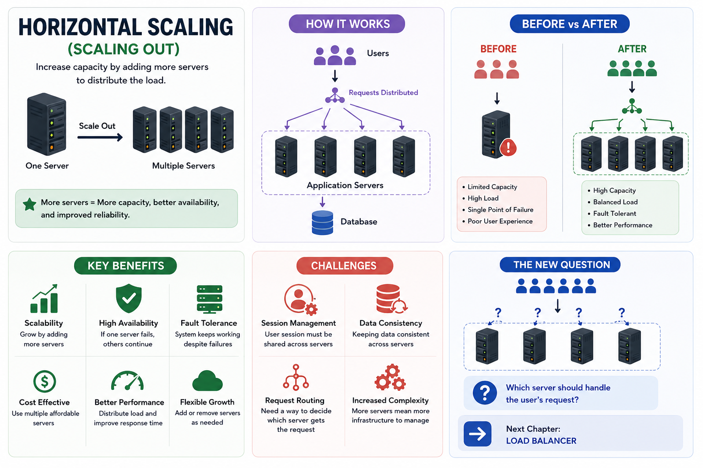
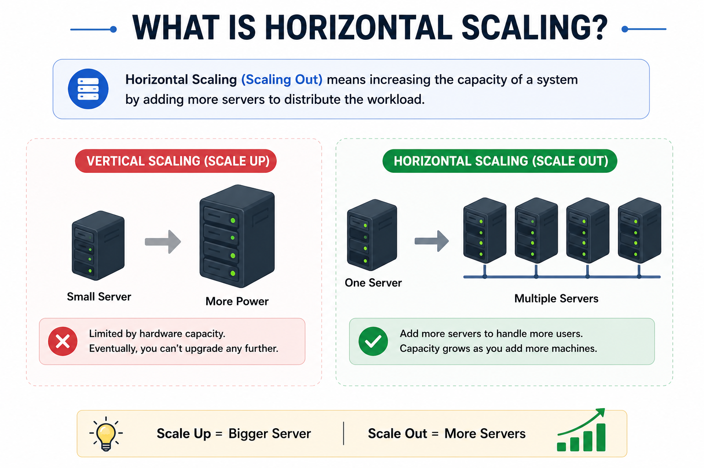
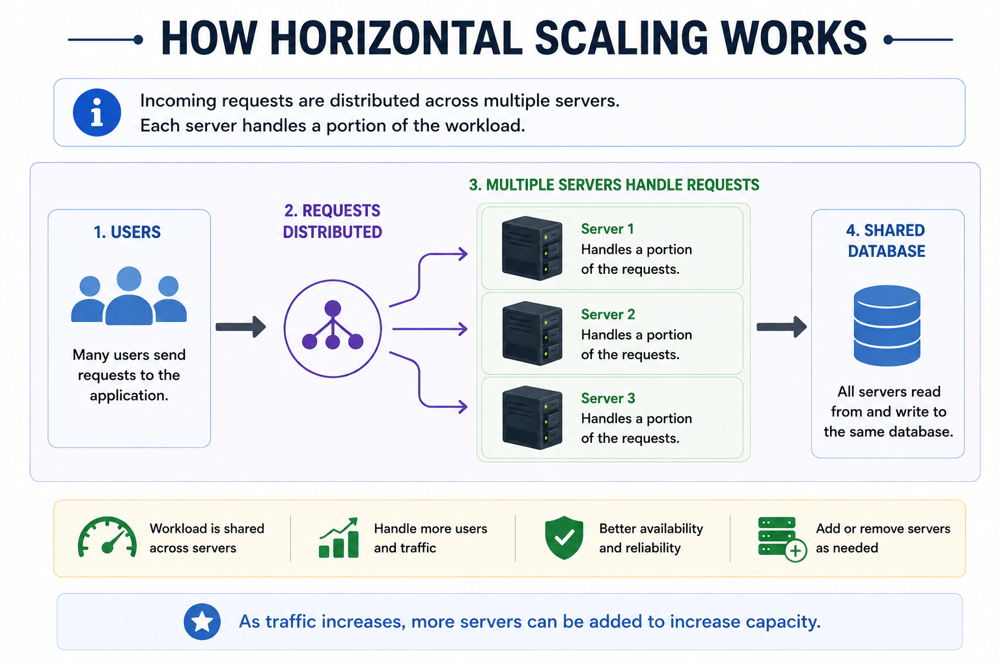
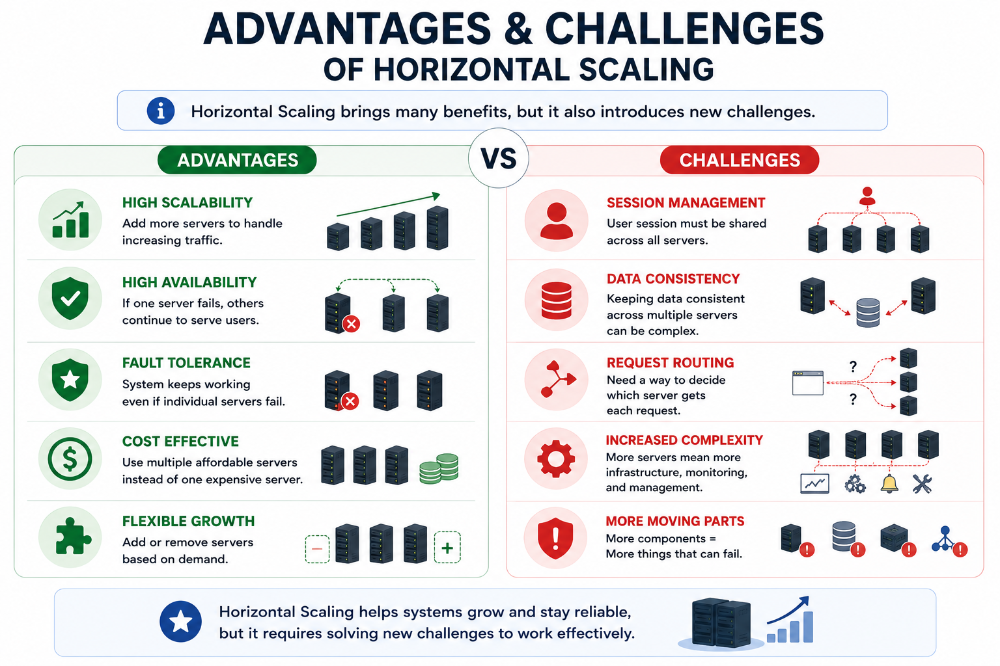
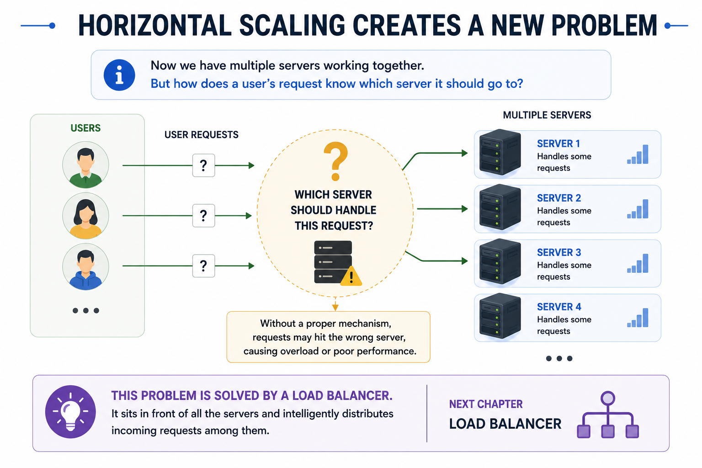

# 14. Horizontal Scaling (Scaling Out)

# Introduction

In the previous chapter, we learned about **Vertical Scaling**, where we increased the capacity of an application by upgrading the hardware of an existing server.

By adding more CPU cores, RAM, storage, or network bandwidth, a single server could handle more users and process more requests.

For many applications, this approach works well during the early stages of growth.

However, Vertical Scaling has an important limitation.

Every server has a **maximum hardware capacity**.

No matter how powerful the server becomes, there comes a point where:

- No more CPU cores can be added.
- Memory cannot be increased further.
- Storage upgrades become impractical.
- The cost of larger enterprise servers becomes extremely high.

Even worse, the entire application still depends on **one server**.

If that server crashes due to hardware failure, power outage, or network issues, the entire application becomes unavailable.

So the obvious question is:

> **Instead of continuously upgrading one server, why not use multiple servers to share the workload?**

This idea leads us to one of the most important concepts in System Design:

**Horizontal Scaling.**

Instead of making one server more powerful, we increase the system's capacity by adding **more servers**.

This allows applications to support significantly more users while improving scalability, availability, and reliability.

In this chapter, we'll learn how Horizontal Scaling works, why modern applications rely on it, its advantages, challenges, and why it eventually introduces another important component known as the **Load Balancer**.

---

# What is Horizontal Scaling?

Horizontal Scaling is the process of increasing an application's capacity by adding more servers instead of upgrading the existing one.

This approach is commonly known as **Scaling Out**.

Instead of relying on one increasingly powerful machine, the workload is distributed across multiple servers that work together as a single system.

As traffic grows, additional servers can be added to increase the application's capacity.

For example, imagine an application currently running on one server.

```
Users
   │
   ▼
Application Server
   │
   ▼
Database
```

As traffic increases, instead of upgrading this server repeatedly, we add more application servers.

```
Users

       ▼

Application Servers

Server 1
Server 2
Server 3

       ▼

Database
```

Each server now handles a portion of the incoming workload.

Rather than depending on one machine, the application uses the combined resources of multiple servers.

This is Horizontal Scaling.

---

# Why is it Called "Scaling Out"?

The term **Scaling Out** comes from expanding the system **horizontally** by adding additional machines.

Imagine a single server.

```
┌───────────────┐
│ Application   │
│    Server     │
└───────────────┘
```

Instead of making it bigger, we place more servers beside it.

```
┌───────────────┐
│   Server 1    │
└───────────────┘

┌───────────────┐
│   Server 2    │
└───────────────┘

┌───────────────┐
│   Server 3    │
└───────────────┘
```

The number of servers grows sideways rather than upward.

That's why this approach is called **Scaling Out**.

Unlike Vertical Scaling, the individual servers don't necessarily become more powerful.

Instead, the **overall system** becomes more powerful because multiple machines work together.

---

# Why Do We Need Horizontal Scaling?

Horizontal Scaling isn't just about supporting more users.

It solves several important limitations of Vertical Scaling.

Let's understand why modern applications rely on this approach.

---

## 1. Hardware Has Limits

Every server eventually reaches its maximum hardware capacity.

There is a limit to:

- CPU cores
- RAM
- Storage
- Network bandwidth

Once these limits are reached, upgrading the server is no longer possible.

Adding more servers becomes the only practical solution.

---

## 2. Applications Continue Growing

Successful applications rarely stop growing.

As popularity increases:

- More users register.
- More requests are generated.
- More files are uploaded.
- More database operations are performed.

A single server eventually becomes insufficient.

Adding multiple servers allows the application to continue growing without depending on increasingly expensive hardware.

---

## 3. Better Scalability

Instead of replacing one server with a larger one, Horizontal Scaling allows us to gradually increase capacity.

For example:

```
Today

2 Servers

↓

Next Month

4 Servers

↓

Six Months Later

8 Servers

↓

One Year Later

20 Servers
```

Capacity grows along with user demand.

This makes Horizontal Scaling much more flexible.

---

## 4. Improved Availability

Imagine an application running on only one server.

If that server crashes,

the application becomes unavailable.

With multiple servers,

even if one server fails,

the remaining servers can continue serving users.

This significantly improves the application's availability.

We'll explore **High Availability** in detail in a later chapter.

---

## 5. Better Reliability

Because the workload is shared among multiple machines,

the system becomes more resilient.

Individual server failures have much less impact on the overall application.

Users may not even notice that one server has failed.

---

## 6. Cost Efficiency

Enterprise-grade servers become increasingly expensive.

Instead of purchasing one extremely powerful machine,

many organizations prefer deploying multiple affordable servers.

This often provides better performance while reducing infrastructure costs.

---

> [!TIP]
> **💡 Did You Know?**
> 
> Many cloud platforms allow organizations to automatically add or remove servers based on traffic.
> 
> For example, during a major sale or festival, additional servers can be launched automatically to handle increased demand.
> 
> When traffic decreases, those extra servers can be removed, helping reduce infrastructure costs.
> 
> This ability to dynamically increase or decrease the number of servers is one of the biggest advantages of Horizontal Scaling.

---

# How Horizontal Scaling Works

Horizontal Scaling works by distributing the application's workload across multiple servers.

Instead of one machine processing every request,

multiple servers work together.

A simplified architecture looks like this:

```
                Users
                   │
                   ▼

        ┌──────────────────┐
        │  Application      │
        │     Servers       │
        └──────────────────┘

      ┌────────┬────────┬────────┐
      ▼        ▼        ▼
  Server 1  Server 2  Server 3

              │
              ▼

          Database
```

Each server is capable of processing user requests independently.

As traffic increases,

additional servers can be added to increase the system's overall capacity.

Notice something interesting.

We now have **multiple servers**.

This immediately raises a new question.

> **If three servers are available, how does a user's request know which server it should go to?**

At the moment, we'll simply assume that requests somehow reach one of the available servers.

In the next chapter, we'll learn about the component responsible for making this decision—the **Load Balancer**.

---

# Characteristics of Horizontal Scaling

Horizontal Scaling has several important characteristics.

### Multiple Servers

Instead of relying on one machine,

the application runs on multiple servers.

---

### Shared Workload

The incoming workload is distributed across the available servers.

Each server processes only a portion of the total requests.

---

### Incremental Growth

New servers can be added as demand increases.

The application does not require replacing the existing infrastructure.

---

### Better Fault Tolerance

The failure of one server does not necessarily stop the entire application.

Other servers can continue processing requests.

---

### Distributed Architecture

Unlike Vertical Scaling,

Horizontal Scaling introduces a distributed system,

where multiple machines work together to provide a single service.

This increases scalability but also introduces new challenges that we'll explore later in this chapter.

---

> [!TIP]
> **💡 Did You Know?**
> 
> Horizontal Scaling is one of the key reasons why modern internet services can support millions of users simultaneously.
> 
> Rather than depending on one extremely powerful server, companies build clusters of servers that work together as a single system.
> 
> This approach makes it possible to continue expanding the application simply by adding more machines as demand grows.

---
# Architecture Before and After Horizontal Scaling

Let's compare how an application looks before and after Horizontal Scaling.

### Before Horizontal Scaling

Initially, the application runs on a single server.

```
                Users
                   │
                   ▼
        ┌────────────────────┐
        │ Application Server │
        └────────────────────┘
                   │
                   ▼
             ┌────────────┐
             │  Database  │
             └────────────┘
```

This architecture is simple and works well for applications with low to moderate traffic.

However, as more users access the application simultaneously, the server begins to struggle.

Common symptoms include:

- High CPU utilization
- Memory exhaustion
- Slow API responses
- Increased response time
- Request timeouts
- Poor user experience

Eventually, the server reaches its maximum capacity.

---

### After Horizontal Scaling

Instead of replacing the server with a larger one, we add more application servers.

```
                     Users
                        │
                        ▼

           ┌────────────────────────┐
           │    Application Layer    │
           └────────────────────────┘

       ┌────────┬────────┬────────┐
       ▼        ▼        ▼
   Server 1  Server 2  Server 3

             │
             ▼

          Database
```

Now, multiple servers work together to process user requests.

Instead of one machine performing all the work, the workload is shared among several servers.

As demand grows, additional servers can be added without replacing the existing infrastructure.

---

# Before vs After Horizontal Scaling

| Before Horizontal Scaling | After Horizontal Scaling |
|---------------------------|--------------------------|
| Single application server | Multiple application servers |
| Limited hardware capacity | Capacity grows by adding servers |
| One server handles all requests | Workload shared across servers |
| Lower fault tolerance | Higher fault tolerance |
| Single Point of Failure | Failure impact greatly reduced |
| Difficult to support massive traffic | Designed for large-scale applications |

Horizontal Scaling increases the overall capacity of the system by increasing the number of servers instead of increasing the power of one server.

---

# How Horizontal Scaling Improves Performance

Horizontal Scaling improves application performance in several ways.

---

## More Concurrent Users

Instead of one server processing every request,

multiple servers process requests simultaneously.

As a result,

the application can support a much larger number of concurrent users.

---

## Reduced Server Load

Since requests are shared across multiple machines,

each server performs less work.

This reduces CPU utilization, memory consumption, and overall resource pressure on individual servers.

---

## Better Throughput

Throughput refers to the number of requests a system can process in a given period of time.

Because multiple servers process requests simultaneously,

the system can handle significantly more requests per second.

---

## Improved Response Time

When no single server becomes overloaded,

requests are processed more efficiently,

leading to lower response times and a smoother user experience.

---

## Better Resource Utilization

Instead of purchasing one extremely powerful machine,

organizations distribute the workload across multiple moderately sized servers.

This often leads to more efficient utilization of computing resources.

---

## Easier Future Expansion

As traffic increases,

organizations simply add more servers.

There is no need to replace the entire infrastructure with increasingly expensive hardware.

---

> [!TIP]
> **💡 Did You Know?**
> 
> Large-scale applications rarely add hundreds of servers at once.
> 
> Instead, they scale gradually.
> 
> For example, if monitoring shows that CPU utilization remains consistently high, engineers may add just a few more servers to distribute the workload more effectively.
> 
> This incremental approach helps balance performance and infrastructure costs.

---

# Advantages of Horizontal Scaling

Horizontal Scaling has become the preferred scaling strategy for most modern distributed applications because it offers several important advantages.

---

## 1. Almost Unlimited Scalability

Unlike Vertical Scaling, which is limited by the hardware capacity of a single machine,

Horizontal Scaling allows organizations to continue increasing capacity by adding additional servers.

This makes it possible to support applications that serve millions of users.

---

## 2. Better Availability

When multiple servers are available,

the application becomes more accessible.

If one server experiences problems,

other servers can continue serving users.

This improves the overall availability of the system.

We'll explore High Availability in detail in a dedicated chapter.

---

## 3. Better Fault Tolerance

Hardware failures are inevitable.

Servers may fail because of:

- Hardware issues
- Operating system crashes
- Network failures
- Unexpected software bugs

With Horizontal Scaling,

other servers continue handling requests,

reducing the impact of individual server failures.

This ability to continue operating despite failures is known as **Fault Tolerance**.

We'll study Fault Tolerance in detail later.

---

## 4. Reduced Single Point of Failure (SPOF)

One of the biggest problems with Vertical Scaling is that the entire application depends on one server.

If that server crashes,

the application becomes unavailable.

Horizontal Scaling significantly reduces this risk by distributing the workload across multiple servers.

Even if one server becomes unavailable,

the remaining servers continue serving users.

Although Horizontal Scaling reduces the application's dependency on a single server,

it does **not completely eliminate** Single Points of Failure.

Other components in the architecture can still become SPOFs if they are not designed properly.

We'll explore this concept in detail in the SPOF chapter.

---

## 5. Cost Efficiency

Instead of purchasing one extremely expensive enterprise server,

organizations can deploy multiple smaller servers.

This often provides:

- Better scalability
- Improved availability
- Easier expansion
- Lower long-term infrastructure costs

---

## 6. Incremental Growth

One of the biggest advantages of Horizontal Scaling is flexibility.

Organizations don't need to make huge infrastructure investments upfront.

Instead,

they can add servers gradually as demand grows.

This allows infrastructure costs to closely match business growth.

---

# High Availability

One major benefit of Horizontal Scaling is **High Availability**.

Availability refers to how often an application remains accessible to users.

Imagine an application running on three servers.

If one server suddenly crashes,

the remaining servers continue processing requests.

Users can still access the application without experiencing a complete outage.

This greatly improves the application's availability.

We'll dedicate an entire chapter to High Availability because it is one of the most important concepts in distributed systems.

---

# Fault Tolerance

Fault Tolerance refers to a system's ability to continue operating even when one or more components fail.

With Horizontal Scaling,

server failures become much less disruptive.

Instead of bringing down the entire application,

the remaining servers continue serving users while the failed server is repaired or replaced.

Modern internet applications are designed with this principle in mind.

Rather than trying to prevent failures entirely,

they assume failures will happen and build systems that can recover from them.

---

> [!TIP]
> **💡 Did You Know?**
> 
> Google, Amazon, Netflix, Meta, and other large technology companies expect servers to fail every day.
> 
> Instead of trying to build servers that never fail,
> 
> they build systems that continue working even when individual servers become unavailable.
> 
> Designing for failure is one of the fundamental principles of distributed systems.

---
# Challenges of Horizontal Scaling

Horizontal Scaling offers many advantages, but it also introduces new challenges.

When an application runs on a single server, everything is relatively simple.

- User sessions are stored in one place.
- Application data is available locally.
- Every request reaches the same server.

Once multiple servers are introduced, the architecture becomes distributed.

Now, different requests from the same user may reach different servers.

This creates several challenges that developers must solve.

Let's explore the most important ones.

---

# 1. Stateless vs Stateful Applications

One of the first concepts you'll encounter while learning Horizontal Scaling is the difference between **Stateless** and **Stateful** applications.

Understanding this distinction is essential because it directly affects how well an application can scale.

---

## What is a Stateful Application?

A Stateful application stores information about a user or previous requests inside the application server.

For example, suppose a user logs into an application.

The server stores the user's session in its local memory.

```
User

     │

     ▼

Server 1

Session Stored Here
```

When the user sends another request,

the application expects that request to return to the **same server**.

Only that server knows about the user's session.

---

### Example

Imagine you're shopping on an e-commerce website.

You:

- Log in
- Add products to your cart
- Proceed to checkout

If your shopping cart exists only in Server 1's memory,

another server won't know anything about it.

This creates problems when multiple servers are introduced.

---

## What is a Stateless Application?

A Stateless application does **not** store user-specific information inside the application server.

Instead,

each request contains everything required to process it,

or the required data is retrieved from a shared storage system.

This means any server can process any request.

```
User

Request

↓

Server 1

or

↓

Server 2

or

↓

Server 3
```

Since every server behaves the same way,

requests can be processed by any available machine.

Stateless applications are much easier to scale horizontally.

---

## Why Stateless Applications Are Preferred

Modern distributed systems are usually designed to be stateless because:

- Any server can handle any request.
- Servers can be added or removed easily.
- Individual server failures have less impact.
- Load can be distributed more efficiently.

This flexibility is one of the reasons Horizontal Scaling works so well.

---

> [!TIP]
> **💡 Did You Know?**
> 
> REST APIs are designed to be **stateless**.
> 
> Each HTTP request contains all the information required for the server to process it.
> 
> The server does not rely on remembering previous requests.
> 
> This design makes REST APIs much easier to scale across multiple servers.

---

# 2. Session Management Problem

Let's assume an application has three servers.

```
Server 1

Server 2

Server 3
```

A user logs in.

Their session is stored in **Server 1**.

Later,

the user sends another request.

This time,

the request reaches **Server 3**.

Server 3 has no information about that user's session.

As a result,

the application may:

- Ask the user to log in again.
- Lose the shopping cart.
- Lose temporary user data.
- Reject authenticated requests.

This problem occurs because user information exists only on one server.

This is one of the biggest challenges introduced by Horizontal Scaling.

---

# 3. Sticky Sessions

One possible solution is called **Sticky Sessions**.

With Sticky Sessions,

once a user connects to a particular server,

future requests from that user are always sent to the same server.

For example:

```
User A

↓

Server 2

↓

Every future request

↓

Server 2
```

This ensures the user's session remains available.

However,

Sticky Sessions have several drawbacks.

### Limitations

- One server may become overloaded.
- If that server fails,
  the user's session is lost.
- Scaling becomes less flexible.
- Traffic cannot always be distributed evenly.

Because of these limitations,

modern large-scale applications rarely rely solely on Sticky Sessions.

---

# 4. Shared Session Storage

A better solution is to store user sessions in a **shared storage system** instead of inside individual servers.

Now,

every application server accesses the same session store.

```
          Shared Session Store

                  ▲

       ┌──────────┼──────────┐

       │          │          │

Server 1     Server 2     Server 3
```

Regardless of which server receives the request,

it can retrieve the user's session from the shared storage.

This eliminates the dependency on a specific application server.

Technologies such as **Redis** are commonly used as shared session stores because they provide extremely fast access to session data.

We'll learn about Redis and distributed caching in upcoming chapters.

---

# 5. Data Consistency Challenges

When multiple servers work together,

they often access the same database.

Suppose one server updates a user's profile.

Another server immediately reads that information.

The updated data should be available consistently across the system.

As distributed systems grow,

keeping data synchronized becomes increasingly difficult.

This challenge is known as **Data Consistency**.

Although we won't explore it in detail here,

it becomes an important topic when studying:

- Database Replication
- Distributed Databases
- CAP Theorem

We'll cover these concepts in later chapters.

---

# Real-World Examples

Horizontal Scaling is widely used across modern internet applications.

### Social Media Platforms

Applications like Instagram, Facebook, and X (formerly Twitter) serve millions of users every day.

Handling this amount of traffic would be impossible using a single application server.

---

### E-Commerce Platforms

Online stores experience massive traffic during shopping festivals and flash sales.

By adding additional servers,

they can continue serving customers even during peak demand.

---

### Video Streaming Platforms

Streaming services process millions of simultaneous requests.

Horizontal Scaling allows new servers to be added whenever demand increases.

---

### Cloud Services

Cloud providers use Horizontal Scaling extensively.

As customer demand grows,

additional virtual machines can be launched automatically to increase capacity.

---

> [!TIP]
> **💡 Did You Know?**
> 
> One of the biggest mindset changes in distributed systems is this:
> 
> > **Don't build applications that depend on a specific server. Build applications that can run on any server.**
> 
> This principle makes systems easier to scale, easier to recover from failures, and much simpler to maintain as they grow.

---
# When Should You Use Horizontal Scaling?

Horizontal Scaling is not always the first solution for every application.

For small applications, Vertical Scaling is often simpler and more cost-effective.

However, as applications continue growing, Horizontal Scaling becomes the preferred approach.

You should consider Horizontal Scaling when:

---

## Your Application Receives High Traffic

If thousands or millions of users access the application simultaneously, a single server may no longer be sufficient.

Adding additional servers allows the workload to be distributed more efficiently.

---

## High Availability Is Required

Applications such as:

- Banking systems
- E-commerce platforms
- Healthcare applications
- Video streaming platforms

cannot afford frequent downtime.

Horizontal Scaling improves availability by allowing other servers to continue serving users if one server fails.

---

## Fault Tolerance Is Important

Server failures are inevitable.

Horizontal Scaling allows the application to continue operating even when individual servers become unavailable.

---

## Your Application Continues Growing

Instead of repeatedly purchasing larger servers,

new servers can simply be added as demand increases.

This makes future expansion much easier.

---

## Cloud-Native Applications

Most modern cloud applications are designed with Horizontal Scaling in mind.

Cloud platforms make it easy to launch additional servers whenever demand increases.

---

# When Should You Avoid Horizontal Scaling?

Although Horizontal Scaling offers many advantages, it isn't always the right solution.

It may not be necessary when:

- The application has very few users.
- Traffic is predictable and relatively low.
- Simplicity is more important than scalability.
- The application is still in its early development stages.
- Infrastructure costs need to be minimized.

In these situations,

Vertical Scaling is often the better choice.

---

# Common Misconceptions

Horizontal Scaling is often misunderstood.

Let's clarify some common misconceptions.

---

## Misconception 1

**"Adding more servers automatically makes an application faster."**

Reality:

Adding servers increases capacity,

but poor application design, inefficient database queries, or slow external APIs can still cause poor performance.

Scaling should never replace good software design.

---

## Misconception 2

**"Horizontal Scaling completely eliminates failures."**

Reality:

Servers can still fail.

Networks can still fail.

Databases can still fail.

Horizontal Scaling reduces the impact of failures,

but it doesn't eliminate failures entirely.

---

## Misconception 3

**"Horizontal Scaling is always cheaper."**

Reality:

Although smaller servers are often less expensive,

running many servers introduces additional costs such as:

- Monitoring
- Networking
- Infrastructure management
- Synchronization
- Maintenance

Cost depends on the application's architecture.

---

## Misconception 4

**"Every application should start with Horizontal Scaling."**

Reality:

Not necessarily.

Many successful startups begin with a single server.

Horizontal Scaling is introduced only when the application's growth justifies the additional complexity.

---

> [!TIP]
> **💡 Did You Know?**
> 
> One of the most common pieces of engineering advice is:
> 
> > **"Don't optimize for millions of users before you have thousands."**
> 
> Building a distributed system too early can slow development and increase operational complexity.
> 
> Most successful applications evolve gradually as user demand increases.

---

# Vertical Scaling vs Horizontal Scaling

Both approaches increase an application's capacity,

but they achieve this in different ways.

| Vertical Scaling | Horizontal Scaling |
|------------------|--------------------|
| Scale Up | Scale Out |
| Upgrade one server | Add more servers |
| Simple architecture | Distributed architecture |
| Limited by hardware | Easier to expand |
| Easier to implement | More complex to implement |
| Lower initial cost | Better long-term scalability |
| Single Point of Failure | Reduced Single Point of Failure |
| Easier maintenance | Requires additional infrastructure |
| Suitable for small to medium applications | Suitable for large-scale applications |

Neither approach is universally better.

The right choice depends on the application's requirements.

Many modern systems combine both approaches.

---

# Common Interview Questions

Here are some interview questions frequently asked in backend and System Design interviews.

---

### 1. What is Horizontal Scaling?

---

### 2. Why is Horizontal Scaling also called Scaling Out?

---

### 3. How does Horizontal Scaling improve application performance?

---

### 4. Why is Horizontal Scaling preferred for large-scale systems?

---

### 5. What are the advantages of Horizontal Scaling?

---

### 6. What challenges does Horizontal Scaling introduce?

---

### 7. Explain Stateless vs Stateful applications.

---

### 8. What is the Session Management problem?

---

### 9. What are Sticky Sessions?

---

### 10. Why are Stateless applications easier to scale?

---

### 11. What is Shared Session Storage?

---

### 12. How does Horizontal Scaling improve High Availability?

---

### 13. How does Horizontal Scaling reduce Single Point of Failure (SPOF)?

---

### 14. Compare Vertical Scaling and Horizontal Scaling.

---

### 15. Which scaling strategy would you choose for a rapidly growing application and why?

---

# Summary

Horizontal Scaling increases an application's capacity by adding more servers instead of upgrading an existing one.

Unlike Vertical Scaling, which depends on the hardware limits of a single machine, Horizontal Scaling allows the system to continue growing by distributing the workload across multiple servers.

This approach offers several important benefits, including:

- Better scalability
- Higher availability
- Improved fault tolerance
- Reduced dependency on a single server
- Easier long-term expansion

However, Horizontal Scaling also introduces new challenges.

Developers must consider:

- Stateless application design
- Session management
- Shared session storage
- Data consistency
- Distributed system complexity

Despite these challenges,

Horizontal Scaling has become the foundation of modern cloud-native and large-scale distributed applications.

---

# 🎯 Key Takeaway

Horizontal Scaling is one of the most important concepts in modern System Design.

Instead of relying on one increasingly powerful server,

it distributes the workload across multiple servers,

allowing applications to support millions of users while improving scalability, availability, and reliability.

Although it introduces additional architectural complexity,

it provides the flexibility required by today's internet-scale applications.

---

# What's Next?

So far, we've learned that Horizontal Scaling allows multiple application servers to work together.

But another important question immediately arises.

Imagine we have four application servers.

```
Server 1

Server 2

Server 3

Server 4
```

Now a user sends a request.

**Which server should handle it?**

Should every request always go to Server 1?

How do we ensure that all servers receive a fair share of the workload?

How do we prevent one server from becoming overloaded while others remain idle?

We need a component that sits in front of all the application servers and intelligently distributes incoming requests.

This component is called a **Load Balancer**.

In the next chapter, we'll learn:

- What is a Load Balancer?
- Why every horizontally scaled system needs one.
- Different load balancing algorithms.
- Active-active vs Active-passive setups.
- Health checks.
- Layer 4 vs Layer 7 Load Balancers.
- Real-world examples from modern distributed systems.

Let's continue our System Design journey by exploring one of the most important components in scalable architectures—the **Load Balancer**.

---
## Reference Images





